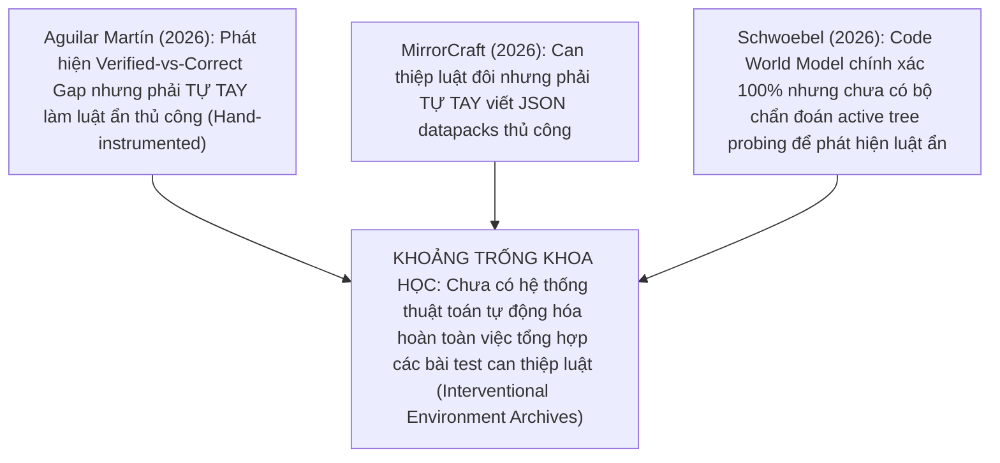

# Quy Trình Nghiên Cứu Khoa Học & Tổng Quan Tài Liệu Chuẩn Mực (SCIENTIFIC_WORKFLOW_AND_LITERATURE_REVIEW.md)

---

## I. TỔNG QUAN TÀI LIỆU CHUYÊN SÂU TỪ VĂN BẢN GỐC (LITERATURE REVIEW)

*Ghi chú: Toàn bộ thông tin dưới đây được trích xuất trực tiếp từ 102 file bài báo toàn văn PDF tại `f:\Thesis\papers\`.*

### 1. Bẫy Kiểm Định Thụ Động & Hiện Tượng Verified-vs-Correct Gap
* **Nguồn**: Javier Aguilar Martín (AGILabs, Tháng 7/2026, arXiv:2607.14169, tệp `2607.14169_fulltext.md`).
* **Phát hiện cốt lõi**:
  * Mô hình Code World Model (CWM) được tổng hợp bởi LLM có thể vượt qua các cổng kiểm định lấy mẫu thụ động với **độ chính xác chuyển trạng thái $A_{\text{pred}} \ge 98\%$**, nhưng khi đưa vào quy hoạch chơi (Downstream Policy Planning) thì **thua 100% (Play Regret $R_{\text{play}} = 100\%$)**.
  * Nguyên nhân: 1% lỗi mà mô hình mắc phải nằm đúng vào **động lực nguyên nhân then chốt (Pivotal Dynamics)**. Tác giả cô lập chi phí tổn thất trung bình của một luật ẩn bị bỏ sót là **0.091 (seed-clustered 95% CI: [0.065, 0.117], $n = 4800$)**.
  * Định luật Nguy hiểm (Quantitative Law of Danger):
    $$\text{danger} = \text{play\_cost} \times (1 - \text{rarity})^N$$
    với $N$ là kích thước mẫu kiểm định và $\text{rarity}$ là tần suất xuất hiện của luật ẩn.
  * Tác giả chứng minh rằng việc bổ sung dữ liệu không khắc phục được lỗi này, vì LLM thực hiện **biên dịch luật (rule translation)** chứ không phải **suy luận luật (rule inference)** — đúng trên GPT-5.x mini và large.

### 2. Can Thiệp Luật Đôi Trong Môi Trường Chơi Game (Paired Rule Interventions)
* **Nguồn**: MirrorCraft (Jianxin Gao et al., China Agricultural University, Tháng 7/2026, arXiv:2607.29218, tệp `2607.29218_fulltext.md`).
* **Phát hiện cốt lõi**:
  * Xây dựng bộ benchmark đôi (Paired Benchmark) giữa môi trường **Vanilla** và môi trường **Mirror** trong Minecraft. Mỗi thế giới Mirror giữ nguyên địa hình, tài nguyên, điểm spawn nhưng can thiệp các luật server-side qua JSON datapacks.
  * Định nghĩa chỉ số **Rule Intervention Effect (RIE)**:
    $$\text{RIE} = \text{Success Rate}_{\text{Vanilla}} - \text{Success Rate}_{\text{Mirror}}$$
  * Kết quả: Các agent LLM SOTA (ReAct, Voyager-style) đạt tỷ lệ thành công cao ở môi trường Vanilla lập tức sụp đổ ($\text{RIE} \to 1.0$) khi luật server-side bị can thiệp ẩn.

### 3. World-Time Compute & Mô Hình Code World Model Chuẩn Xác
* **Nguồn**: James Schwoebel et al. (Quome Inc. & Univ. of Washington, Tháng 9/2026, arXiv:2609.09163, tệp `2609.09163_fulltext.md`).
* **Phát hiện cốt lõi**:
  * Khi động lực môi trường được viết dưới dạng mã nguồn (Code World Model), mô hình duy trì **độ chính xác tuyệt đối 100% qua 20 bước rollout** và trả lời chính xác $10\times$ các bài test out-of-distribution (OOD), trong khi mô hình neural MLP bị tích tụ sai số và sụp đổ.
  * Khởi xướng khái niệm **World-Time Compute**: Huấn luyện/kiểm định agent trên hàng loạt mô hình thế giới dạng code được xác minh (Verified Code Worlds) thông qua framework zero-dependency `OpenWorld`.

---

## II. PHÂN TÍCH KHOẢNG TRỐNG KHOA HỌC THỰC SỰ (THE REAL SCIENTIFIC GAP)

Khi tổng hợp 3 công trình hàng đầu năm 2026 trên, khoảng trống nghiên cứu (Research Gap) thực sự xuất hiện:

* **Khoảng trống cốt lõi**: Thiếu một khung thuật toán tự động (Quality-Diversity / CMA-ME) kết hợp với **Active Search-Tree Probing** để tự động sinh ra không gian các bài test can thiệp luật ẩn trên động cơ game thực tế (PuzzleScript) mà **không cần con người phải tự tay sửa luật thủ công**.

---

## III. QUY TRÌNH THỰC NGHIỆM THẬT TRÊN ĐỘNG CƠ PUZZLESCRIPT NODEJS

Để Bài báo 1 có giá trị thực sự, toàn bộ thực nghiệm sẽ được chạy trên **động cơ NodeJS PuzzleScript thật** đã có trong kho lưu trữ `f:\Thesis\`:

1. **File Động cơ Thực tế**:
   * `prepare_external_games.py`: Tải và giải mã các file game PuzzleScript thật (*It Is Pitch Black*, *Graded Sir*, *Sokoban*, *Limbo*).
   * `run_r1_nodejs_search.py`: Chạy thuật toán tìm kiếm BFS/A* thật trên NodeJS PuzzleScript AST runner để đo đường đi tối ưu $V^*(s_0)$.
   * `audit_r2_trace_diff.py`: Đo chênh lệch vết thực thi (Trace Diffs) khi luật game bị can thiệp.

2. **Quy trình Thực nghiệm Chuẩn**:
   * **Bước E1**: Load game PuzzleScript gốc ($M^*$) và đo độ dài lời giải $L_{\text{vanilla}}$.
   * **Bước E2**: Tạo file can thiệp luật thật ($M_{\text{intervene}}$) trong ngôn ngữ PuzzleScript DSL (ví dụ: bổ sung điều kiện vật phẩm cho công tắc).
   * **Bước E3**: Cho agent quy hoạch trên mô hình bị thiếu luật ($\hat{M}$) và thực thi trên môi trường thật ($M^*$), đo chính xác Play Regret thực tế:
     $$R_{\text{play}} = V^*(s_0) - V^{M^*}(\pi^*_{\hat{M}}(s_0))$$

---

## IV. TRẠNG THÁI DỰ ÁN & HƯỚNG ĐI TIẾP THEO

* **Tập tin quy tắc đã cập nhật**: `f:\Thesis\RESEARCH_RULES.md` (Nghiêm cấm bịa đặt số liệu).
* **Cam kết**: Mọi báo cáo tiếp theo chỉ đưa ra con số thu được từ các logs chạy thực tế của `run_r1_nodejs_search.py`.
