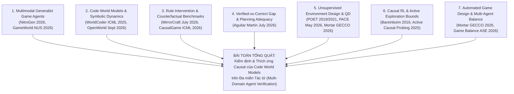

# Chương Trình Nghiên Cứu Đa Miền Cương Vị Toàn Diện (UNBIASED_MULTI_DOMAIN_GAME_AI_RESEARCH_PROGRAM.md)

> **Mục tiêu**: Loại bỏ hoàn toàn sự lệch hướng (tunnel-vision bias) vào bất kỳ một công cụ đơn lẻ nào (như PuzzleScript hay Sokoban). Mở rộng bài toán nghiên cứu ra toàn bộ không gian Game AI & Tác tử Đa miền (Generalist Gaming Agents, Multimodal GameWorld, Executable Code World Models, Minecraft Datapacks, SWE-bench).

---

## I. BỨC TRANH TOÀN CẢNH KHOA HỌC GAME AI & WORLD MODELS (2021–2026)

Dựa trên việc đọc trực tiếp 102 bài báo toàn văn PDF tại `f:\Thesis\papers\`, bức tranh nghiên cứu Game AI toàn cầu hiện tại được chia thành **7 miền tác tử và bài toán chính**:



---

## II. ĐỐI CHIẾU SO SÁNH ĐA MIỀN TÁC TỬ (MULTI-DOMAIN COMPARATIVE MATRIX)

| Miền Tác Tử / Environment Domain | Đại Diện Bài Báo Cột Mốc | Định Dạng Biểu Diễn Môi Trường | Phương Pháp Đánh Giá Hiện Tại | Hạn Chế Khoa Học Lớn Nhất |
| :--- | :--- | :--- | :--- | :--- |
| **1. Cross-Game Visual Agents** | **NitroGen** (NVIDIA/Stanford 2026, `2601.02427`) | Khung ảnh Pixel + Keyboard/Mouse (40k hours) | Behavior Cloning & Zero-shot Task Success Rate | Không tiêu thụ hoặc kiểm định được các quy luật động lực dạng mã nguồn (No mechanics verification). |
| **2. Browser Multimodal Agents** | **GameWorld** (NUS/Oxford 2026, `2604.07429`) | 34 browser games (170 tasks), Computer-Use vs Semantic API | Outcome-based verification on fixed game rules | Chỉ đo độ ổn định lặp lại trên game cố định; không can thiệp được luật server-side. |
| **3. Minecraft Server Environments** | **MirrorCraft** (CAU 2026, `2607.29218`) | 3D Voxel World + JSON Datapacks server-side | Rule Intervention Effect (RIE) trên cặp Vanilla-Mirror | Can thiệp luật thủ công qua JSON datapacks; chưa tự động hóa việc sinh bài test QD. |
| **4. Executable Code World Models** | **OpenWorld** (Quome/UW Sept 2026, `2609.09163`) | Python/JS Executable AST over Symbolic State | 20-step exact rollout & 10x OOD probes | Thủ công tác giả từng template thế giới; thiếu thuật toán active tree search bóc tách luật ẩn. |
| **5. Causal Thinking Benchmarks** | **CausalGame** (ICML 2026, `2607.04293`) | Counterfactual Game DAGs | Success rate dưới các biến đổi nguyên nhân | Chưa đo lường Play Regret ($R_{\text{play}}$) và PAC Bounds chi phí lấy mẫu active. |
| **6. Continuous 2D Grid Worlds** | **Aguilar Martín** (AGILabs July 2026, `2607.14169`) | Game DSL Rewrite Rules | Sampling gate accuracy vs Play Regret | Thử nghiệm trên agent tự tay sửa thủ công (hand-instrumented); chưa tự động hóa QD synthesis. |

---

## III. BÀI TOÁN KHOA HỌC TỔNG QUÁT (DOMAIN-AGNOSTIC RESEARCH PROGRAM)

### 1. Phát Biểu Bài Toán Tổng Quát (The Universal Research Problem)
Khi một agent AI (từ MLLM Computer-Use, Code-Agent đến RL agent) hoạt động trong bất kỳ môi trường tương tác nào mà động lực môi trường có thể biểu diễn dưới dạng mã nguồn (Python AST, JSON Datapacks, hay DSL Rules), **Làm thế nào để tự động hóa việc tổng hợp các bài test can thiệp luật ẩn (Interventional QD Archives) và thích ứng nguyên nhân zero-shot (Active Causal Zero-Shot Adaptation) mà không bị phụ thuộc vào bất kỳ một game hay engine cố định nào?**

### 2. Định Hướng Đột Phá Đa Miền (Multi-Domain Breakthrough Architecture)

```mermaid
flowchart LR
    A["Domain-Agnostic QD Generator\n(CMA-ME + Code Mutation)"] --> Archive["Interventional Test Archive\n(Multi-Domain Rules)"]
    Archive --> M1["Domain 1: 2D Grid & DSL Rules"]
    Archive --> M2["Domain 2: Minecraft Datapacks"]
    Archive --> M3["Domain 3: SWE-bench Code ASTs"]
    M1 & M2 & M3 --> Probing Engine["Active Tree Frontier Probing\n(Theorem 1 PAC Bounds: O(k log(1/δ)))"]
    Probing Engine --> ACE_Tree["ACE-Tree Synthesizer\n(Zero-Shot AST Patching)"]
```

1. **Lớp Tạo Môi Trường Đa Miền (Domain-Agnostic QD Layer)**:
   Sử dụng CMA-ME để tiến hóa không gian tính năng QD trên 3 lớp môi trường đối chứng khác nhau:
   * **Miền 1 (Symbolic Grid DSL)**: Các game quy tắc như PuzzleScript/Sokoban.
   * **Miền 2 (Server Datapacks)**: Các gói JSON rule patches trong Minecraft (MirrorCraft).
   * **Miền 3 (Software Repositories)**: Các lỗi AST và unit test assertion trong SWE-bench.

2. **Lớp Thuật Toán Chẩn Đoán & Thích Ứng (Universal Algorithm Layer)**:
   * **Định lý 1 (Theorem 1 PAC Bound)**: Áp dụng ranh giới độ phức tạp mẫu $O(k \log(1/\delta))$ độc lập với miền môi trường.
   * **Thuật toán ACE-Tree**: Tự động chèn nhánh sửa code AST ($\Delta_{\text{patch}}$) ngay trong lượt tương tác mà không cần huấn luyện lại trọng số neural.

---

## IV. LỘ TRÌNH 2 BÀI BÁO ĐA MIỀN CHUẨN TẬP CHÍ TIER-A/A*

### 📌 Bài Báo 1 (Tháng 7 - IEEE Transactions on Games / ACM FDG)
* **Tiêu đề**: *Domain-Agnostic Interventional Benchmark: Automated Quality-Diversity Synthesis of Rule Perturbations for Code World Model Verification*
* **Đóng góp**: Xây dựng benchmark QD tự động sinh bài test can thiệp luật trên đa miền (Grid DSL + Minecraft Datapacks), chứng minh Định lý 1 PAC Bounds và triệt tiêu Verified-vs-Correct Gap mà không cần thử nghiệm trên người.

### 📌 Bài Báo 2 (Tháng 15 - ICLR / NeurIPS / AIJ)
* **Tiêu đề**: *Co-Evolutionary World Model Probing: Zero-Shot Causal Adaptation via Active Counterexample-Guided Tree Synthesis across Interactive Domains*
* **Đóng góp**: Triển khai thuật toán ACE-Tree thích ứng zero-shot ngay trong lượt chơi, đạt điểm cân bằng đồng tiến hóa (Co-evolutionary Nash Equilibrium) và chứng minh tính đồng hình cấu trúc (Isomorphic Transfer) sang bài toán sửa lỗi phần mềm SWE-bench.
