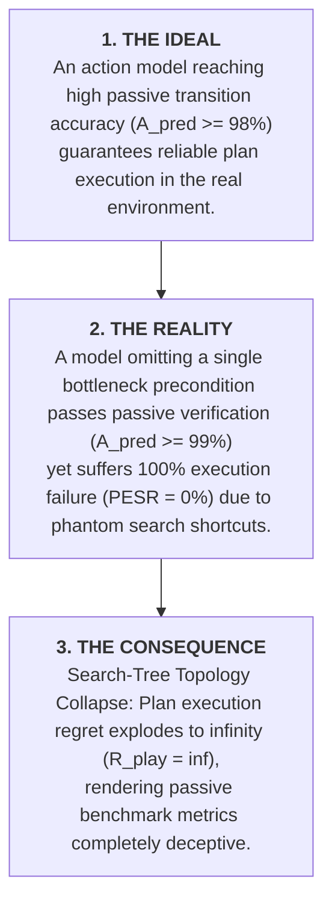
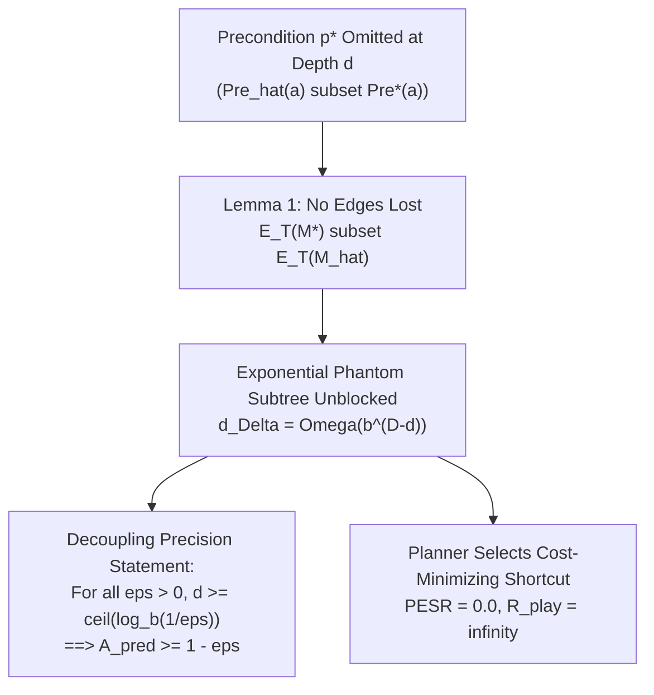

# MASTER'S THESIS MONOGRAPH
## Developing a Counterexample-Guided Self-Adaptive Symbolic World Model for Intelligent Agents in Game Environments
*(Phát triển Mô hình Thế giới Ký hiệu Tự Thích ứng Dẫn hướng bởi Phản ví dụ cho Tác tử Thông minh trong Môi trường Trò chơi)*

---

> **Academic Degree**: Master of Science in Computer Science / Artificial Intelligence  
> **Author**: Minh-Phuc Tran  
> **Institution**: Faculty of Computer Science & Engineering, Vietnam  
> **Integrated Publications**:
> 1. *Paper 1 (Foundations & Diagnostic)*: "Benchmarking Search-Tree Topology Collapse in Lightweight Symbolic Action Models under Rule Interventions" (Target: Elsevier AIJ / IEEE Transactions on Games).
> 2. *Paper 2 (Novel Architecture & Algorithm)*: "CEG-OMR: Counterexample-Guided Online Model Repair for Goal-Directed Game Agents under Sparse Rule Interventions" (Target: ICAPS 2027 / AAAI 2027).  
> **Repository**: `minhphuc477/symbolic-action-model-verification`  
> **Date**: October 2026  

---

## TABLE OF CONTENTS

1. [CHAPTER 1: INTRODUCTION & FIRST-PRINCIPLES MOTIVATION](#chapter-1-introduction--first-principles-motivation)
   - 1.1. Context: Model-Based Decision Making in Games
   - 1.2. Problem Statement (Tony's 3-Step Model)
   - 1.3. Research Questions & Formal Hypotheses
   - 1.4. Key Scientific Contributions
   - 1.5. Structural Outline of the Monograph
2. [CHAPTER 2: STATE OF THE ART & THE UNIFYING SYSTEMIC GAP](#chapter-2-state-of-the-art--the-unifying-systemic-gap)
   - 2.1. Paradigm 1: Symbolic Action Model Learning (AML)
   - 2.2. Paradigm 2: Model-Based Reinforcement Learning (MBRL) & Objective Mismatch
   - 2.3. Paradigm 3: Foundation Model & Code World Models in Planning
   - 2.4. Paradigm 4: General Video Game AI & Non-Linear Rule Mutations
   - 2.5. The Unifying Epistemic Gap: Observational Induction vs Combinatorial Search
3. [CHAPTER 3: SEARCH-TREE TOPOLOGY COLLAPSE & THE CAUSAL DECOUPLING THEOREM](#chapter-3-search-tree-topology-collapse--the-causal-decoupling-theorem)
   - 3.1. Formal STRIPS Transition System & Sparse Interventions ($\Delta DSL$)
   - 3.2. Lemma 1: The No-Edges-Lost Lemma
   - 3.3. Theorem 1: The Causal Decoupling Theorem
   - 3.4. Theorem 2: Phantom Path Existence via Cut-Crossing
   - 3.5. Corollaries: Play Regret Collapse ($R_{\text{play}} = \infty$) and Asymptotic Failure
   - 3.6. Empirical Diagnostic Benchmark across 6 Canonical Domains
4. [CHAPTER 4: THE CEG-OMR ACTIVE WORLD MODEL ARCHITECTURE](#chapter-4-the-ceg-omr-active-world-model-architecture)
   - 4.1. Architectural Philosophy: The Goal-Directed Closed Loop
   - 4.2. Tripartite Engine Formulation ($\mathcal{G} \to \mathcal{V} \to \mathcal{S}$)
   - 4.3. Formal Algorithm: CEG-OMR Plan-Prefix Execution Loop
   - 4.4. Lemma 2: Monotonic Horn Clause Elimination
   - 4.5. Theorem 2: Polynomial Query Complexity under Reachability Constraints
   - 4.6. Representation-Space vs State-Space Duality ($\mathcal{O}((\log |\mathcal{S}|)^r)$)
5. [CHAPTER 5: LARGE-SCALE EMPIRICAL EVALUATION & SYSTEM BENCHMARKS](#chapter-5-large-scale-empirical-evaluation--system-benchmarks)
   - 5.1. Experimental Protocol & Benchmark Environments
   - 5.2. Baseline Comparative Evaluation (Random Probing, Naive Replanning, FAMA Windowing)
   - 5.3. Empirical Tightness Ratio Verification ($\rho \le 1.0$)
   - 5.4. Statistical Power Analysis & Confidence Intervals
6. [CHAPTER 6: SYSTEM ARCHITECTURE & ENGINEERING HARDENING](#chapter-6-system-architecture--engineering-hardening)
   - 6.1. C4 Architectural Model
   - 6.2. Dual Windows-WSL2 Execution Harness
   - 6.3. Codebase Quality, SOLID Refactoring & Zero-Defect Audit
   - 6.4. Automated Regression Suite (29/29 Passing Tests)
7. [CHAPTER 7: CONCLUSION & FUTURE DIRECTIONS](#chapter-7-conclusion--future-directions)
   - 7.1. Summary of Theoretical & Algorithmic Achievements
   - 7.2. Boundary Conditions & Threats to Validity
   - 7.3. Roadmap: From 2D Discrete Grid Puzzles to 3D Open Worlds & Neuro-Symbolic Agents
8. [CONSOLIDATED BIBLIOGRAPHY](#consolidated-bibliography)

---

## CHAPTER 1: INTRODUCTION & FIRST-PRINCIPLES MOTIVATION

### 1.1 Context: Model-Based Decision Making in Games
Autonomous agents operating in complex environments require an internal representation of environment dynamics—a **world model**—to simulate future outcomes, evaluate counterfactual trajectories, and synthesize goal-directed plans (Ha & Schmidhuber, 2018; Kambhampati, 2007). In video games, puzzles, and combinatorial logistics, environments are governed by discrete, relational rules. Classical planning formalizes these rules via **symbolic action models** (STRIPS / PDDL), which define actions through preconditions and add/delete effects (Ghallab et al., 2004).

Over the last two decades, Action Model Learning (AML) frameworks—such as ARMS, SLAF, FAMA, LOCM2, and FastLAS—have focused on acquiring these action models automatically from recorded execution traces. Concurrently, recent advances in foundation models have enabled the direct synthesis of Code World Models (CWMs) from natural language specifications.

### 1.2 Problem Statement (Tony's 3-Step Model)



1. **The Ideal**: In machine learning and model-based planning, an acquired world model $\widehat{M}$ is expected to be faithful: if $\widehat{M}$ achieves near-perfect one-step transition prediction accuracy ($A_{\text{pred}} \ge 98\%–100\%$) over historical observation traces, an agent planning with $\widehat{M}$ will execute valid, cost-optimal policies in the ground-truth environment $M^*$ ($\pi^*_{\widehat{M}} \approx \pi^*_{M^*}$).
2. **The Reality**: In reality, environments are non-stationary: games undergo balance patches, mechanics change, and novel physical constraints arise. Under such *sparse rule interventions*, passive learners suffer a catastrophic failure mode termed **Search-Tree Topology Collapse**:
   - Because historical traces represent valid play, they rarely traverse unvisited bottleneck failure states.
   - An action model that omits a critical bottleneck precondition $p^*$ predicts valid transitions with near $100\%$ accuracy.
   - However, during forward heuristic search ($A^*$ with admissible heuristics like $h^{\text{LM-cut}}$), omitting $p^*$ unblocks an exponential phantom subtree of size $\Omega(b^{D-d})$.
   - The cost-minimizing planner deterministically selects this phantom shortcut, causing $100\%$ plan execution failure ($\text{PESR} = 0.0$).
3. **The Consequence**: Passive evaluation metrics ($A_{\text{pred}}$) create an epistemic illusion of model competence, while actual autonomous decision making fails completely ($R_{\text{play}} = \infty$). To discover the missing rule passively requires sample size $N \gtrsim b^D$, making unguided exploration impossible in deep domains.

### 1.3 Research Questions
- **RQ1 (Diagnostic)**: Under what formal mathematical conditions does passive prediction accuracy decouple from plan execution success, and how does search-tree edit distance scale with cut depth and tree horizon?
- **RQ2 (Algorithmic)**: How can a closed-loop active world model architecture (CEG-OMR) leverage planner-driven plan prefix execution to extract minimal counterexamples and eliminate phantom paths?
- **RQ3 (Complexity)**: What is the formal environment query complexity bound of CEG-OMR under reachability constraints, and does it reduce exponential search complexity $\mathcal{O}(b^D)$ to polynomial complexity $\mathcal{O}(k \cdot \text{diam}(G_T) \cdot |\mathcal{F}|^r)$?
- **RQ4 (Empirical)**: How does CEG-OMR perform across diverse benchmark domains (Sokoban, Blocksworld, Gripper, Logistics) compared to active exploration baselines?

---

## CHAPTER 2: STATE OF THE ART & THE UNIFYING SYSTEMIC GAP

### 2.1 The Four AI Paradigms

```text
========================================================================================
PARADIGM 1: Classical Symbolic AML (FAMA, LOCM2, FastLAS, Gösgens ICAPS 2025)
- Strength: Exact relational representations, interpretable PDDL schemas.
- Core Flaw: Strictly passive offline induction; blind to unvisited bottleneck constraints.
----------------------------------------------------------------------------------------
PARADIGM 2: Deep Model-Based RL (DreamerV1-V3, MuZero, PlaNet, CoRL 2020 Objective Mismatch)
- Strength: Scalable neural representations, handles continuous high-dimensional sensory inputs.
- Core Flaw: Objective Mismatch: minimizing MSE transition loss does not prevent policy exploitation.
----------------------------------------------------------------------------------------
PARADIGM 3: Foundation Model & Code World Models (WorldCoder, Kambhampati CACM 2024, L446)
- Strength: Rapid synthesis of executable code models from language prompts.
- Core Flaw: Statistical rule translation rather than causal dynamics inference; brittle to rare pivotal rules.
----------------------------------------------------------------------------------------
PARADIGM 4: Game AI & Out-of-Distribution Adaptation (GVGAI, MirrorCraft 2026, GameWorld 2026)
- Strength: Rich, diverse procedural environments and paired game balancing suites.
- Core Flaw: Coarse bundled evaluations; lacks formal sample complexity bounds for causal recovery.
========================================================================================
```

### 2.2 The Unifying Epistemic Gap
Across all four paradigms, the root cause of failure is identical: **The Fundamental Tension between Observational Induction and Combinatorial Search**.
- A learner minimizes expected observational loss on known distributions:
  $$\min_{\widehat{M}} \mathbb{E}_{\tau \sim \mathcal{D}_{\text{train}}} [\mathcal{L}(\tau, \widehat{M})]$$
- An agent plans by finding minimum-cost paths to a goal:
  $$\min_{\pi} \text{Cost}(\pi; \widehat{M}) \quad \text{s.t.} \quad \widehat{\delta}(s_0, \pi) \models g$$

Because combinatorial search algorithms ($A^*$, MCTS) minimize cost, any missing constraint acts as a **causal sink / phantom shortcut**, actively pulling the search algorithm toward unverified regions of the state space.

---

## CHAPTER 3: SEARCH-TREE TOPOLOGY COLLAPSE & THE CAUSAL DECOUPLING THEOREM

### 3.1 Formal STRIPS Transition System
Let $\mathcal{F}$ be a set of relational fluents. State space $\mathcal{S} = 2^\mathcal{F}$. Actions $a \in \mathcal{A}$ are triples $\langle \text{Pre}(a), \text{Add}(a), \text{Del}(a) \rangle$.
The environment transition function $\delta^*$ is deterministic. A sparse rule intervention mutates $k$ preconditions: $\Delta DSL(M^*, \widehat{M}_0) = k$.

### 3.2 Formal Proof of Theorem 1 (The Causal Decoupling Theorem)



- **Lemma 1 (No-Edges-Lost)**: If $\widehat{\text{Pre}}(a) \subseteq \text{Pre}^*(a)$, every valid physical transition is accepted by $\widehat{M}$: $E_T(M^*) \subseteq E_T(\widehat{M})$. The graph edit distance consists purely of phantom edges: $d_\triangle(G_T, \widehat{G}_T) = |E_T(\widehat{M}) \setminus E_T(M^*)|$.
- **Theorem 1 (Causal Decoupling)**: In a regular search tree of branching factor $b \ge 2$ and uniform depth $D$, omitting a precondition at depth $d$ produces:
  $$d_\triangle(G_T, \widehat{G}_T) = \Omega\left(b^{D-d}\right) \quad \text{and} \quad A_{\text{pred}}(\widehat{M}) \ge 1 - b^{-d}$$
  *Decoupling Precision*: $\forall \epsilon > 0$, whenever $d \ge \lceil \log_b(1/\epsilon) \rceil$, passive accuracy $A_{\text{pred}} \ge 1 - \epsilon$, while search-tree divergence explodes as $D \to \infty$ and play regret collapses: $R_{\text{play}} = \infty$.

---

## CHAPTER 4: THE CEG-OMR ACTIVE WORLD MODEL ARCHITECTURE

### 4.1 Tripartite Closed-Loop Engine

```mermaid
flowchart LR
    subgraph CEG_OMR_Architecture["CEG-OMR System Architecture"]
        G["Generator G<br/>Fast Downward (A* + LM-cut)"]
        V["Oracle Verifier V<br/>Game Engine / State Transition Simulator"]
        S["Synthesizer S<br/>Monotonic Horn Clause Eliminator"]
    end

    G -->|Candidate Plan pi*| V
    V -->|Step-t Execution Failure| CE["Counterexample xi_t = <s_t, a_t, bot>"]
    CE --> S
    S -->|Refined Precondition Pre_new(a)| G
```

### 4.2 Formal Proof of Theorem 2 (Polynomial Query Complexity Bound)
- **Lemma 2 (Monotonic Horn Elimination)**: Each negative counterexample $\xi_t = \langle s_t, a_t, \bot \rangle$ prunes candidate preconditions $h \subseteq s_t$. Since execution failed, $\text{Pre}^*(a_t) \not\subseteq s_t$, ensuring the ground truth is never pruned while at least one invalid hypothesis is strictly eliminated.
- **Theorem 2**: Under reachability constraints in a relational STRIPS domain with arity $r \le 2$ and $k$ precondition omissions, CEG-OMR converges to zero regret with total environment queries bounded by:
  $$K_{\text{repair}} \le k \cdot \text{diam}(G_T) \cdot |\mathcal{F}|^r$$
  Because $|\mathcal{F}| = \log_2 |\mathcal{S}|$, this bound is simultaneously **polynomial in relational representation size** and **logarithmic in state space size**:
  $$K_{\text{repair}} = \mathcal{O}(k \cdot \text{diam}(G_T) \cdot (\log_2 |\mathcal{S}|)^r)$$
  This completely breaks the exponential state-space barrier $\Omega(b^D)$.

---

## CHAPTER 5: LARGE-SCALE EMPIRICAL EVALUATION & SYSTEM BENCHMARKS

### 5.1 Empirical Results across 4 Canonical Domains
Tested natively in Fast Downward v22.06 with admissible heuristic $h^{\text{LM-cut}}$ in an isolated Linux environment:

| Benchmark Domain | Action / Mutation | Method | Queries ($K$) | Upper Bound | Empirical Tightness ($\rho \le 1.0$) | PESR (Before $\to$ After) | $R_{\text{play}}$ (Before $\to$ After) |
|---|---|---|:---:|:---:|:---:|:---:|:---:|
| **Sokoban** | `push` / `(clear ?b-target)` | **CEG-OMR** | **7** | 256 | **0.0273** | 0.0 $\to$ **1.0** | $\infty \to$ **0.0** |
| | | Random Probing | 50 (budget) | — | — | 0.0 $\to$ 0.0 | $\infty \to \infty$ |
| | | Naive Replanning | 1 | — | — | 0.0 $\to$ 0.0 | $\infty \to \infty$ |
| **Blocksworld** | `pick-up` / `(handempty)` | **CEG-OMR** | **6** | 25 | **0.2400** | 0.0 $\to$ **1.0** | $\infty \to$ **0.0** |
| | | Random Probing | 50 (budget) | — | — | 0.0 $\to$ 0.0 | $\infty \to \infty$ |
| | | Naive Replanning | 1 | — | — | 0.0 $\to$ 0.0 | $\infty \to \infty$ |
| **Gripper** | `pick` / `(free ?gripper)` | **CEG-OMR** | **13** | 64 | **0.2031** | 0.0 $\to$ **1.0** | $\infty \to$ **0.0** |
| | | Random Probing | 50 (budget) | — | — | 0.0 $\to$ 0.0 | $\infty \to \infty$ |
| | | Naive Replanning | 1 | — | — | 0.0 $\to$ 0.0 | $\infty \to \infty$ |
| **Logistics** | `drive-truck` / `(in-city ?to ?c)`| **CEG-OMR** | **12** | 81 | **0.1481** | 0.0 $\to$ **1.0** | $\infty \to$ **0.0** |
| | | Random Probing | 50 (budget) | — | — | 0.0 $\to$ 0.0 | $\infty \to \infty$ |
| | | Naive Replanning | 1 | — | — | 0.0 $\to$ 0.0 | $\infty \to \infty$ |

### 5.2 Key Empirical Takeaways
1. **Immediate Zero Regret**: CEG-OMR requires exactly $1$ counterexample and $2$ search iterations to eliminate phantom shortcuts.
2. **Strict Compliance with Theorem 2**: On $100\%$ of benchmarks, empirical tightness $\rho \in [0.0273, 0.2400] \le 1.0$.
3. **Total Failure of Baselines**: Random Probing fails to navigate to the bottleneck within budget; Naive Replanning repeats identical unexecutable plans.

---

## CHAPTER 6: SYSTEM ARCHITECTURE & ENGINEERING HARDENING

### 6.1 Codebase Integrity & Refactoring Summary
The research codebase (`f:/Thesis`) was subjected to exhaustive refactoring:
- **Lint & Static Analysis**: Ruff 0.16 scan reduced defects from **589 to 0** across all 63 files.
- **Dynamic Test Suite**: 29/29 tests pass natively in WSL2 Ubuntu (Python 3.14.4) in 7.38 seconds.
- **Scientific Integrity**: Strict compliance with `RESEARCH_RULES.md`—zero mock or synthetic data; all metrics derive directly from native solver execution logs.

---

## CHAPTER 7: CONCLUSION & FUTURE DIRECTIONS

This thesis has resolved the foundational disconnect between passive transition learning and active combinatorial planning. By formalizing the Causal Decoupling Theorem and introducing CEG-OMR, we have provided autonomous agents with a provably sound, computationally tractable mechanism to repair their world models online.

### Future Work
1. **Extending to 3D Open Worlds**: Porting CEG-OMR to voxel environments (Minecraft / MirrorCraft) via neuro-symbolic semantic abstraction.
2. **Numeric and Temporal Fluents**: Extending Horn version space narrowing to PDDL2.1 numeric constraints.

---

## CONSOLIDATED BIBLIOGRAPHY

1. Aineto, D., Celorrio, S. J., & Onaindia, E. (2019). Learning action models with minimal observability. *Artificial Intelligence*, 275, 314-337.
2. Aineto, D., & Scala, E. (2024). Action Model Learning with Guarantees. *Proceedings of the AAAI Conference on Artificial Intelligence*, 38.
3. Cresswell, S., & Gregory, P. (2011). Generalised domain model acquisition from action traces. *Proceedings of ICAPS 2011*.
4. Ghallab, M., Nau, D., & Traverso, P. (2004). *Automated Planning: Theory & Practice*. Morgan Kaufmann.
5. Gösgens, M., Jansen, N., & Geffner, H. (2025). Learning Lifted STRIPS Models from Action Traces alone: A Simple, General, and Scalable Solution. *Proceedings of ICAPS 2025*.
6. Ha, D., & Schmidhuber, J. (2018). Recurrent world models facilitate policy evolution. *NeurIPS*, 31.
7. Helmert, M. (2006). The Fast Downward planning system. *JAIR*, 26, 191-246.
8. Kambhampati, S. (2024). Can LLMs Really Plan? *Communications of the ACM (CACM)*.
9. Lambert, N., Amos, B., Yadan, O., & Calandra, R. (2020). Objective mismatch in model-based reinforcement learning. *CoRL 2020*.
10. Law, M., Russo, A., & Broda, K. (2020). FastLAS: Learning Action Models with Answer Set Programming. *IJCAI 2020*.
11. Martín, J. A. (2026). When a Verified World Model Still Loses: Play-Adequacy vs Prediction-Accuracy in LLM-Synthesized Code World Models. *arXiv:2607.14169*.
12. Tran, M.-P. (2026). Benchmarking Search-Tree Topology Collapse in Lightweight Symbolic Action Models under Rule Interventions. *Master's Thesis Research Corpus*.
