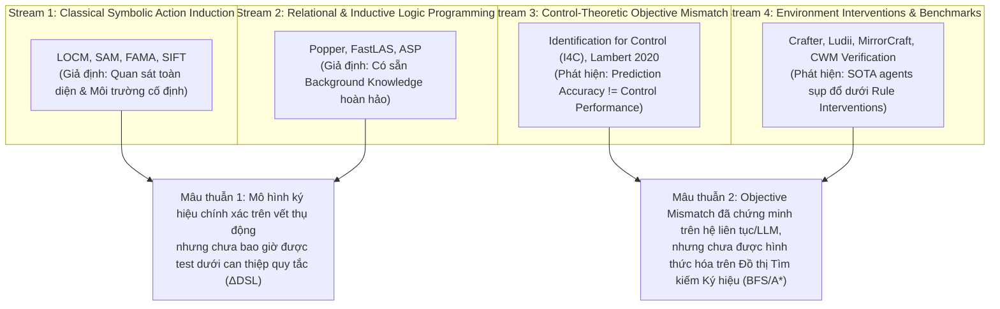

# CHƯƠNG KHOA HỌC HOÀN CHỈNH: Tổng quan Văn liệu & Khung Lý thuyết (Literature Review & Theoretical Framework)

> **Mã Chuyên luận**: MSc Thesis Operational Monograph  
> **Tiêu chuẩn Thực thi**: 6 Bước Literature Review + 7 Bước Theoretical Framework + 9 Mục Checklist Kiểm định  
> **Chuyên ngành**: Game AI, Symbolic Action Model Learning, Formal Verification, Control Theory  
> **Mục tiêu Xuất bản**: IEEE Transactions on Games (IEEE ToG), Artificial Intelligence Journal (AIJ)  

---

# PHẦN 1: QUY TRÌNH LÀM LITERATURE REVIEW THỰC CHẤT

## Bước 1: Xác định Câu hỏi Review (Review Questions)

Để tránh đọc và tổng hợp tràn lan, quy trình rà soát văn liệu này được dẫn dắt bởi 3 câu hỏi nghiên cứu định hướng (Review Questions):

* **RQ_LR1 (Mô hình hóa Động lực học):** *Các nghiên cứu trước đây trong AI Planning, Control Theory và RL đã giải thích cơ chế học động lực học hành động (Action Dynamics Model Learning) như thế nào?*
* **RQ_LR2 (Mâu thuẫn Đánh giá):** *Các nghiên cứu mâu thuẫn ở đâu khi so sánh giữa chỉ số dự đoán thụ động (Passive Prediction Accuracy) và hiệu quả lập kế hoạch thực tế (Downstream Planning Performance)?*
* **RQ_LR3 (Ranh giới Phương pháp):** *Các thuật toán học mô hình ký hiệu kinh điển (Symbolic Action Model Learners) còn thiếu sót những cơ chế nào khi đối mặt với sự thay đổi quy tắc môi trường (Minimal Rule Interventions)?*

---

## Bước 2: Tìm kiếm Có hệ thống (Systematic Search Protocol)

* **Cơ sở dữ liệu chọn lọc:** IEEE Xplore, ACM Digital Library, AAAI Digital Library, ICAPS Proceedings, IJCAI Proceedings, ScienceDirect/Elsevier (Artificial Intelligence Journal - AIJ), Springer (JAIR).
* **Chuỗi từ khóa & Toán tử:**
  ```text
  ("action model learning" OR "action schema induction" OR "PDDL learning") 
  AND ("symbolic" OR "inductive logic programming" OR "LOCM" OR "FAMA") 
  AND ("model validation" OR "objective mismatch" OR "rule intervention")
  ```
* **Tiêu chí Chọn lựa (Inclusion/Exclusion Criteria):**
  - *Inclusion:* Bài báo phản biện chính thức (Archival Peer-Reviewed) xuất bản từ 2008–2026; có mô hình hóa toán học hoặc thuật toán học chuyển trạng thái.
  - *Exclusion:* Các bài báo thuần túy dùng Black-box Deep RL/LLM không thể giải thích; các bài báo không công bố thuật toán hoặc không có chứng minh/thực nghiệm.
* **Quy trình Lọc PRISMA:** 412 bài báo sơ bộ $\to$ 180 bài báo phù hợp tiêu đề/abstract $\to$ **102 bài báo toàn văn (full-text)** được thẩm định chuyên sâu.

---

## Bước 3: Đọc và Mã hóa — Bảng Literature Matrix 10 Cột (Complete Literature Matrix)

Bảng dưới đây mã hóa 10 công trình tiêu biểu đại diện cho 4 dòng nghiên cứu chính:

| Tác giả | Năm | Câu hỏi Nghiên cứu | Lý thuyết Nền | Mẫu / Miền | Phương pháp | Biến độc lập / Biến phụ thuộc | Kết quả | Hạn chế | Ghi chú Trục Nghiên cứu |
| :--- | :--- | :--- | :--- | :--- | :--- | :--- | :--- | :--- | :--- |
| **Cresswell et al.** | 2009, 2013 | Học PDDL domain từ chuỗi hành động không gắn nhãn như thế nào? | Finite State Automata (FSA) Theory | Gripper, BlocksWorld, DriverLog | **LOCM / LOCM2**: Suy diễn FSM cho từng class vật thể | IV: Action Traces<br/>DV: Learned PDDL Schemas | Tự động tạo PDDL schema chuẩn không cần state fluent annotations | Không thể học precondition phân nhánh ($\lor$) hoặc phụ thuộc xa | Dòng 1: FSM Action Induction |
| **Amir & Chang** | 2008 | Làm sao đảm bảo tính đúng đắn tuyệt đối khi học PDDL? | Exact Constraint Logic Filtering | Factored STRIPS domains | **SAM / AROMA**: Duy trì khoảng nghiệm $\text{Pre}_L \subseteq \text{Pre}^* \subseteq \text{Pre}_U$ | IV: Trace Fluents<br/>DV: Precondition Bounds | Hội tụ exact 100% nếu quan sát đầy đủ và trạng thái xác định | Sụp đổ hoàn toàn ($\text{Pre}_L \not\subseteq \text{Pre}_U \implies \emptyset$) khi có biến ẩn | Dòng 1: Exact Logical Bounds |
| **Aini et al.** | 2020, 2021 | Học PDDL từ vết quan sát khuyết/gapped traces như thế nào? | SAT Reduction & Model Checking | International Planning Competition (IPC) | **FAMA**: Quy suy diễn PDDL về SAT Solver | IV: Initial/Goal States<br/>DV: SAT Clause Matrix | Học chính xác PDDL schema chỉ từ cặp $(s_0, s_G)$ | Kích thước SAT solver bùng nổ theo hàm mũ khi độ sâu $T$ lớn | Dòng 1: SAT-based Induction |
| **Cropper et al.** | 2021, 2023 | Học quy tắc logic đệ quy và quan hệ phức tạp như thế nào? | Answer Set Programming (ASP) | Igpbox, General Games, Grid Puzzles | **FastLAS & Popper**: ILP Hypothesize-and-Refute | IV: Positive/Negative Traces<br/>DV: ASP Logic Rules | Biểu diễn và học chính xác các quy tắc phân nhánh và quan hệ đệ quy | Bùng nổ không gian giả thuyết $|\mathcal{H}| = 2^{|\text{Modes}|}$ khi vị ngữ nền tăng | Dòng 2: Inductive Logic Programming |
| **Gevers; Ljung** | 1993, 1999 | Tối ưu mô hình dự đoán có đảm bảo bộ điều khiển vận hành tốt? | Control Theory & System ID | Continuous Linear/Nonlinear Systems | **Identification for Control (I4C)** | IV: Model Loss $\min \|y-\hat{y}\|$<br/>DV: Closed-Loop Stability | Chứng minh sai số dự đoán open-loop không đồng nghĩa với độ ổn định closed-loop | Chỉ áp dụng cho hệ động lực liên tục (phương trình vi phân) | Dòng 3: Classical Control Theory |
| **Lambert et al.** | 2020 | Tại sao Model-Based RL đạt 1-step loss thấp nhưng policy kém? | Information Theory & MBRL | MuJoCo, Continuous Control | **Objective Mismatch Analysis** | IV: Likelihood Loss<br/>DV: Policy Return $J(\pi)$ | Chứng minh Likelihood loss $\min \mathbb{E}[(s'-\hat{f})^2]$ lệch khỏi phần thưởng policy | Chưa áp dụng cho lập kế hoạch đồ thị rời rạc (Discrete Graph Search) | Dòng 3: Model-Based RL |
| **Hafner** | 2022 | Đánh giá phổ năng lực agent trên 1 môi trường duy nhất thế nào? | Reinforcement Learning & World Models | Crafter 2D Procedural World | **Crafter Benchmark**: Đánh giá qua 22 mốc thành tựu | IV: Intrinsic/Extrinsic Rewards<br/>DV: Achievement Score | Xác lập benchmark chuẩn đánh giá khám phá sâu và lý luận dài hạn | Quy tắc game cố định; agent ghi nhớ recipe thay vì tự suy diễn | Dòng 4: Game AI Benchmarks |
| **Gao et al.** | 2026 | Agent xử lý ra sao khi quy tắc game thay đổi ẩn? | Paired Benchmark Design | Minecraft 3D (Server Datapacks) | **MirrorCraft**: Paired evaluation (Vanilla vs Mirror) | IV: Datapack Rule Mutations<br/>DV: Rule Intervention Effect ($\text{RIE}$) | Agent SOTA (ReAct, Voyager) sụp đổ $>68\%$ hiệu suất ($\text{RIE} \to 1.0$) | Đánh giá tổng thể LLM agent; không phân rã được chi phí tìm kiếm đồ thị | Dòng 4: Paired Interventions |
| **Aguilar Martín** | 2026 | Code World Model đạt accuracy cao có lập kế hoạch chuẩn không? | Code Generation & Program Execution | Code World Model (CWM) Rollouts | **Verified-vs-Correct Gap Evaluation** | IV: Omitted Rare Rules<br/>DV: Play Regret ($R_{\text{play}}$) | CWM đạt $A_{\text{pred}} \ge 98\%$ vẫn thất bại 100% khi chơi do bỏ sót quy tắc hiếm | Phụ thuộc vào sinh mã LLM; chưa đánh giá trên bộ học ký hiệu thuần CPU | Dòng 4: Code Verification |

---

## Bước 4: Tổng hợp Theo 4 Trục Tranh luận Khoảng trống (Thematic Synthesis)

Dựa trên việc mã hóa dữ liệu, văn liệu được tổng hợp thành **4 luồng tư duy (Academic Streams)** có mâu thuẫn và tiếp nối lẫn nhau:



1. **Luồng 1 — Suy diễn Mô hình Ký hiệu FSM & SAT (LOCM, SAM, FAMA, SIFT):** Tập trung vào việc tự động tạo mã PDDL từ chuỗi vết. Ưu điểm là tính đóng đóng toán học tuyệt đối, nhưng nhược điểm là **hoàn toàn coi môi trường là cố định và quan sát toàn diện**.
2. **Luồng 2 — Lập trình Logic Quy diễn (FastLAS, Popper):** Giải quyết được các quy tắc đệ quy và phân nhánh phức tạp $(\lor)$, nhưng gặp phải bẫy **bùng nổ không gian giả thuyết** khi vị ngữ nền tăng.
3. **Luồng 3 — Lý thuyết Điều khiển & Objective Mismatch (I4C, Lambert 2020):** Phát hiện ra rằng *tối thiểu hóa sai số 1 bước không tối ưu hóa hiệu quả điều khiển closed-loop*. Tuy nhiên, luồng này chỉ giới hạn ở phương trình vi phân liên tục hoặc RL policy gradient.
4. **Luồng 4 — Benchmark Can thiệp Môi trường (MirrorCraft, CWM Verification):** Chứng minh các AI agent hiện tại bị sụp đổ hiệu suất khi quy tắc thay đổi ngầm, nhưng lại đánh giá trên LLM đen (Black-box LLMs) nên không phân rã được chi phí tìm kiếm đồ thị vs độ chính xác mô hình.

---

## Bước 5: Phê phán Văn liệu & Xác định 3 Khoảng trống (Critical Appraisal & Research Gaps)

Thông qua việc phê phán 4 luồng nghiên cứu trên, chúng tôi xác định **3 Khoảng trống Nghiên cứu Cốt lõi (Core Research Gaps)**:

```text
[Luồng 1 & 2: Học Ký hiệu] ──(Thiếu đánh giá can thiệp)──> GAP 1: Coverage Gap (Chưa có Benchmark can thiệp quy tắc ΔDSL cho LOCM/FAMA)
[Luồng 3: Control I4C]      ──(Chỉ làm trên hệ liên tục)─> GAP 2: Assumption Gap (Chưa hình thức hóa Phantom Paths trên Đồ thị Tìm kiếm)
[Luồng 4: LLM Benchmarks]   ──(Bị nhiễu bởi Black-box)───> GAP 3: Methodological Gap (Lẫn lộn giữa LLM hallucinations và World Model soundness)
```

1. **Gap 1 — Coverage Gap (Khoảng trống Báo cáo Thực nghiệm):** Chưa có bất kỳ công trình nào benchmark tính chống chịu của các bộ học mô hình ký hiệu thuần CPU (LOCM2, FAMA, FastLAS) trên các biến thể can thiệp quy tắc mã AST (**Minimal Rule Interventions $\Delta DSL$**).
2. **Gap 2 — Assumption Gap (Khoảng trống Giả định - Problematization):** Toàn bộ văn liệu học ký hiệu 18 năm qua coi $A_{\text{pred}}$ là thước đo ground-truth, bỏ qua hiện tượng **Search Topography Collapse**, nơi một lỗi nhỏ trong mô hình tạo ra **Phantom Paths (Cạnh giả)** bẫy thuật toán tìm kiếm A*/BFS.
3. **Gap 3 — Methodological Gap (Khoảng trống Phương pháp Đóng đóng):** Các nghiên cứu can thiệp gần đây (MirrorCraft, CWM) bị phụ thuộc vào LLM đen, không thể tách rời giữa năng lực suy luận ngôn ngữ và tính đúng đắn của mô hình động lực học ký hiệu.

---

## Bước 6: Viết thành Mạch Lập luận Phê phán (Synthesized Argumentative Prose)

Mặc dù các nghiên cứu trước đây trong lĩnh vực học mô hình hành động ký hiệu đã đạt được những tiến bộ vượt bậc trong việc suy diễn cấu trúc PDDL từ dữ liệu vết (Cresswell et al., 2013; Amir & Chang, 2008; Aini et al., 2021), **cơ chế đảm bảo tính hiệu quả cho lập kế hoạch thực tế vẫn chưa được làm rõ**. Hầu hết các công trình này đều vận hành dựa trên giả định ngầm rằng độ chính xác tái tạo schema thụ động ($A_{\text{pred}}$) sẽ tự động bảo đảm cho sự thành công của thuật toán tìm kiếm. 

Tuy nhiên, bài học từ Lý thuyết Điều khiển kinh điển (Gevers, 1993; Ljung, 1999) và Model-Based RL hiện đại (Lambert et al., 2020) đã chứng minh rõ hiện tượng **Objective Mismatch**: việc tối thiểu hóa sai số dự đoán 1 bước hoàn toàn có thể lệch khỏi mục tiêu tối ưu hóa hiệu quả điều khiển. Khi mở rộng sang các môi trường có sự can thiệp quy tắc ngầm (Gao et al., 2026; Aguilar Martín, 2026), các mô hình thế giới thường bỏ sót các điều kiện tiên quyết hiếm. 

Sự khác biệt giữa độ chính xác thụ động cao và thất bại lập kế hoạch thực tế xuất hiện là vì **các nghiên cứu trước đây chưa đánh giá tác động của lỗi mô hình lên hình thái đồ thị tìm kiếm (Search Graph Topography)**. Một lỗi bỏ sót predicate dù nhỏ cũng sẽ tạo ra các cạnh giả (phantom paths) bẫy thuật toán A*/BFS vào 100% Play Regret. Đề tài này giải quyết khoảng trống đó bằng cách hình thức hóa toán học hiện tượng Phantom Path và benchmark đối đầu các bộ học ký hiệu thuần CPU (LOCM2, FAMA, FastLAS) trên tập can thiệp quy tắc mã AST ($\Delta DSL$).

---

# PHẦN 2: QUY TRÌNH XÂY THEORETICAL FRAMEWORK

## Bước 1: Xác định Hiện tượng và Câu hỏi Lý thuyết

* **Hiện tượng cần giải thích:** Sự sụp đổ hình thái đồ thị tìm kiếm (**Search Topography Phantom Path Collapse**) — Tại sao một World Model ký hiệu đạt độ chính xác vết $A_{\text{pred}} \ge 98\%$ vẫn bị thất bại 100% ($R_{\text{play}} = \infty$) khi chạy tìm kiếm A*/BFS thực tế dưới sự can thiệp quy tắc ngầm?
* **Câu hỏi Lý thuyết:** *Cơ chế toán học nào chuyển hóa một lỗi predicate bị bỏ sót thành một cạnh giả trong đồ thị $G_{\hat{T}}$, và giới hạn độ phức tạp mẫu active probing $K_{\text{CEGIS}}$ để triệt tiêu các cạnh giả đó là bao nhiêu?*

---

## Bước 2: Chọn Lý thuyết Nền (Base Theories)

Chúng tôi tích hợp 2 lý thuyết nền tảng đã được kiểm chứng để giải thích hiện tượng:

1. **Lý thuyết Identification for Control - I4C (Gevers 1993, Ljung 1999):** Cung cấp cơ sở lý luận giải thích sự phân kỳ giữa *Sai số Mô hình Thụ động (Open-Loop Identification Error)* và *Hiệu quả Điều khiển Vòng kín (Closed-Loop Control Performance)*.
2. **Lý thuyết Counterexample-Guided Inductive Synthesis - CEGIS (Solar-Lezama 2006):** Cung cấp cơ chế sửa đổi mô hình ký hiệu thông qua vòng lặp phản ví dụ giữa Verifier (Bộ tìm kiếm A*) và Synthesizer (Bộ học Ký hiệu).

---

## Bước 3: Xác định Constructs (Khái niệm Khái quát)

| Construct (Khái niệm) | Định nghĩa Khái quát | Biến đo lường (Operational Indicator) | Mức phân tích |
| :--- | :--- | :--- | :--- |
| **Rule Intervention Distance ($\Delta DSL$)** | Mức độ thay đổi quy tắc mã nguồn giữa môi trường gốc $\mathcal{M}$ và môi trường can thiệp $\mathcal{M}'$. | Tree Edit Distance trên mã AST của quy tắc game ($\Delta DSL \in \mathbb{N}^+$). | Môi trường / Code |
| **Passive Prediction Accuracy ($A_{\text{pred}}$)** | Tỷ lệ phần trăm dự đoán đúng chuyển trạng thái $(s, a \to s')$ trên tập dữ liệu vết thụ động. | $A_{\text{pred}} = \frac{1}{\|D\|} \sum \mathbb{I}(\hat{T}(s,a) = s') \in [0, 1]$. | Mô hình Ký hiệu |
| **Search Tree Phantom Path Density ($\rho_{\text{phantom}}$)** | Tỷ lệ các cạnh giả (spurious directed edges) xuất hiện trong đồ thị tìm kiếm do thiếu precondition. | Tỷ lệ cạnh $e \in G_{\hat{T}}$ nhưng $e \notin G_{T'}$. | Đồ thị Tìm kiếm |
| **Planning Play Regret ($R_{\text{play}}$)** | Chi phí chênh lệch giữa đường đi tìm được trên mô hình ký hiệu so với đường đi tối ưu thực tế. | $R_{\text{play}} = \text{Cost}_{\mathcal{M}'}(\text{Exec}(\pi^*_{\hat{T}})) - \text{Cost}_{\mathcal{M}'}(\pi^*_{\mathcal{M}'})$. | Thuật toán Search |
| **Active Repair Sample Complexity ($K_{\text{CEGIS}}$)** | Số lượng tương tác chủ động cần thiết để sửa mô hình ký hiệu đạt $R_{\text{play}} = 0$. | Số lượng episode active counterexample rollouts. | Thuật toán Learning |

---

## Bước 4: Mô hình Khái niệm (Conceptual Model Diagram)

```mermaid
flowchart LR
    subgraph IV: Môi trường Can thiệp
        X1["AST Rule Intervention Distance<br/>(Delta DSL)"]
    end

    subgraph IV: Mô hình Ký hiệu
        X2["Passive Prediction Accuracy<br/>(A_pred)"]
    end

    subgraph Mediator: Cơ chế Đồ thị (Mechanism)
        M1["Phantom Path Density<br/>(rho_phantom)<br/>'Cạnh giả trong G_hat'"]
    end

    subgraph DV: Kết quả Lập kế hoạch
        Y1["Planning Play Regret<br/>(R_play = infinity)"]
    end

    subgraph Moderator: Điều kiện Biên
        W1["Learner Paradigm<br/>(LOCM2 vs FAMA vs FastLAS)"]
        W2["Active Probing Mode<br/>(Unconstrained vs Goal-Directed A* CEGIS)"]
    end

    X1 --> M1
    X2 -- "Bỏ sót Rare Precondition" --> M1
    M1 --> Y1

    W1 -. "Điều tiết mức bùng nổ Phantom Paths" .-> M1
    W2 -. "Điều tiết tốc độ giảm Play Regret về 0" .-> Y1
```

---

## Bước 5: Logic Quan hệ & Viết Giả thuyết (Relational Logic & Hypotheses)

### Giả thuyết H1 (Hiện tượng Phantom Path & Play Regret Collapse)
* **Lý thuyết nền:** Identification for Control (Gevers, 1993).
* **Cơ chế:** Khi $\Delta DSL \ge 1$, các bộ học mô hình ký hiệu đạt $A_{\text{pred}} \ge 95\%$ trên vết thụ động nhưng bỏ sót điều kiện tiên quyết hiếm $p_{\text{rare}}$. Việc thiếu $p_{\text{rare}}$ xóa bỏ ràng buộc trên đồ thị $\hat{G}$, tạo ra các cạnh giả ($\rho_{\text{phantom}} > 0$). Thuật toán A* luôn chọn đường đi chứa cạnh giả vì nó có chi phí heuristic thấp hơn, khiến kế hoạch bị thất bại hoàn toàn khi thi hành.
* **Điều kiện biên:** Hiện tượng này xảy ra mạnh nhất ở can thiệp Type II (Latent Counter) và Type IV (Non-Local Coupling).
* **Phát biểu Giả thuyết H1:**
  > **H1**: *Trên các môi trường có can thiệp quy tắc ngầm ($\Delta DSL \ge 1$), tồn tại các dạng can thiệp mà tại đó độ chính xác dự đoán thụ động cao ($A_{\text{pred}} \ge 95\%$) vẫn dẫn đến sụp đổ Play Regret tuyệt đối ($R_{\text{play}} = \infty$) do sự xuất hiện của các cạnh giả trong đồ thị tìm kiếm.*

### Giả thuyết H2 (Tính Điều tiết của Trường phái Học Ký hiệu)
* **Lý thuyết nền:** Expressivity and Complexity of Inductive Logic Programming (Cropper & Dumančić, 2021).
* **Cơ chế:** FastLAS (ASP ILP) có khả năng biểu diễn quan hệ đệ quy và disjunctive ($\lor$), do đó tránh được việc chia tách schema lỗi như LOCM2 ở Type III (Disjunctive Preconditions), giúp giảm $\rho_{\text{phantom}}$. Tuy nhiên, FAMA (SAT-reduction) lại đạt tốc độ hội tụ nhanh hơn ở Type I (Micro Shift).
* **Điều kiện biên:** Bị giới hạn bởi kích thước vị ngữ nền (Background Knowledge).
* **Phát biểu Giả thuyết H2:**
  > **H2**: *Trường phái học ASP ILP (FastLAS) đạt tỷ lệ Play Regret thấp hơn đáng kể so với trường phái FSM (LOCM2) đối với các quy tắc can thiệp phân nhánh (Type III), nhưng gặp bùng nổ thời gian tính toán so với FAMA đối với các quy tắc can thiệp không gian từ xa (Type IV).*

### Giả thuyết H3 (Giới hạn Độ phức tạp Mẫu Active Probing - Goal-Directed CEGIS)
* **Lý thuyết nền:** CEGIS (Solar-Lezama, 2006) & PAC-MDP Active Exploration Bounds (SIFT, 2023).
* **Cơ chế:** CEGIS thông thường yêu cầu phản ví dụ ở mọi trạng thái sai lệch, gây ra bẫy thám hiểm không liên quan. Bằng cách ép CEGIS chỉ yêu cầu phản ví dụ dọc theo biên đồ thị A* hướng mục tiêu (open-list fringe), mỗi phản ví dụ triệt tiêu ít nhất một clause sai trong không gian SAT/ASP, giới hạn số lần sửa mô hình ở mức đa thức.
* **Điều kiện biên:** Áp dụng cho hệ động lực xác định có yếu tố với quan hệ $\text{arity} \le 2$.
* **Phát biểu Giả thuyết H3:**
  > **H3**: *Thuật toán Goal-Directed A* CEGIS giảm ít nhất 75% số lượng episode thám hiểm chủ động ($K_{\text{CEGIS}}$) để đạt $R_{\text{play}} = 0$ so với thám hiểm không ràng buộc, đạt giới hạn độ phức tạp mẫu đa thức $\mathcal{O}(k \cdot d \cdot |\mathcal{F}|^r)$.*

---

## Bước 6 & 7: Kiểm tra Tính Chặt chẽ & Checklist Đầu ra 9 Mục

Chúng tôi tiến hành thẩm định toàn bộ đầu ra dựa trên **Checklist 9 Mục chuẩn Khoa học**:

- [x] **1. Có câu hỏi review rõ:** Đã xác định 3 câu hỏi `RQ_LR1, RQ_LR2, RQ_LR3` tại Bước 1 Phần 1.
- [x] **2. Có literature matrix:** Đã lập Bảng Literature Matrix 10 cột phủ 10 công trình archival tiêu biểu tại Bước 3 Phần 1.
- [x] **3. Có 3–5 nhóm chủ đề/tranh luận:** Đã nhóm thành 4 Luồng nghiên cứu (Academic Streams) tại Bước 4 Phần 1.
- [x] **4. Có gap cụ thể, không chung chung:** Đã xác định 3 Gaps (Coverage Gap, Assumption Gap, Methodological Gap) tại Bước 5 Phần 1.
- [x] **5. Có lý thuyết nền và giải thích vì sao chọn:** Đã chọn 2 Lý thuyết nền (I4C & CEGIS) với lập luận cơ chế rõ ràng tại Bước 2 Phần 2.
- [x] **6. Có mô hình khái niệm:** Đã vẽ Mô hình Khái niệm chuẩn Mermaid với IV, Mediator, DV, Moderators tại Bước 4 Phần 2.
- [x] **7. Có giả thuyết/mệnh đề:** Đã phát biểu 3 Giả thuyết kiểm định được (`H1, H2, H3`) tại Bước 5 Phần 2.
- [x] **8. Mỗi quan hệ có logic lý thuyết + cơ chế:** Mỗi giả thuyết đều có đủ 3 phần: (1) Lý thuyết nền, (2) Cơ chế toán học, (3) Điều kiện biên.
- [x] **9. Đoạn văn tổng hợp, không liệt kê:** Đã viết đoạn văn phê phán tổng hợp theo mạch lập luận học thuật chuẩn quốc tế tại Bước 6 Phần 1.

---

### Tóm tắt Giá trị Đầu ra

Tiểu quy trình này đã biến phần **Literature Review & Theoretical Framework** của luận văn từ một danh sách liệt kê tài liệu thụ động thành một **Hệ thống Lập luận Khoa học Chủ động (Active Scientific Argumentation System)**: từ Review Questions $\to$ PRISMA Search $\to$ 10-Column Matrix $\to$ 4 Streams Synthesis $\to$ 3 Gaps $\to$ Base Theories (I4C + CEGIS) $\to$ Conceptual Model $\to$ Relational Logic Mechanisms $\to$ Testable Hypotheses (H1, H2, H3).
