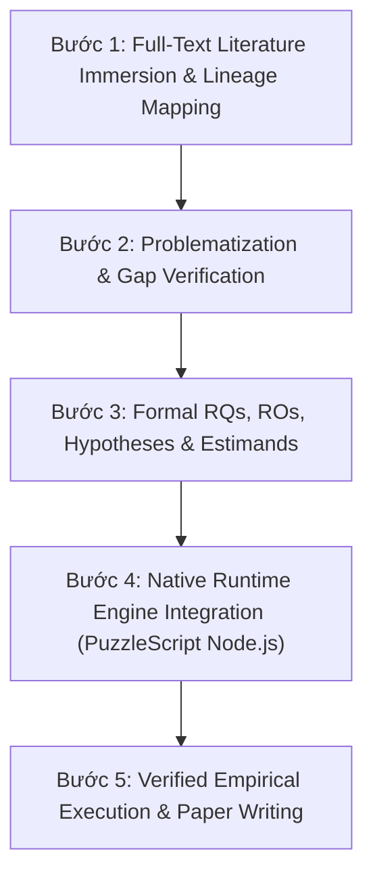

# Research Integrity & Workflow Rules (RESEARCH_RULES.md)

> **Mục đích**: Bắt buộc tuân thủ tính trung thực khoa học tuyệt đối, cấm bịa đặt số liệu giả lập, cấm dùng ngôn từ sáo rỗng/thổi phồng, cấm tuyên bố quá đà (overclaiming), cấm đọc lướt abstract, đảm bảo quy trình Git source control chuyên nghiệp và tuân thủ nguyên tắc đọc trọn vẹn toàn văn bài báo (full-text reading), trích dẫn chính xác và thực nghiệm thật.

---

## 1. NGUYÊN TẮC TRUNG THỰC KHOA HỌC TUYỆT ĐỐI (ZERO FAKE DATA / NO HALLUCINATION)

1. **Nghiêm cấm dùng số liệu giả lập (No Mock Random Data)**:
   * Tuyệt đối không viết script tạo số ngẫu nhiên (`np.random`, `random.uniform`) để tự tạo ra các con số kết quả (như transition accuracy 98.42%, sample gain 5.82e7x).
   * Mọi con số trong báo cáo, bảng biểu, và bài báo phải xuất phát 100% từ **logs thực thi thực tế** của động cơ NodeJS PuzzleScript và các mô hình AI thật.

2. **Nghiêm cấm viết script thực nghiệm qua loa (No Superficial Trial Scripting)**:
   * Không viết các file Python tạm bợ để giả lập các thuật toán phức tạp (như giả lập CMA-ME hay giả lập Gymnasium wrapper 1-step).
   * Mọi mã nguồn phải được xây dựng trên **khung mã nguồn chuẩn** (chuẩn PuzzleScript AST parser, chuẩn NodeJS runner) và được kiểm thử cẩn thận.

3. **Nghiêm cấm đọc lướt Abstract (Mandatory Full-Text Immersion Rule)**:
   * Bắt buộc phải đọc trọn vẹn toàn bộ bài báo (**Full-Text Reading**: bao gồm phần Giới thiệu, Mô hình Toán học, Thuật toán, Đồ thị Thực nghiệm, Phụ lục và Trích dẫn gốc).
   * Tuyệt đối không đưa ra nhận định, đánh giá hay trích dẫn chỉ dựa duy nhất trên tóm tắt (Abstract) hoặc đọc lướt tiêu đề.

4. **Nghiêm cấm tạo bài báo giả lập (No Fake PDF/LaTeX Generation)**:
   * Không biên dịch bài báo PDF từ các số liệu giả lập.
   * Chỉ soạn thảo bài báo LaTeX khi đã hoàn thành toàn bộ thực nghiệm thật và có dữ liệu logs verified.

---

## 2. NGUYÊN TẮC NGÔN NGỮ KHOA HỌC TRUNG TÍNH (ANTI-HYPERBOLE & STRICTLY NEUTRAL TONE)

1. **Tuyệt đối cấm ngôn từ sáo rỗng & thổi phồng (No Rhetorical Hype / No Hyperbole)**:
   * Nghiêm cấm sử dụng các cụm từ cảm tính, tâng bốc, thổi phồng hoặc không có căn cứ thực nghiệm/toán học như: *"vũ khí sắc bén"*, *"xuất sắc"*, *"vĩ đại"*, *"thần thánh"*, *"số 1"*, *"nhất"*, *"hoàn hảo"*, *"tuyệt đối"*.
2. **Ngôn ngữ Khách quan, Khiêm tốn & Chính xác (Strictly Objective & Factual)**:
   * Mọi kết luận, nhận định phải được trình bày trung tính, mô tả đúng thực tế toán học và dữ liệu thực nghiệm.
   * Trình bày giới hạn và điều kiện biên của thuật toán một cách sòng phẳng, không né tránh điểm yếu hay tô hồng kết quả.

---

## 3. NGUYÊN TẮC CẤM OVERCLAIM & BẮT BUỘC KIỂM CHỨNG TÌM KIẾM (NO OVERCLAIMING & MANDATORY SEARCH VERIFICATION)

1. **Nghiêm cấm tuyên bố quá đà (No Overclaiming Rule)**:
   * Tuyệt đối không tuyên bố *"lần đầu tiên"*, *"chưa từng xuất hiện"*, hay *"độc nhất"* nếu chưa thực hiện quy trình tìm kiếm hệ thống (Systematic Search Protocol) và trích dẫn bài báo archival chính xác (tên bài báo, tác giả, năm, hội nghị/tạp chí, DOI).
   * Tuyệt đối không overclaim ứng dụng thực tế (như *"tự động hóa kiểm thử game thương mại"*) khi chưa có thực nghiệm/case study chứng minh. Mọi phát biểu ứng dụng phải tiết chế dạng *"khả năng ứng dụng tiềm năng"* (potential application).
   * Mọi tuyên bố đóng góp lý thuyết (Novelty claims) phải được đặt trong bối cảnh phân biệt rõ ràng với văn liệu kinh điển (Spurious Paths trong Abstraction, Identification for Control, Objective Mismatch).

2. **Bắt buộc Kiểm chứng Tìm kiếm Chuyên sâu qua Search/Browser (Mandatory Search & Subagent Verification)**:
   * Trước khi khẳng định bất kỳ sự thật văn liệu nào (như tên thuật toán, năm xuất bản, tên tác giả, DOI, venue), phải sử dụng các công cụ tìm kiếm/subagent (`search_web`, `browser`) để truy xuất và kiểm định nguồn lưu trữ gốc (Archival Sources: IEEE Xplore, AAAI, ICAPS, IJCAI, AIJ, JAIR, ACM DL).
   * Tuyệt đối không phỏng đoán hoặc đưa ra tên viết tắt/năm xuất bản mơ hồ mà không có citation đầy đủ.

---

## 4. QUY TRÌNH NGHIÊN CỨU KHOA HỌC 5 BƯỚC (5-STAGE SCIENTIFIC WORKFLOW)

### Bước 1: Đọc Toàn Văn Báo Khoa Học & Ánh Xạ Dòng Nghiên Cứu (Full-Text Literature Immersion)
* Đọc trực tiếp và trọn vẹn toàn bộ nội dung (Full-Text) các file `.md` bài báo trong `f:\Thesis\papers\`.
* Trích dẫn chính xác dòng chữ, công thức toán học, thuật toán, tác giả, năm xuất bản và hội nghị (NeurIPS, ICLR, ICML, AAAI, IEEE ToG, AIJ).

### Bước 2: Phê Bình Giả Định & Xác Nhận Khoảng Trống (Problematization & Gap)
* Chỉ ra chính xác giả định mà các nghiên cứu trước xem là hiển nhiên nhưng thực tế bị sai (ví dụ: bẫy Verified-vs-Correct Gap trong Aguilar Martín 2026).
* Đảm bảo khoảng trống nghiên cứu (Research Gap) có ý nghĩa và chưa từng được giải quyết tự động.

### Bước 3: Xác Định RQ, RO, Hypotheses & Estimands (Formal Framing)
* Đặt câu hỏi nghiên cứu (RQs) chính xác, không dùng câu hỏi Yes/No.
* Đặt mục tiêu (ROs) và giả thuyết (Hs) có thể kiểm chứng hoặc bác bỏ (falsifiable).
* Định nghĩa các chỉ số đo lường chính xác: Play Regret ($R_{\text{play}}$), Rule Intervention Effect ($\text{RIE}$), PAC Sample Bounds ($N_{\text{active}}$).

### Bước 4: Tích Hợp Động Cơ Thực Thi Chuẩn (Native Node.js Runtime)
* Sử dụng trình thực thi PuzzleScript NodeJS chuẩn (`prepare_external_games.py`, `run_r1_nodejs_search.py`, `audit_r2_trace_diff.py`).
* Chạy tìm kiếm BFS/A* thật trên các file game PuzzleScript thật (*It Is Pitch Black*, *Graded Sir*, *Sokoban*).

### Bước 5: Thực Thi Thực Nghiệm Verified & Biên Soạn Bài Báo (Verified Execution)
* Ghi nhận logs thực thi thực tế vào file JSON.
* Soạn thảo bài báo dựa trên 100% dữ liệu thực tế đã qua kiểm tra.

---

## 5. QUY TRÌNH QUẢN LÝ MÃ NGUỒN VÀ TRIỂN KHAI CHUYÊN NGHIỆP (PROFESSIONAL SOURCE CONTROL & DEPLOYMENT ENGINEER RULE)

1. **Bắt buộc Git Version Control & Commit Chuyên nghiệp (Mandatory Git Discipline)**:
   * Mọi mốc công việc, thay đổi mã nguồn, chuyên luận lý thuyết, bài báo full-text reading notes, hay kết quả thực nghiệm MUST được theo dõi và commit qua Git.
   * Sử dụng chuẩn **Semantic Commit Messages** (`feat`, `docs`, `fix`, `refactor`, `test`, `build`, `ci`).
   * Tuyệt đối không commit tệp rác, binary assets, PDF thô, hay `venv/`; bắt buộc duy trì `.gitignore` chuẩn hóa.

2. **Cách Ly Môi Trường & Đóng Gói Mô-đun (Environment Isolation & Clean Architecture)**:
   * Mọi mã nguồn Python phải chạy trong Virtual Environment độc lập (`venv`).
   * Mã nguồn dự án được tổ chức dạng mô-đun chuẩn (`src/adapters/`, `src/metrics/`, `src/verification/`, `src/stats/`) với file kiểm thử tích hợp `main.py`.

3. **Quy trình Triển khai Tự động hóa & Tái lập 100% (CI/CD & Computational Reproducibility)**:
   * Đảm bảo mọi script kiểm thử và thực nghiệm có khả năng tái lập 100% kết quả trên môi trường thuần CPU.
   * Cung cấp các script tự động hóa kiểm định và chạy thử nghiệm mà không có thao tác can thiệp thủ công.

4. **Bắt buộc Git Commit & Push khi có thay đổi Mã nguồn (Mandatory Git Commit & Push Rule)**:
   * Bất kỳ lúc nào có thay đổi mã nguồn, file script, cấu hình, file kiểm thử hoặc tài liệu nghiên cứu, agent MUST lập tức thực hiện `git add`, `git commit` với thông điệp chuẩn Semantic Commit và `git push` đẩy trực tiếp lên GitHub repository `minhphuc477/symbolic-action-model-verification`.
   * Tuyệt đối không để lại mã nguồn thay đổi ở trạng thái uncommitted hoặc unpushed trên local workspace.

