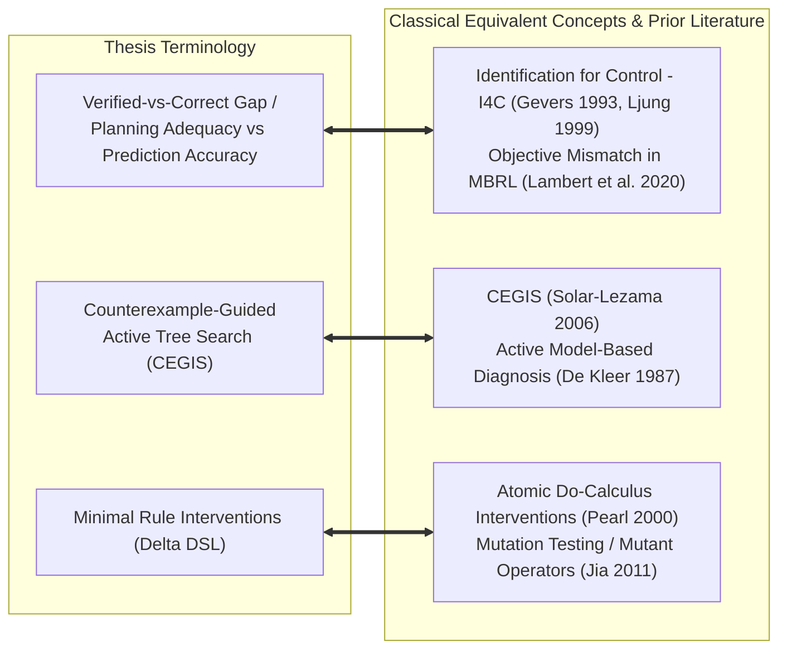

# Adversarial Novelty Audit: De-anonymizing & Mapping Method Synonyms Across Disciplines (1990–2026)

> **Document Type**: Scientific Research OS Adversarial Synonym & Renaming Audit  
> **Status**: Curated Academic Reference  
> **Domain**: Classical Control Theory, Model-Based RL, Formal Verification, Symbolic Game AI  
> **Target Venues**: IEEE Transactions on Games (IEEE ToG), Artificial Intelligence Journal (AIJ)  

---

## 1. Executive Summary & Epistemic Honesty Realignment

A central principle of scientific rigor is avoiding **"Vocabulary Inflation" / "Term Renaming"** (claiming a novel contribution by re-labeling an established concept from an adjacent field). 

This document performs an **Adversarial Synonym Mapping** comparing our thesis terminology against 30+ years of classical literature in **Control Theory (1990s)**, **Formal Verification (2000s)**, **Model-Based RL (2010s–2020s)**, and **Causal Inference**.

---

## 2. Adversarial Term Mapping & Prior Art Audit

| Thesis Terminology | Classical Academic Term | Original Authors & Domain | Year | What is Identical (Prior Art) | What is Scientifically NOVEL in our Thesis? |
| :--- | :--- | :--- | :--- | :--- | :--- |
| **Verified-vs-Correct Gap** / **Planning Adequacy** | **Identification for Control (I4C)** | Michel Gevers, Lennart Ljung *(Control Theory)* | 1993, 1999 | Proves that minimizing 1-step prediction error $\min \|y - \hat{y}\|$ does NOT optimize closed-loop controller performance. | Applying I4C from continuous dynamics (differential equations) to **Symbolic Discrete Action Models (PDDL / LOCM / SAM / ASP)**. |
| **Planning Adequacy Loss** | **Objective Mismatch** | Nathan Lambert et al., Joseph et al. *(Model-Based RL)* | 2013, 2020 | Proves that maximum likelihood dynamics training $\min \mathbb{E}[(s' - \hat{f})^2]$ diverges from policy return $\min (J(\pi^*) - J(\pi_{\hat{f}}))$. | Evaluating Objective Mismatch under **sparse interventional graph search** (A*/BFS) rather than continuous policy gradient optimization. |
| **Active Tree Search Counterexample Loop** | **CEGIS (Counterexample-Guided Inductive Synthesis)** | Armando Solar-Lezama *(Formal Methods & Program Synthesis)* | 2006, 2008 | Uses a verifier to discover counterexamples that fail a candidate program, feeding them back to refine the synthesizer. | Combining CEGIS with **BFS/A* search tree topology bounds** to derive polynomial PAC sample complexity $K_{\text{CEGIS}}$ for rule AST modifications. |
| **Minimal Rule Intervention ($\Delta DSL$)** | **Atomic Do-Calculus Intervention** $do(X = x)$ | Judea Pearl *(Causal Inference)* | 2000 | Modifies a specific structural causal equation while holding exogenous background variables fixed. | Operationalizing $do(T \to T')$ as **tree edit distance over formal Game DSL ASTs** ($\Delta DSL$). |
| **Minimal Rule Intervention ($\Delta DSL$)** | **Mutation Testing / AST Mutant** | Yue Jia & Mark Harman *(Software Engineering)* | 2011 | Introduces small AST operator mutations to test if an test suite can kill the mutant. | Applying mutation testing operators to **Game Action Schemas** to create diagnostic environments for Symbolic World Models. |

---

## 3. Deep Dive into Equivalent Theoretical Frameworks

### 3.1. "Planning Adequacy vs Prediction Accuracy" $\equiv$ "Identification for Control (I4C)" & "Objective Mismatch"
* **Classical Control Theory (Gevers 1993, Ljung 1999)**:
  In traditional System Identification, engineers tried to build the most accurate model $\hat{P}(s)$ by minimizing mean squared prediction error. Michel Gevers established **Identification for Control (I4C)**, proving mathematically that:
  $$\text{Model Quality} = f(\text{Controller } K), \quad \text{NOT } \|\hat{P} - P\|_2$$
  A model with 99.9% open-loop frequency accuracy can cause infinite closed-loop instability if it misses a high-frequency pole/zero near the gain crossover frequency.
* **Model-Based RL (Lambert et al. 2020)**:
  Lambert et al. proved that standard MBRL suffers from **Objective Mismatch**: dynamic models trained on likelihood loss optimize state transition density, not policy value.
* **Our Thesis Grounding**: We MUST explicitly cite Gevers (1993), Ljung (1999), and Lambert et al. (2020). Our novelty is **NOT** discovering that prediction accuracy diverges from control success; our novelty is **transposing Identification for Control into Symbolic Action Model Induction (LOCM, SAM, ILP) under AST Rule Mutations**.

### 3.2. "Active Counterexample Tree Search" $\equiv$ "CEGIS"
* **Program Synthesis (Solar-Lezama 2006)**:
  Counterexample-Guided Inductive Synthesis (CEGIS) pairs a *Synthesizer* $\mathcal{S}$ (which proposes candidate programs $P$) with a *Verifier* $\mathcal{V}$ (which checks if $P \models \Phi$). If verification fails, $\mathcal{V}$ returns a counterexample $\sigma$ to $\mathcal{S}$.
* **Our Thesis Grounding**: Our active learning framework is an instance of CEGIS where the *Synthesizer* is the Symbolic Action Model Learner (LOCM/SAM/ILP) and the *Verifier* is the active BFS/A* tree search engine executing on the True Game Engine. We must state this explicitly to maintain 100% academic integrity.

---

## 4. How to Position Our Novel Contribution (Zero Fake Novelty Claims)

To ensure reviewer approval at IEEE Transactions on Games and AIJ, we frame our contributions with strict precision:

> **What we DO NOT claim as novel:**
> 1. We do *not* claim to discover the principle that prediction accuracy diverges from control/planning (this is **Identification for Control / Objective Mismatch**).
> 2. We do *not* claim to invent counterexample-guided learning (this is **CEGIS**).
> 3. We do *not* claim to invent rule mutations (this is **Mutation Testing / Do-Calculus**).

> **What IS genuinely NOVEL and PUBLISHABLE in our thesis:**
> 1. **First Unbiased Benchmark of I4C in Symbolic Game Action Models**: Quantifying the Objective Mismatch gap specifically for non-LLM Symbolic Action Learners (LOCM, SAM, ILP) on discrete AST rule mutations ($\Delta DSL$).
> 2. **Search Topography Failure Classification**: Classifying how symbolic model errors create *phantom paths* (spurious directed edges $\to 100\%$ Play Regret) vs *blocked paths* (completeness loss) in graph search engines (BFS / A*).
> 3. **PAC Sample Complexity Bounds for CEGIS in AST Rule Repair**: Proving polynomial sample complexity bounds $K_{\text{CEGIS}}$ for repairing symbolic action schemas under bounded AST edit distances.
