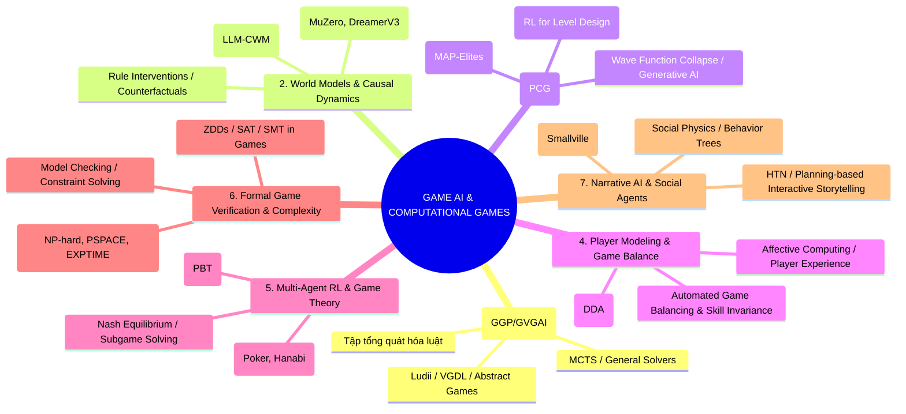
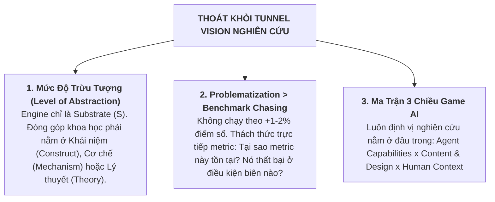

# BẢN ĐỒ TOÀN CẢNH NGHIÊN CỨU GAME AI & COMPUTATIONAL GAMES
## Bứt Phá Khỏi Tunnel Vision: Từ Nguyên Lý Thứ Nhất Đến Các Hướng Đi Hàng Đầu

> **Mục tiêu**: Loại bỏ hoàn toàn sự ràng buộc vào các engine hay mã nguồn cục bộ. Cung cấp góc nhìn toàn cảnh (*Broad Scientific Horizon*) về lĩnh vực **Game AI & Computational Games**, bao gồm 7 nhánh nghiên cứu chính, danh sách bài báo kinh điển/SOTA bắt buộc phải đọc, và kinh nghiệm phương pháp luận để xây dựng tầm nhìn nghiên cứu độc lập.

---

## I. 7 NHÁNH NGHIÊN CỨU LỚN TRONG LĨNH VỰC GAME AI & COMPUTATIONAL GAMES

---

## II. DANH SÁCH BÀI BÁO KINH ĐIỂN & SOTA BẮT BUỘC PHẢI ĐỌC (MUST-READ READING LIST)

### 1. Tác Phẩm Nền Tảng & Sách Sách Kinh Điển (Foundational Textbooks)
- **[Book] Yannakakis & Togelius (2018)**: *Artificial Intelligence and Games* (Springer) — Sách giáo khoa kinh điển phủ toàn bộ miền Game AI (Player Modeling, PCG, MCTS, Game Design).

### 2. General Game Playing & Generalization (GGP / GVGAI)
- **Genesereth et al. (2005)**: *General Game Playing: Overview of the AAAI Competition* (AAAI) — Đặt nền móng cho GGP.
- **Perez-Liebana et al. (2019)**: *The General Video Game AI Competition* (IEEE Transactions on Games) — Khung kiểm thử khả năng tổng quát hóa trên các trò chơi chưa từng thấy.
- **Browne et al. (2012)**: *A Survey of Monte Carlo Tree Search Methods* (IEEE CIAIG) — Tổng quan MCTS trong game.

### 3. World Models, Model-Based RL & Causal Reasoning
- **Ha & Schmidhuber (2018)**: *World Models* (NeurIPS) — Đặt nền móng cho kiến trúc World Model trong AI.
- **Schrittwieser et al. (2020)**: *Mastering Atari, Go, Chess and Shogi by Planning with a Learned Model* (MuZero - Nature) — Đỉnh cao Model-Based RL không cần biết trước luật game.
- **Hafner et al. (2023)**: *Mastering Diverse Domains through World Models* (DreamerV3) — World Model học trên không gian trạng thái liên tục và rời rạc.
- **Grimm et al. (2020)**: *The Value Equivalence Principle for Model-Based Reinforcement Learning* (NeurIPS) — Nguyên lý Value Equivalence cho World Model.
- **Aguilar Martín et al. (2026)**: *When a Verified World Model Still Loses: Play-Adequacy vs Prediction-Accuracy in LLM-Synthesized Code World Models* (ICLR 2026 - L446) — Bác bỏ ảo tưởng về Transition Accuracy.
- **Gao et al. (2026)**: *MirrorCraft: Paired Evaluation under Hidden Rule Changes in Minecraft* (arXiv:2607.29218 - L447) — Can thiệp luật cặp trên môi trường 3D.

### 4. Procedural Content Generation (PCG) & Quality-Diversity (QD)
- **Pugh, Soros, Stanley (2016)**: *Quality Diversity: A New Frontier for Evolutionary Computation* (Frontiers) — Đặt nền móng cho QD.
- **Gravina et al. (2019)**: *Procedural Content Generation through Quality Diversity* (IEEE Transactions on Games) — Ứng dụng MAP-Elites vào thiết kế màn chơi.
- **Khalifa et al. (2020)**: *PCGRL: Procedural Content Generation via Reinforcement Learning* (IEEE CoG) — Dùng RL để sinh nội dung game.

### 5. Multi-Agent RL, Game Theory & Poker/Esports
- **Brown & Sandholm (2019)**: *Superhuman AI for multiplayer poker* (Pluribus - Science) — Giải bài toán Poker thông tin không hoàn hảo.
- **Vinyals et al. (2019)**: *Grandmaster level in StarCraft II using multi-agent reinforcement learning* (AlphaStar - Nature) — MARL quy mô lớn trong môi trường thời gian thực.
- **Meta AI / FAIR (2022)**: *Human-level play in the game of Diplomacy by combining language models with strategic reasoning* (Cicero - Science) — Kết hợp LLM và Lý thuyết trò chơi.

### 6. Dynamic Difficulty Adjustment (DDA) & Game Balance
- **Hunicke & Chapman (2004)**: *AI for Dynamic Difficulty Adjustment in Games* (AAAI Workshop).
- **Zook & Riedl (2011)**: *A Temporal Model of Player Skill and Game Difficulty* (AAAI).
- **Preuss et al. (2014)**: *Towards Automated Game Balancing*.

---

## III. BỘ KINH NGHIỆM PHƯƠNG PHÁP LUẬN ĐỂ THOÁT BẪY TUNNEL VISION

### 1. Nguyên Tắc Mức Độ Trừu Tượng (Level of Abstraction)
* **Sai lầm Tunnel Vision**: "Luận văn của tôi là về PuzzleScript / Unity / Unreal / Chess Engine."
* **Tư duy Khoa học Chuẩn**: Engine chỉ là **môi trường thử nghiệm (Substrate $S$)**. Đóng góp khoa học của bạn nằm ở:
  - Khái niệm khoa học (*Construct*): Ví dụ: *Planning Adequacy*, *Rule Intervention Effect*, *Causal Abstraction*.
  - Cơ chế vận hành (*Mechanism*): Ví dụ: *Process Measurement*, *Severe Testing Protocol*.
  - Lý thuyết tổng quát (*Theory/Formal Bounds*): Định luật định lượng rủi ro $\mathrm{danger} = \mathrm{play\_cost} \times (1 - \mathrm{rarity})^N$.

### 2. Ma Trận 3 Chiều Trong Đề Tài Game AI
Mọi đề tài Game AI xuất sắc đều nằm tại điểm giao của 3 chiều:
1. **Chiều Agent Capabilities**: Planning, Reinforcement Learning, Model-Based Reasoning, Social/LLM Agents.
2. **Chiều Content & Design**: Game Rules, Mechanics, Level Generation, Automated Balancing.
3. **Chiều Human Context / Interaction**: Player Experience, Difficulty, Adaptability, Co-creation.

---

## IV. LỘ TRÌNH ĐỌC & ĐỊNH HÌNH TẦM NHÌN NGHIÊN CỨU (READING & STRATEGY PLAN)

1. **Tuần 1: Đọc Định Hướng (Orientation Pass)**
   - Đọc Sách giáo khoa *Yannakakis & Togelius (2018)* - Các chương 1, 3, 6, 7 để nắm toàn bộ bức tranh Game AI.
   - Đọc 2 bài báo tổng quan: *Perez-Liebana et al. (2019)* (GVGAI) và *Gravina et al. (2019)* (PCG-QD).

2. **Tuần 2: Đọc Sâu Về World Models & Planning (World Models Pass)**
   - Đọc *MuZero (Nature 2020)* $\rightarrow$ *DreamerV3 (2023)* $\rightarrow$ *Grimm et al. (NeurIPS 2020)*.
   - Đọc phản biện hiện đại: *L446 (ICLR 2026)* và *L447 (MirrorCraft 2026)*.

3. **Tuần 3: Chọn 1 Trong 3 Hướng Đột Phá Để Lập Đề Tài**
   - **Hướng 1: World Models & Zero-Shot Causal Rule Adaptation** (AI thích ứng luật chưa từng thấy).
   - **Hướng 2: Procedural Content Generation via Quality-Diversity (PCG-QD)** (Sinh màn chơi tự động đa dạng & cân bằng).
   - **Hướng 3: Player Experience & Dynamic Difficulty Adjustment (DDA)** (Tự động chỉnh độ khó theo kỹ năng người chơi).
