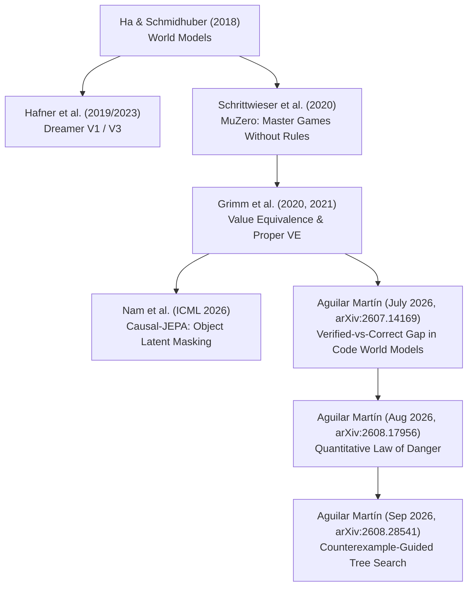
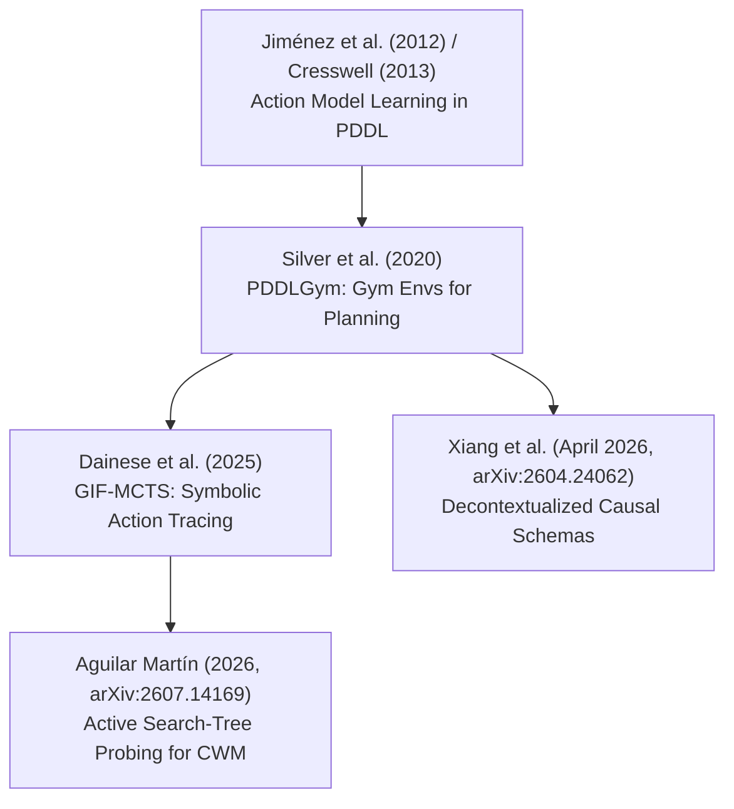
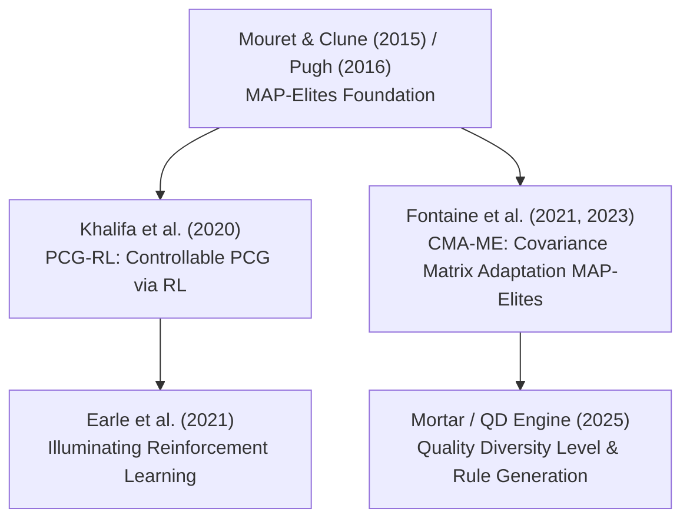
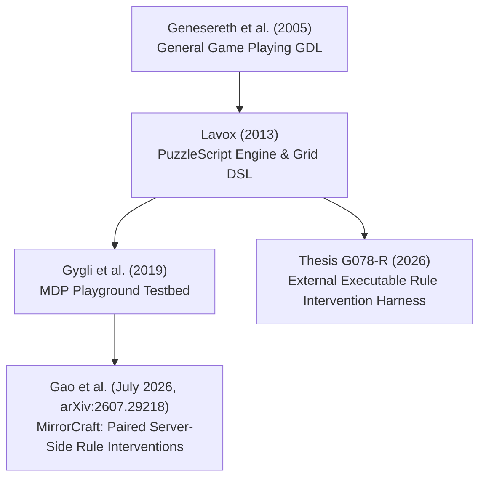

# Connected Papers Literature Flows & Citation Network (2021–2026)

> [!NOTE]
> This document maps out the connected papers network, explicit citation flows, and research lineages across **World Models**, **Action Model Learning**, **Quality-Diversity (PCG-QD)**, and **General Game Playing / Rule Interventions**.

---

## 1. Citation Lineage 1: World Models, Value Equivalence & Planning Adequacy

### Core Connection Mechanics:
- **Value Equivalence (Grimm et al. 2020/2021)**: World models need not match exact state transitions if they preserve value predictions under optimal policy $\pi^*$.
- **The Verified-vs-Correct Gap (Aguilar Martín 2026)**: Passive transition accuracy ($\ge 98\%$) masks omitted pivotal rules on unvisited tree branches, causing 100% play loss ($B = 0.091, 95\%\text{ CI }[0.065, 0.117]$).

---

## 2. Citation Lineage 2: Action Model Learning & Code World Models

### Core Connection Mechanics:
- **Symbolic Action Models vs Neural Code World Models**: PDDLGym established structured state-action learning. Modern Code World Models generate executable Python/JAX transition code, requiring active search-tree probing to verify rule correctness.

---

## 3. Citation Lineage 3: Procedural Content Generation & Quality-Diversity (PCG-QD)

### Core Connection Mechanics:
- **Quality-Diversity as Environment Probing**: MAP-Elites and CMA-ME generate diverse game levels/rules that serve as stress tests for world model planning adequacy.

---

## 4. Citation Lineage 4: General Game Playing & Paired Rule Interventions

### Core Connection Mechanics:
- **Rule Intervention Sensitivity**: MirrorCraft proves static agents collapse under paired server-side rule modifications, highlighting the necessity of causal execution feedback over passive prompt context.

---

## 5. Master Connected Papers Matrix

| Paper / Reference | Year | Lineage | Core Citation Dependency | Primary Contribution to Thesis |
|---|---|---|---|---|
| **Aguilar Martín (arXiv:2607.14169)** | 2026 | World Models | MuZero / Value Equivalence | Verified-vs-Correct Gap in Code World Models |
| **Gao et al. (arXiv:2607.29218)** | 2026 | Rule Interventions | General Game Playing / MDP Playground | Paired server-side rule intervention benchmark |
| **Nam et al. (ICML 2026)** | 2026 | World Models | JEPA / Object Representation | Latent object masking for causal world models |
| **Xiang et al. (arXiv:2604.24062)** | 2026 | Action Models | PDDLGym / Symbolic Planning | Decontextualized causal schemas & rule transfer |
| **Dainese et al. (2025)** | 2025 | Action Models | MCTS / Code Generation | GIF-MCTS active search-tree rollouts |
| **Grimm et al. (2020, 2021)** | 2021 | World Models | RL Value Function Theory | Value Equivalence and Proper Value Equivalence |
| **Fontaine et al. (2021, 2023)** | 2023 | PCG-QD | MAP-Elites | CMA-ME quality diversity optimization |
| **Silver et al. (2020)** | 2020 | Action Models | PDDL / OpenAI Gym | PDDLGym benchmark for action model learning |
| **Hafner et al. (2019, 2023)** | 2023 | World Models | Latent Dynamics Models | Dreamer V1/V2/V3 latent world model architecture |
