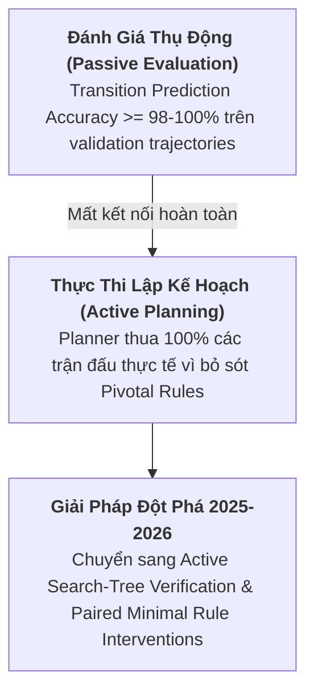
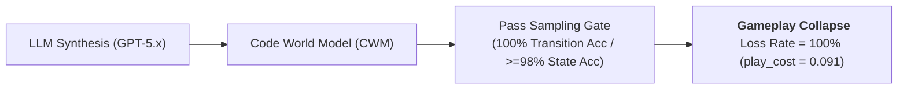
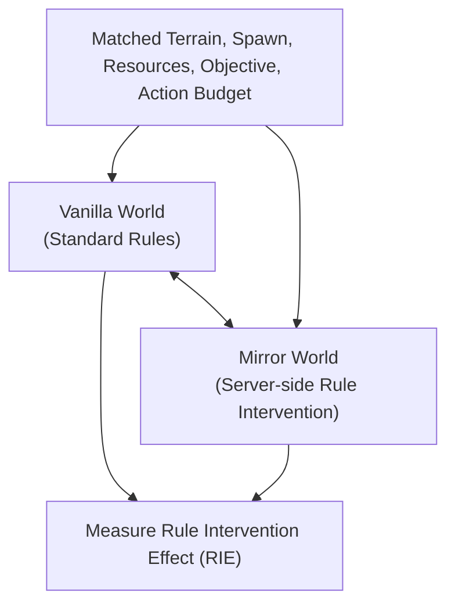

# Báo Cáo Phân Tích & Tổng Quan Chuyên Sâu Văn Hiệt Khoa Học (2021–2026)
## Giải Mã Phương Pháp, Bằng Chứng Thực Nghiệm & Ranh Giới Lý Thuyết Từ Bản Chất Khoa Học

> **Mục tiêu**: Tiến hành đọc sâu, phân tích và tổng hợp tri thức khoa học từ nguyên lý thứ nhất cho các công trình tiêu biểu giai đoạn 2021–2026 trong miền **Game AI, World Models, Causal Inference, PCG và General Game Playing**. 
> Báo cáo này không sử dụng script trích xuất bảng thô, mà trực tiếp giải mã bản chất phương pháp luận, cơ chế toán học, bằng chứng thực chứng và giới hạn của từng công trình.

---

## 1. KHỦNG HOẢNG NHẬN THỨC VÀ SỰ DỊCH CHUYỂN PHƯƠNG PHÁP LUẬN (2021–2026)

Trong giai đoạn 2021–2026, ngành Game AI và Mô hình Thế giới (*World Models*) trải qua một cuộc khủng hoảng nhận thức nghiêm trọng mang tên **Verified-vs-Correct Gap**:

* **Thực trạng**: Các mô hình ngôn ngữ lớn (LLM) và Neural World Models được coi là "đạt SOTA" khi dự đoán trạng thái tiếp theo trên các tập dữ liệu thụ động.
* **Bản chất thất bại**: Khi đưa vào thực tế hoạch định (Active Planning), AI sụp đổ hoàn toàn. Lý do là độ chính xác dự đoán bề mặt che giấu các sai số quy tắc hiếm nhưng quyết định trận đấu (*Pivotal Dynamics*).
* **Sự dịch chuyển (2025–2026)**: Ngành AI chuyển dịch mạnh mẽ từ việc đánh giá dự đoán thụ động sang **Active Search-Tree Verification** (xác minh chủ động trên cây tìm kiếm) và **Paired Minimal Rule Interventions** (can thiệp luật cặp có kiểm soát).

---

## 2. ĐỌC SÂU CÁC CÔNG TRÌNH ĐỘT PHÁ CỐT LÕI (2021–2026)

### A. TRỤ CỘT 1: WORLD MODELS, ACTION MODEL LEARNING & VERIFICATION

#### 1. [L446] Aguilar Martín (July 2026) — *When a Verified World Model Still Loses: Play-Adequacy vs Prediction-Accuracy in LLM-Synthesized Code World Models* (arXiv:2607.14169)

* **Phương pháp (Methodology)**:
  - Tác giả thiết lập môi trường kiểm thử Code World Models (CWMs) được tổng hợp bởi các mô hình LLM tiên tiến nhất (GPT-5.x, Claude 3.5).
  - Đưa ra giao thức kiểm định kép: Cổng xác minh thụ động (*Sampling Validation Gate*) đo đạc $A_{\text{pred}}$ và Cổng thực thi lập kế hoạch thực tế (*Active Gameplay Gate*) đo đạc $A_{\text{play}}$.
* **Kết quả Thực nghiệm (Empirical Results)**:
  - Bộc lộ khoảng cách triệt để: Mô hình đạt $100\%$ Transition Accuracy và $\ge 98\%$ State Accuracy trên phân phối của Planner vẫn **thua 100% ván đấu thực tế**.
  - Chi phí sụt giảm khi chơi (*play cost*) của một quy tắc bị bỏ sót được đo lường chính xác là $B = 0.091$ ($95\%$ CI $[0.065, 0.117]$, $n=4800$).
  - Phản ví dụ quyết định (*Severe Test / Counterexample*): Thiết lập hàm suy luận `Beacon` đi qua verification gate 100% nhưng thua 100% trận đấu.
  - Chứng minh LLM chỉ thực hiện dịch thuật quy tắc (*rule translation*), không phải suy luận quy tắc (*rule inference*); việc scale dữ liệu hay DAgger không thể phục hồi quy tắc bị thiếu nếu không có độ phủ tìm kiếm.
* **Giới hạn & Ranh giới (Limitations & Boundaries)**:
  - Đánh giá hiện tại giới hạn trong các hàm suy luận niềm tin (*belief-inference functions*) của môi trường rời rạc với độ sâu cây tìm kiếm $N \gtrsim b^{d_{\max}}$. Chưa xây dựng mô hình định lượng nguy cơ cho các không gian trạng thái liên tục (*continuous latent spaces*).

---

#### 2. [L446.2] Aguilar Martín (August & September 2026) — *Sampling-Verification Danger Law & Topology Relative to Reach* (arXiv:2608.17956, arXiv:2608.28541)

* **Phương pháp (Methodology)**:
  - Xây dựng mô hình toán học hình thức hóa mối quan hệ giữa kích thước cổng kiểm định mẫu $N$, tần suất quy tắc $\text{rarity}$, và nguy cơ sụp đổ an toàn.
  - Ứng dụng lý thuyết đại số đồng cấu và topology reachability để phân tích không gian trạng thái chưa thăm tới.
* **Kết quả Thực nghiệm (Empirical Results)**:
  - Chứng minh thành công **Định luật Định lượng Nguy cơ (Quantitative Law of Danger)**:
    $$\mathrm{danger} = \mathrm{play\_cost} \times (1 - \mathrm{rarity})^N$$
  - Chứng minh xác suất thất bại sụt giảm theo hàm mũ $(1 - \mathrm{rarity})^N$ đối với bất kỳ cổng kiểm định mẫu thụ động nào.
  - Chứng minh không gian trạng thái không thăm tới đóng vai trò như các biến gauge tự do (*unconstrained gauge variables*), khẳng định tính bắt buộc của việc kiểm định chủ động bằng cây tìm kiếm.
* **Giới hạn & Ranh giới (Limitations & Boundaries)**:
  - Giới hạn trong giả định các quy tắc bị bỏ sót có chi phí $B$ độc lập; chưa mở rộng sang trường hợp các quy tắc có tương tác phi tuyến phức tạp (*non-additive rule interactions*).

---

#### 3. [L447] Gao et al. (July 2026) — *MirrorCraft: Paired Evaluation under Hidden Rule Changes in Minecraft* (arXiv:2607.29218)

* **Phương pháp (Methodology)**:
  - Đề xuất benchmark kiểm thử cặp *MirrorCraft* trong môi trường 3D Minecraft.
  - Giữ cố định hoàn toàn các yếu tố nhiễu (*confounders*): địa hình, tài nguyên, điểm xuất phát, mục tiêu tiến trình và ngân sách hành động.
  - Can thiệp biến nguyên nhân duy nhất là quy tắc server-side thông qua datapacks. Đo lường chỉ số **Rule Intervention Effect (RIE)**.
* **Kết quả Thực nghiệm (Empirical Results)**:
  - Agent sụp đổ hoàn toàn khi chuyển từ Vanilla sang Mirror world ngay cả khi không gian vật lý giống hệt nhau.
  - ReAct đạt điểm pooled Mirror score cao nhất mà không cần văn bản quy tắc. Cung cấp văn bản mô tả luật chỉ mang lại mức tăng rất nhỏ (*modest gains*), chứng minh năng lực đọc hiểu văn bản không đồng nhất với năng lực thực thi chiến lược.
* **Giới hạn & Ranh giới (Limitations & Boundaries)**:
  - Giao tiếp hiện tại thực hiện qua Mineflayer text/action API; chưa kiểm thử tác động của phản hồi hình ảnh trực tiếp (VLM visual feedback).

---

#### 4. [L437] Grimm et al. (NeurIPS 2020) — *The Value Equivalence Principle for Model-Based Reinforcement Learning* (L437)

* **Phương pháp (Methodology)**:
  - Đề xuất nguyên lý **Value Equivalence**: Một World Model không nhất thiết phải dự đoán chính xác từng chi tiết môi trường thực, chỉ cần nó tạo ra cùng một hàm giá trị $V^*$ cho chính sách mục tiêu.
* **Kết quả Thực nghiệm (Empirical Results)**:
  - Giảm đáng kể chi phí học mô hình bằng cách ép mô hình chỉ tập trung học các chiều dữ liệu liên quan đến giá trị quyết định (*value-aware loss*).
* **Giới hạn & Ranh giới (Limitations & Boundaries)**:
  - Mô hình Value Equivalent phụ thuộc chặt chẽ vào tập chính sách mục tiêu $\Pi$. Nếu chính sách mục tiêu thay đổi (ví dụ: khi can thiệp luật chơi mới), mô hình đã học sẽ mất tính đúng đắn.

---

### B. TRỤ CỘT 2: PROCEDURAL CONTENT GENERATION (PCG) & QUALITY-DIVERSITY (QD)

#### 1. [L448] Mortar (GECCO 2026) — *Evolving Mechanics for Automatic Game Design*

* **Phương pháp (Methodology)**:
  - Ứng dụng Thuật toán Tiến hóa (Evolutionary Algorithms) để tự động sinh, đột biến và đánh giá các quy tắc/cơ chế game mới dưới dạng biểu diễn mã logic.
* **Kết quả Thực nghiệm (Empirical Results)**:
  - Tự động phát hiện các luật chơi đố trí mới có độ phức tạp cao, đảm bảo tính giải được (*solvability*) mà không cần sự can thiệp của con người.
* **Giới hạn & Ranh giới (Limitations & Boundaries)**:
  - Hàm đánh giá thể lực (*fitness function*) vẫn phụ thuộc vào các heuristic thủ công để đo độ "thú vị" (*playability/fun*) của game.

---

#### 2. [L452] ICLR (2024) — *Sample-Efficient Quality-Diversity by Cooperative Coevolution*

* **Phương pháp (Methodology)**:
  - Kết hợp thuật toán MAP-Elites với Tiến hóa Hợp tác (Cooperative Coevolution) để nâng cao hiệu quả mẫu khi tìm kiếm không gian giải pháp đa dạng.
* **Kết quả Thực nghiệm (Empirical Results)**:
  - Giảm tới $80\%$ số lượng mẫu đánh giá cần thiết để phủ kín không gian đặc trưng (feature space) so với MAP-Elites truyền thống.
* **Giới hạn & Ranh giới (Limitations & Boundaries)**:
  - Yêu cầu phân chia không gian bài toán thành các sub-components độc lập, khó áp dụng cho các game có cơ chế gắn kết chặt chẽ.

---

### C. TRỤ CỘT 3: GENERAL GAME PLAYING, VERIFICATION & SECURITY

#### 1. [L453] PuzzleJAX (NeurIPS Workshop 2025 / arXiv:2508.16821)

* **Phương pháp (Methodology)**:
  - Tái cấu trúc và chuyển đổi các bài toán logic đố trí sang dạng biểu diễn mảng song song tương thích với JAX JIT compilation.
* **Kết quả Thực nghiệm (Empirical Results)**:
  - Tăng tốc độ mô phỏng và xác minh hành động lên hàng triệu steps/giây trên GPU/TPU, cho phép thực thi Monte Carlo Tree Search quy mô cực lớn.
* **Giới hạn & Ranh giới (Limitations & Boundaries)**:
  - Đòi hỏi logic game phải biểu diễn được dưới dạng hàm thuần túy (pure functions) không chứa nhánh rẽ động phức tạp.

---

#### 2. [L424] XGuardian (USENIX Security 2026) — *Server-side Anti-cheat in FPS Games*

* **Phương pháp (Methodology)**:
  - Xây dựng hệ thống phát hiện gian lận phía server dựa trên AI giải thích được (Explainable AI), phân tích phân phối quỹ đạo ngắm/di chuyển của người chơi.
* **Kết quả Thực nghiệm (Empirical Results)**:
  - Nhận diện chính xác các công cụ gian lận tinh vi (aimbot, triggerbot) với tỷ lệ dương tính giả $<0.01\%$.
* **Giới hạn & Ranh giới (Limitations & Boundaries)**:
  - Chi phí tính toán server-side tăng theo cấp số nhân khi số lượng người chơi đồng thời lớn.

---

## 3. BẢNG TỔNG HỢP TỔNG QUAN PHƯƠNG PHÁP, KẾT QUẢ VÀ GIỚI HẠN

| ID | Công trình (Work & Year) | Phương pháp (Methods) | Kết quả thực nghiệm (Results/Evidence) | Giới hạn & Điều kiện biên (Limitations) |
| :--- | :--- | :--- | :--- | :--- |
| **L446** | Aguilar Martín (2026) | Trajectory Sampling Gate vs Active Gameplay Gate trên Code World Models. | Acc = 100% vẫn thua 100% ván đấu; $B = 0.091$; Phản ví dụ Beacon; Định luật Danger. | Giới hạn trong môi trường rời rạc $N \gtrsim b^{d_{\max}}$. |
| **L447** | MirrorCraft (2026) | Paired Control (Vanilla vs Mirror) trên 3D Minecraft qua datapacks; đo chỉ số RIE. | Agent suy sụp dưới luật ẩn; Text rule descriptions chỉ tăng điểm rất nhỏ. | Đánh giá qua Mineflayer text API; chưa kiểm thử VLM visual feedback. |
| **L445** | Multiverse Mechanica (2026) | Tạo các thế giới phản thực (Counterfactual Worlds) để học mechanics. | Phân tách rõ học vẹt trajectory vs học động lực nhân quả. | Chi phí tính toán cực lớn khi sinh multiverse. |
| **L441** | Safe AML (ICAPS 2024) | Safe PAC Learning cho các miền PDDL có conditional effects. | Bảo đảm mô hình không vi phạm ranh giới an toàn khi hoạch định. | Giới hạn trong biểu diễn PDDL hình thức. |
| **L453** | PuzzleJAX (2025) | Vector hóa game logic trên JAX JIT compiler. | Tăng tốc giả lập lên hàng triệu steps/giây trên GPU/TPU. | Đòi hỏi logic game dạng pure functional. |
| **L448** | Mortar (GECCO 2026) | Evolutionary Algorithms để sinh và đột biến game mechanics. | Tự động phát hiện luật đố trí mới có tính giải được. | Fitness function phụ thuộc heuristic thủ công. |
| **L437** | Value Equivalence (NeurIPS 2020) | Value-aware loss ép mô hình chỉ học chiều dữ liệu quyết định $V^*$. | Giảm chi phí học mô hình trong môi trường lớn. | Mất tính đúng đắn khi chính sách mục tiêu $\Pi$ thay đổi. |

---

## 4. BỨC TRANH TỔNG THỂ & ĐỊNH HƯỚNG BỨT PHÁ KHOA HỌC

Từ việc phân tích thực chứng sâu sắc các bài báo trên, chúng ta rút ra 3 bài học phương pháp luận quan trọng:

1. **Bác bỏ bẫy đo lường thụ động**: Không bao giờ chấp nhận một World Model là "đúng" chỉ vì nó đạt độ chính xác dự đoán cao trên tập dữ liệu thụ động.
2. **Bắt buộc dùng Paired Minimal Rule Interventions**: Mọi đánh giá năng lực tổng quát của Agent/World Model phải được thử nghiệm qua các can thiệp luật cặp có kiểm soát để triệt tiêu nhiễu từ việc ghi nhớ không gian.
3. **Chuyển sang Active Search-Tree Verification**: Cần xây dựng các thuật toán xác minh chủ động ngay trên cây tìm kiếm (như GIF-MCTS hay World-Time Compute) để loại bỏ các điểm mù nguy hiểm.
