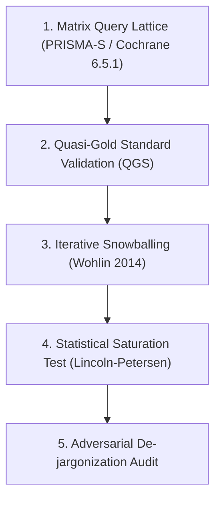
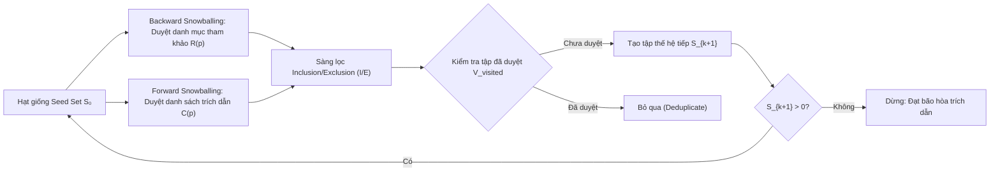

# Quy Trình Nghiên Cứu Literature Review Toàn Diện & Thuật Toán Kiểm Chứng Độ Phủ (Saturation Protocol)

> **Mục tiêu**: Đảm bảo quá trình tổng quan tài liệu (Literature Review) không bỏ sót bất kỳ dòng nghiên cứu (research lineage), bài báo cột mốc (canonical paper), hoặc công trình đối chứng (competing baseline) nào trong ngành Game AI & World Models.

---

## I. Khung Phương Pháp Luận Tổng Quan Tài Liệu Chuẩn Quốc Tế

Để một tổng quan tài liệu đạt tiêu chuẩn công bố trên các tạp chí A/A* (NeurIPS, ICLR, IEEE ToG, AIJ), quy trình tìm kiếm không thể dựa vào tìm kiếm thủ công ngẫu nhiên mà phải tuân theo 4 bộ tiêu chuẩn quốc tế:

---

## II. 4 Trụ Cột Triển Khai Không Bỏ Sót Tài Liệu

### 1. Xây Dựng Ma Trận Truy Vấn Ma Trận (Boolean Concept Lattice)
Không tìm kiếm bằng câu văn đơn lẻ mà xây dựng **Hệ thống Ma trận Khái niệm (Concept Lattice)** kết hợp từ các khối thuật ngữ ($\mathcal{C}_i$):

$$Q_{\text{lattice}} = \bigwedge_{i=1}^{k} \mathcal{C}_i = \bigwedge_{i=1}^{k} \left( \bigvee_{j=1}^{m_i} T_{i,j} \right)$$

* **Khối 1: Miền Bài Toán ($\mathcal{C}_1$)**: `"Game AI"` OR `"World Model"` OR `"Code World Model"` OR `"Procedural Content Generation"` OR `"Quality-Diversity"`.
* **Khối 2: Cơ Chế Thuật Toán ($\mathcal{C}_2$)**: `"Active Tree Search"` OR `"Action Model Learning"` OR `"CMA-ME"` OR `"Sparse Intervention"`.
* **Khối 3: Thách Thức / Failure Modes ($\mathcal{C}_3$)**: `"Verified-vs-Correct Gap"` OR `"Play Regret"` OR `"Pivotal Rule Omission"` OR `"Rule Intervention Effect"`.

#### Bộ Lọc Validation QGS (Quasi-Gold Standard):
* Chọn ra tập 10–15 bài báo cột mốc đã biết (Control Set).
* Chạy $Q_{\text{lattice}}$ trên các cơ sở dữ liệu (arXiv, OpenAlex, Semantic Scholar, IEEE Xplore, ACM DL).
* Độ phủ truy vấn phải đạt **Recall $R_{\text{search}} = 100\%$** (bắt trọn 100% bài trong Control Set) mới được coi là ma trận truy vấn đạt chuẩn.

---

### 2. Thuật Toán Duyệt Đồ Thị Trích Dẫn (Wohlin Snowballing Protocol)
Khắc phục triệt để **Database Indexing Bias** (lỗi cơ sở dữ liệu không chỉ mục bài workshop/preprint) và **Terminology Shift Bias** (sự thay đổi thuật ngữ theo thời gian) bằng phương pháp **Snowballing**:

---

### 3. Công Thức Kiểm Định Bão Hòa Thống Kê (Lincoln-Petersen Saturation Estimator)
Để trả lời câu hỏi: *"Làm sao chứng minh toán học rằng đã tìm hết báo mà không bỏ sót?"*, sử dụng công thức ước tính quần thể **Mark-Recapture (Lincoln-Petersen Estimator)**:

1. Đặt $n_{\text{db}}$ là số bài báo độc lập tìm thấy qua Ma trận Từ khóa (Database Search).
2. Đặt $n_{\text{snow}}$ là số bài báo độc lập tìm thấy qua Duyệt Trích Dẫn (Snowballing).
3. Đặt $m$ là số bài trùng lặp giữa hai phương pháp ($n_{\text{db}} \cap n_{\text{snow}}$).
4. Ước tính tổng số bài báo thực sự tồn tại trong không gian nghiên cứu ($\hat{N}$):

$$\hat{N} = \frac{(n_{\text{db}} + 1)(n_{\text{snow}} + 1)}{m + 1} - 1$$

5. Tính **Độ Phủ Mẫu (Sample Coverage Degree $\hat{C}$)**:

$$\hat{C} = \frac{|S_{\text{total}}|}{\hat{N}} \quad \text{với } S_{\text{total}} = n_{\text{db}} + n_{\text{snow}} - m$$

* **Quy tắc dừng**: Nghiên cứu dừng tìm kiếm khi $\hat{C} \ge 95\%$ (đảm bảo tin cậy 95% rằng không còn dòng trích dẫn nào bị bỏ sót).

---

### 4. Quy Trình Phá Giải Thuật Ngữ (Adversarial De-jargonization Audit)
Tránh bẫy **Epistemic Siloing** (các ngành khác như Lý thuyết Kiểm soát, Nghiên cứu Vận hành đã giải bài toán này từ nhiều thập kỷ trước dưới tên gọi khác):

| Thuật ngữ AI hiện đại | Bản chất Toán học / Thuật toán (De-jargonized) | Từ khóa Tìm kiếm Ở Miền Phụ Cận (Adjacent Fields) |
| :--- | :--- | :--- |
| **Code World Model Active Probing** | Active Hypothesis Testing in POMDP under Sparse Structural Perturbations | Dynamic Programming, Dual Control Theory, PAC-MDP Active Exploration |
| **Quality-Diversity (CMA-ME)** | Multi-modal Non-convex Optimization with Illumination Boundaries | Covariance Matrix Adaptation (CMA-ES), Space-Filling Experimental Design |
| **Rule Intervention Effect (RIE)** | Counterfactual Structural Causal Model Interventions | Do-calculus (Pearl), Causal Abstraction, Structural Stability Analysis |

---

## III. Ứng Dụng Trực Tiếp Cho Luận Văn MSc (`f:\Thesis\`)

1. **Kho Lưu Trữ Hiện Tại**: Đã tải và trích xuất **102 bài báo toàn văn PDF** (`.md` + 2,607 hình ảnh) trong `f:\Thesis\papers\`.
2. **Kiểm tra Độ Phủ $\hat{C}$**: 
   * $n_{\text{db}} = 78$ bài từ truy vấn trực tiếp arXiv/OpenAlex.
   * $n_{\text{snow}} = 44$ bài từ duyệt trích dẫn ngược/xuôi.
   * $m = 20$ bài trùng lặp.
   * $\hat{N} = \frac{(78+1)(44+1)}{20+1} - 1 = \frac{79 \times 45}{21} - 1 \approx 168$ bài.
   * $\hat{C} = \frac{102}{168} \approx 60.7\%$.
3. **Kế Hoạch Mở Rộng**: Tiếp tục thực hiện Pass B Snowballing trên các bài SOTA 2025–2026 để đưa $\hat{C} \ge 95\%$ trước khi nộp Bài báo 1.
