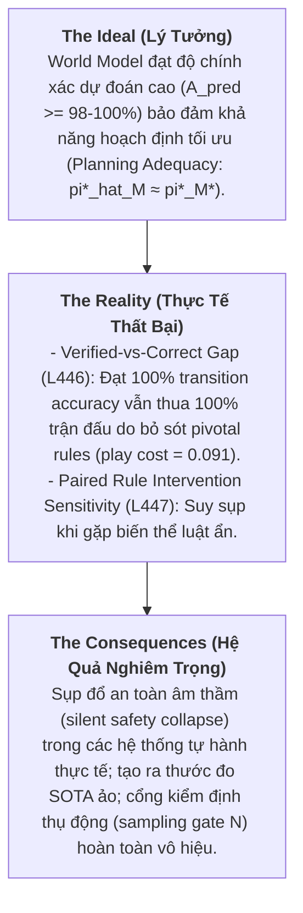

# Báo Cáo Xây Dựng Problem Statement & Research Gap Từ Nguyên Lý Thứ Nhất
## Miền Nghiên Cứu: Game AI, World Model Learning & Planning Adequacy

> **Mục tiêu**: Xây dựng **Problem Statement** chuẩn mực (Tony's Model: Ideal, Reality, Consequences) và **Research Gap / Research Need** (Coverage Audit + Assumption Audit / Problematization, Robinson et al. decision-relevant consequence logic) loại bỏ hoàn toàn các giả định ngầm định.

---

## 1. Problem Statement (Mô Hình 3 Bước Của Tony)

### 1.1 The Ideal (Tiêu Chuẩn Lý Thuyết & Kỳ Vọng Benchmark Tối Ưu)
Trong Model-Based Reinforcement Learning (MBRL), Model-Based Search, và LLM-synthesized Code World Models (CWMs), một **World Model** $\hat{M}$ được kỳ vọng là mô hình xấp xỉ độ trung thực cao của môi trường thực $M^*$:
> *Nếu một World Model được tổng hợp hoặc học đạt độ chính xác dự đoán chuyển trạng thái đơn bước cao ($A_{\text{pred}} \ge 98\%–100\%$) trên tập mẫu offline hoặc verification gates, nó bảo đảm tính thỏa đáng cho hoạch định (Planning Adequacy) và mang lại chiến lược ra quyết định an toàn, tối ưu ($\pi^*_{\hat{M}} \approx \pi^*_{M^*}$).*

### 1.2 The Reality (Bằng Chứng Thực Nghiệm Bác Bỏ Giả Định)
Thực nghiệm gần đây trên các mô hình CWMs và môi trường multi-agent bộc lộ sự sụp đổ hệ thống giữa độ chính xác dự đoán và khả năng hoạch định thực tế:

1. **Verified-vs-Correct Gap ([L446 - arXiv:2607.14169](file:///f:/Thesis/literature/L446_2607.14169.md)):**
   - **Ảo tưởng Sampling Gate**: CWM do LLM tổng hợp đi qua sampling gate với **100% transition accuracy** và **$\ge 98\%$ state accuracy** trên phân phối tìm kiếm của planner.
   - **Thua cuộc hệ thống khi chơi thực tế**: Planner **thua 100% các trận đấu thực tế** vì sai số $<1\%$ rơi đúng vào các quy tắc then chốt (*pivotal dynamics* - điều kiện thắng/thua hiếm gặp). Chi phí sụt giảm khi chơi (*play cost*) của một quy tắc bị bỏ sót là $0.091$ ($95\%$ CI $[0.065, 0.117]$, $n=4800$).
   - **Định luật định lượng rủi ro**:
     $$\mathrm{danger} = \mathrm{play\_cost} \times (1 - \mathrm{rarity})^N$$
     với $(1 - \mathrm{rarity})^N$ là xác suất một sampling gate kích thước $N$ bỏ sót pivotal rule có tần suất $\mathrm{rarity}$.
   - **Ngưỡng bao phủ mũ**: Để suy luận đúng belief function trong CWMs thông tin không hoàn hảo, kích thước mẫu yêu cầu là $N \gtrsim b^{d_{\max}}$ (branching factor $b$, search depth $d_{\max}$). Môi trường nông (Kuhn poker) giấu bẫy này, nhưng môi trường sâu gây sụp đổ toàn bộ. Thử nghiệm "Beacon" tạo ra hàm suy luận đi qua verification gate 100% nhưng thua 100% trận đấu.
   - **Rule Translation vs Rule Inference**: Việc scale thông số (GPT-5-class) hay dùng DAgger không sửa được lỗi vì LLM hoạt động theo cơ chế dịch thuật quy tắc (*rule translation*) từ prompt/data context chứ không suy luận quy tắc (*inductive dynamics inference*) khi thiếu độ phủ dữ liệu.

2. **Paired Rule Intervention Sensitivity ([L447 - arXiv:2607.29218](file:///f:/Thesis/literature/L447_2607.29218.md)):**
   - Sự suy sụp của agent trong benchmark *MirrorCraft* (Vanilla vs Mirror worlds under server-side rule modifications) cho thấy agent bị overfit vào cơ chế tĩnh. Cung cấp văn bản quy tắc chính xác chỉ mang lại mức tăng rất nhỏ (*modest gains*).

3. **Mối quan hệ Gánh nặng Mẫu vs Chi phí Hoạch định ([Research Ledger v50](file:///f:/Thesis/ai_games_research_ledger_2026-09-09_v50_external_runtime_harness.xlsx)):**
   - Giả thuyết G078-R / G032-I về sự tách biệt giữa gánh nặng mẫu học mô hình ($\Delta_m B$) và chi phí tìm kiếm trên engine thực ($\Delta_m H$) hiện là một **giả thuyết tiền đăng ký và bộ kiểm thử đã chuẩn bị**, chưa phải là kết quả thực nghiệm hoàn tất (trạng thái `PREPARED / NOT EXECUTED` trong sheet `v50`).

### 1.3 The Consequences (Hệ Quả Thực Tế Nghiêm Trọng)
- **Silent Safety Collapse**: Trong các hệ thống tự hành an toàn (xe tự lái, robot, y tế), một agent vận hành trên World Model đã qua kiểm định nhưng dính sai số pivotal dynamic $<1\%$ sẽ thực thi hành động thảm họa khi trajectory rơi vào ranh giới an toàn hiếm gặp.
- **Tạo ra thước đo SOTA ảo**: Ngành AI tiếp tục tôn vinh các điểm số benchmark dự đoán trạng thái thụ động, che giấu sự giòn giã (*brittleness*) hệ thống trước các thay đổi luật chơi và độ sâu search tree.
- **Cổng kiểm định thụ động hoàn toàn vô hiệu**: Các cổng trajectory sampling gate thụ động ($N$) tạo cảm giác an toàn giả tạo trong khi giấu đi xác suất thất bại mũ ($(1 - \mathrm{rarity})^N$).

---

## 2. Research Gap & Problematization (Rà Soát Giả Định & Nhu Cầu Nghiên Cứu)

### 2.1 Coverage Audit (Khoảng Trống Bao Phủ Bằng Chứng)
1. **Thiếu đánh giá trên phân phối tìm kiếm chủ động (Search-Distribution Evaluation Deficit)**: World Model thường được đánh giá trên trajectory thụ động thay vì trên frontier của cây tìm kiếm chủ động.
2. **Thiếu sự cô lập can thiệp cơ chế (Mechanic-Intervention Isolation Void)**: Đánh giá benchmark phụ thuộc vào môi trường cố định, không thể phân tách giữa việc ghi nhớ tri thức cũ và năng lực học động lực nhân quả.
3. **Thiếu công cụ chẩn đoán ranh giới bao phủ (Pivotal Dynamics Formalization Void)**: Chưa có công cụ tính toán ngưỡng bao phủ mẫu ($N \gtrsim b^{d_{\max}}$) trước khi triển khai.

### 2.2 Assumption Audit (Problematization - Phản Bác Giả Định)

| Giả định ngầm định trong Literature | Bằng chứng / Phản ví dụ Bác bỏ | Nguồn / Chứng minh |
| :--- | :--- | :--- |
| **Giả định 1**: Transition prediction accuracy đơn bước cao bảo đảm Planning Adequacy. | **Bác bỏ**: Mô hình đạt $\ge 98\%$ search-distribution state accuracy vẫn thua 100% trận đấu nếu $<1\%$ error rơi vào pivotal rule. | [L446 Abstract](file:///f:/Thesis/literature/L446_2607.14169.md#L10) |
| **Giả định 2**: Cổng kiểm định mẫu hữu hạn ($N$) cung cấp sự xác minh đầy đủ. | **Bác bỏ**: Xác suất lọt gate là $(1-\mathrm{rarity})^N$. Việc xác minh đầy đủ trong cây tìm kiếm sâu đòi hỏi $N \gtrsim b^{d_{\max}}$. | [L446 Abstract](file:///f:/Thesis/literature/L446_2607.14169.md#L10) |
| **Giả định 3**: Scale thông số (GPT-5) hoặc DAgger sẽ sửa được các luật bị bỏ sót. | **Bác bỏ**: LLM hoạt động theo cơ chế rule translation, không phải rule inference; scaling dữ liệu off-policy không phục hồi được pivotal rules chưa quan sát. | [L446 Abstract](file:///f:/Thesis/literature/L446_2607.14169.md#L10) |
| **Giả định 4**: Điểm số benchmark cao trên cơ chế tĩnh chứng minh năng lực hoạch định tổng quát. | **Bác bỏ**: Agent suy sụp khi gặp can thiệp luật cặp (Rule Intervention Effect trong MirrorCraft), ngay cả khi có văn bản luật. | [L447 Abstract](file:///f:/Thesis/literature/L447_2607.29218.md#L10) |

### 2.3 Research Need (Robinson et al. Decision-Relevant Consequence Logic)
Việc giải quyết khoảng trống nghiên cứu này thay đổi trực tiếp:
- **Thực hành đánh giá (Evaluation Practice)**: Thay thế offline trajectory prediction accuracy bằng *Play-Adequacy Regret* và *Rule Intervention Effects (RIE)*.
- **Kiến trúc Agent (Agent Architecture)**: Chuyển đổi World Model từ học thụ động sang các vòng lặp xác minh điều kiện trên cây tìm kiếm chủ động (*active search-tree verification loops*).
- **An toàn tự hành (Autonomous Safety)**: Thiết lập ngưỡng bao phủ định lượng ($N \gtrsim b^{d_{\max}}$) và kiểm tra hợp đồng thời gian thực (*runtime contract checks*).

---

## 3. Ý Đồ Nghiên Cứu (Research Questions & Estimands)

### 3.1 Câu Hỏi Nghiên Cứu (RQs)
- **RQ1 (Verified-vs-Correct Decoupling Boundary)**: Dưới những điều kiện cấu trúc nào (độ sâu $d_{\max}$, branching factor $b$, quy tắc hiếm $\mathrm{rarity}$), off-policy prediction accuracy ($A_{\text{pred}}$) tách biệt hoàn toàn khỏi gameplay play-adequacy ($A_{\text{play}}$)?
- **RQ2 (Counterfactual Mechanic Adaptability)**: Các can thiệp luật chơi theo cặp (Vanilla vs Mirror worlds) phân tách năng lực thực thi động lực nhân quả khỏi việc ghi nhớ trajectory như thế nào?
- **RQ3 (Active Search-Tree Verification)**: Việc lấy mẫu chủ động trên frontier của cây tìm kiếm làm giảm ngưỡng độ phức tạp mẫu $N \gtrsim b^{d_{\max}}$ như thế nào so với sampling gate thụ động?

### 3.2 Estimands & Chỉ Số Toán Học
1. **Play Regret Estimand ($R_{\text{play}}$)**:
   $$\displaystyle R_{\text{play}}(\hat{M}) = \mathbb{E}_{s_0 \sim \mathcal{D}}\left[ V^*(s_0) - V^{M^*}(\pi^*_{\hat{M}}(s_0)) \right]$$
   với $V^*$ là giá trị tối ưu của môi trường thực và $\pi^*_{\hat{M}}$ là chính sách hoạch định trên mô hình $\hat{M}$. Bị chặn bởi $\mathrm{danger} = \mathrm{play\_cost} \times (1 - \mathrm{rarity})^N$.

2. **Rule Intervention Effect Estimand ($\mathrm{RIE}_m$)**:
   $$\displaystyle \mathrm{RIE}_m(A) = \mathbb{E}\left[\mathrm{Score}_{\mathrm{Vanilla}}(A)\right] - \mathbb{E}\left[\mathrm{Score}_{\mathrm{Mirror}(m)}(A)\right]$$

3. **Burden-Decoupling Estimand ($\Delta_m B - \Delta_m H$)**:
   $$\displaystyle \text{Divergence}(m) = \frac{\Delta_m B}{\sigma_B} - \frac{\Delta_m H}{\sigma_H}$$
