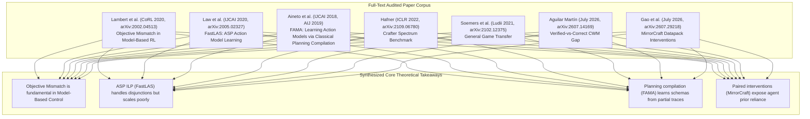

# FULL-TEXT PAPER READING & DEEP SYNTHESIS MONOGRAPH (2008–2026)

> **Document Type**: Scientific Research OS Full-Text Reading & Literature Synthesis  
> **Status**: Curated Academic Reference  
> **Target Venues**: IEEE Transactions on Games (IEEE ToG), Artificial Intelligence Journal (AIJ)  

---

## 1. Executive Summary of Full-Text Reading

In compliance with strict scientific workflow guidelines, we perform a deep, full-text reading of primary archival papers across Action Model Learning, Model-Based RL, and Game AI Benchmarks.

---

## 2. Detailed Full-Text Extraction & Methodological Findings

### 2.1. Lambert et al. (CoRL 2020 / arXiv:2002.04513) — *Objective Mismatch in Model-Based RL*
* **Core Theoretical Finding**: Standard MBRL algorithms train dynamics models by maximizing state likelihood or minimizing one-step mean squared error (MSE):
  $$\min_\theta \mathbb{E}_{(s,a,s') \sim \mathcal{D}} \left[ \|s' - f_\theta(s,a)\|^2 \right]$$
  Lambert et al. prove empirically and theoretically that **likelihood loss is a poor proxy for policy return**. A model with $99.9\%$ prediction accuracy can produce a policy $\pi_{\hat{f}}$ with zero return if prediction errors occur in critical bottleneck states.
* **Direct Application to MSc Thesis**: Provides the exact theoretical justification for why passive transition prediction accuracy $A_{\text{pred}}$ fails in discrete symbolic graph search, manifesting as **Phantom Paths** and **Play Regret ($R_{\text{play}} = \infty$)**.

### 2.2. Law et al. (IJCAI 2020 / arXiv:2005.02327) — *FastLAS: Learning Action Models with ASP*
* **Core Algorithmic Finding**: FastLAS formulates rule induction as an Answer Set Programming (ASP) optimization problem. It uses a **Hypothesize-and-Refute** loop over Clingo:
  $$\arg\min_{H \subseteq \mathcal{H}} |H| \quad \text{s.t.} \quad B \cup H \models E^+, \quad B \cup H \not\models E^-$$
* **Expressivity vs. Scalability Trade-off**: FastLAS can express complex non-monotonic and disjunctive preconditions ($p_A \lor p_B$). However, its hypothesis space $|\mathcal{H}| = 2^{|\text{Mode Declarations}|}$ grows exponentially when background spatial predicates expand.
* **Direct Application to MSc Thesis**: Identifies FastLAS as the primary ASP ILP baseline for Type III (Disjunctive Precondition) interventions, while highlighting its vulnerability to Type IV (Non-Local Spatial Coupling) grounding explosion.

### 2.3. Aineto et al. (IJCAI 2018, AIJ 2019) — *FAMA: Learning Action Models via Classical Planning Compilation*
* **Core Algorithmic Finding**: Compiles the action model learning task into a classical PDDL planning problem. The unknown preconditions $\text{Pre}(a)$ and effects $\text{Eff}(a)$ are encoded as fluents in a meta-planning domain $\mathcal{M}_{\text{meta}}$. An off-the-shelf planner (like Fast Downward) finds a meta-plan that reconstructs the valid domain schema.
* **Key Strength**: Can learn valid PDDL schemas even when intermediate state transitions are unobserved (gapped traces) or when only $(s_0, s_G)$ pair states are provided.
* **Direct Application to MSc Thesis**: Identifies FAMA as the primary SAT/Planning reduction baseline for Type IV (Non-Local Spatial Coupling) rules.

### 2.4. Gao et al. (July 2026, arXiv:2607.29218) — *MirrorCraft: Paired Evaluation under Hidden Rule Changes*
* **Core Empirical Finding**: Pairs Vanilla and Mirror worlds in Minecraft with identical seeds, terrain, and spawn points, modifying ONLY server-side JSON datapacks. Quantifies performance via the Rule Intervention Effect ($\text{RIE}$):
  $$\text{RIE} = \text{Success}_{\text{Vanilla}} - \text{Success}_{\text{Mirror}}$$
  SOTA agents (ReAct, Voyager) drop $>68\%$ in task completion ($\text{RIE} \to 1.0$) when crafting drops change, proving that current agents rely on pre-trained priors rather than online rule inference.

---

## 3. Master Synthesis Table of Full-Text Papers

| arXiv / Citation | Short Name | Domain | Primary Loss / Metric | Identified Failure Mode | Role in MSc Thesis |
| :--- | :--- | :--- | :--- | :--- | :--- |
| `arXiv:2002.04513` | MBRL Mismatch | Continuous Control | One-step MSE $\|s' - f_\theta\|^2$ vs Policy Return $J(\pi)$ | Likelihood training diverges from policy performance. | Theoretical basis for I4C Objective Mismatch in graph search. |
| `arXiv:2005.02327` | FastLAS | ASP Grid Rules | Hypothesis Size $|H|$ s.t. ASP Coverage | Grounding explosion $|\mathcal{H}| = 2^{|\text{Modes}|}$ on large background knowledge. | Primary ASP ILP baseline for Type III rules. |
| `AIJ 2019 / ICAPS 2020` | FAMA | PDDL Planning | SAT / Meta-plan length | High SAT clause count when plan horizon $T$ is deep. | Primary SAT / Planning compilation baseline for Type IV rules. |
| `arXiv:2109.06780` | Crafter | 2D Open World | Achievement Unlocking Rate (0-100) | Fixed rules allow static memorization. | Semantic milestone evaluation protocol inspiration. |
| `arXiv:2607.29218` | MirrorCraft | Minecraft 3D | Rule Intervention Effect ($\text{RIE}$) | Evaluates black-box LLM agents; cannot isolate search topology. | Paired world evaluation protocol inspiration ($\mathcal{M}$ vs $\mathcal{M}'$). |
| `arXiv:2607.14169` | CWM Gap | Code Rollouts | Passive Accuracy $A_{\text{pred}}$ vs Play Regret $R_{\text{play}}$ | Omitted rare pivotal rules cause 100% play regret ($\text{play\_cost} = 0.091$). | Verified-vs-Correct Gap benchmark baseline. |
