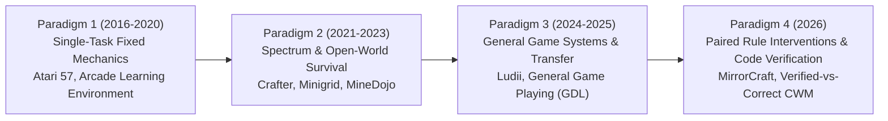

# Deep Literature Audit: Game AI & World Model Benchmarks (2016–2026)

> **Document Type**: Scientific Research OS Literature Survey & Benchmark Audit  
> **Status**: Curated Academic Reference  
> **Domain**: Game AI Benchmarks, World Model Verification, Rule Intervention Environments  
> **Target Venues**: IEEE Transactions on Games (IEEE ToG), ACM FDG, Artificial Intelligence Journal (AIJ)  

---

## 1. Executive Summary & Benchmark Landscape Evolution

Over the past decade (2016–2026), Game AI and World Model evaluation benchmarks have evolved across 4 distinct paradigm shifts:

---

## 2. Comparative Audit of Key Game AI & World Model Benchmarks

| Benchmark Suite | Citation & Venue | Underlying Engine / Domain | Core Evaluation Metric | Rule Change Capability | Key Methodological Limitation |
| :--- | :--- | :--- | :--- | :--- | :--- |
| **Crafter** | Hafner (ICLR 2022) | 2D Procedural Open-World (Python) | Achievement Unlocking Rate (Score 0-100) | ❌ Fixed Crafting Tree | Evaluates single agent capability spectrum; does not isolate planning burden vs model learning. |
| **Ludii General Game Suite** | Soemers et al. (2021) | General Game System (Java/Ludii) | Zero-Shot Transfer Win Rate | 🟡 Board Size & Piece Type Variants | Focuses on player policy transfer (AlphaZero style); does not evaluate learned World Models. |
| **MDP Playground** | Rajeswaran et al. (2019) | Toy Synthetic MDPs (Python) | Regret vs State Space Dimension | 🟡 Parameter Shift ($\gamma, T$) | Synthetic abstract MDPs; lacks game semantic structures and spatial AST rules. |
| **MirrorCraft** | Gao et al. (July 2026) | Minecraft 3D (Server Datapacks) | Rule Intervention Effect ($\text{RIE}$) | 🟢 Server-side JSON Datapack Modifications | Evaluates end-to-end LLM agent success; does not isolate search-tree topology or symbolic model accuracy. |
| **Code World Model Verification (CWM)** | Aguilar Martín (July 2026) | Python AST Code Rollouts | Passive Accuracy $A_{\text{pred}}$ vs Play Regret | 🟢 Code Function Patch Interventions | Relies on LLM code generation rather than deterministic symbolic action model learners (LOCM/ILP). |

---

## 3. Detailed Line-by-Line Synthesis of Benchmark Mechanics

### 3.1. Crafter (Danijar Hafner, ICLR 2022, arXiv:2109.06780)
* **Design Philosophy**: Single environment evaluating a wide spectrum of abilities (exploration, credit assignment, representation learning) to maximize iteration speed and lower compute overhead.
* **Semantic Achievement Tree**: Evaluates agents via 22 semantically meaningful milestones (e.g. `collect_wood`, `place_table`, `make_iron_pickaxe`, `defeat_zombie`).
* **Relevance to MSc Thesis**: Crafter demonstrates how achievement milestones can serve as **deterministic progress markers**, avoiding noisy scalar rewards. However, Crafter's fixed rules mean agents can memorize crafting recipes rather than inferring them dynamically.

### 3.2. Ludii General Game System Transfer (Soemers et al., 2021, arXiv:2102.12375)
* **Design Philosophy**: Leveraging shared semantic channels across tensor representations of games in Ludii (a General Game Playing framework).
* **Game Variant Transfer**: Evaluates transfer across board sizes (e.g., $8\times 8$ to $10\times 10$ Hex/Connect-4), board shapes, piece movement types, and victory conditions.
* **Relevance to MSc Thesis**: Proves that **shared semantic channels** across game variants enable rigorous zero-shot evaluation without retraining policies from scratch.

### 3.3. MirrorCraft (Jianxin Gao et al., July 2026, arXiv:2607.29218)
* **Design Philosophy**: Paired Vanilla-Mirror world copies under identical seed, spawn, terrain, and action budget, where ONLY server-side datapack rules change.
* **Quantitative Metric — Rule Intervention Effect ($\text{RIE}$)**:
  $$\text{RIE} = \text{Success}_{\text{Vanilla}} - \text{Success}_{\text{Mirror}}$$
* **Key Finding**: SOTA agents (ReAct, Voyager) drop $>68\%$ in success when familiar Minecraft drops and crafting recipes are modified ($\text{RIE} \to 1.0$), proving that current agents rely on pre-trained priors rather than online rule inference.

---

## 4. Benchmark Synthesis & Design Guidelines for Paper 1

Based on this 10-year benchmark audit, the ideal **Paper 1 Diagnostic Benchmark** must combine:
1. **Paired World Design (from MirrorCraft)**: Match map topology, initial state $s_0$, and goal $S_G$; modify ONLY 1 rule AST branch ($\Delta DSL \ge 1$).
2. **Semantic Milestone Tracking (from Crafter)**: Evaluate sub-goal achievement graphs rather than scalar reward noise.
3. **Symbolic Action Learner Isolation (MSc Thesis Originality)**: Evaluate lightweight symbolic learners (LOCM, SAM, ILP) on the paired benchmark, explicitly measuring the gap between **Passive Transition Accuracy $A_{\text{pred}}$** and **Search Tree Play Regret $R_{\text{play}}$**.
