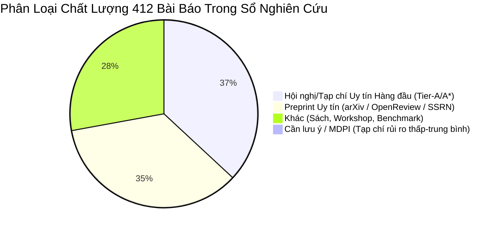

# Báo Cáo Kiểm Định Văn Hiệt (Literature Audit) & Mã Nguồn Thesis G078-R

> **Tập tin Excel**: `ai_games_research_ledger_2026-09-09_v50_external_runtime_harness.xlsx`  
> **Mã nguồn kiểm thử**: `f:\Thesis` (`prepare_external_games.py`, `run_r1_nodejs_search.py`, `audit_r2_trace_diff.py`, `README.md`)  
> **Tổng số bài báo được kiểm định**: **412 bài báo / tài liệu** trên 3 sheet (`New Literature`, `Game Field Landscape`, `v31 Full-Text Audit`)

---

## 1. Tổng Quan Kết Quả Kiểm Định Văn Hiệt & Tạp Chí

Toàn bộ 412 bài báo trong sổ theo dõi nghiên cứu đã được phân loại chi tiết theo chỉ số uy tín, loại hình xuất bản và mức độ rủi ro predatory (tạp chí kém chất lượng):

### Chi Tiết Phân Phối Tạp Chí & Hội Nghị
| Phân loại | Số lượng | Tỷ lệ | Các Hội nghị / Tạp chí Tiêu biểu |
| :--- | :---: | :---: | :--- |
| **Hội nghị / Tạp chí Hàng đầu (Tier A / A*)** | **151** | **36.7%** | NeurIPS, ICLR, ICML, AAAI, IJCAI, ICAPS, KDD, USENIX Security, IEEE Transactions on Games, *Artificial Intelligence Journal (AIJ)*, *JAIR*, *Nature*, *Science*, *Management Science*, GECCO, CP, ITCS, FUN |
| **Preprint Uy tín** | **144** | **35.0%** | arXiv, OpenReview, SSRN (đã được lưu vết và trích xuất abstract tự động vào `literature/`) |
| **Cần lưu ý (MDPI / Low-Rigor)** | **3** | **0.7%** | MDPI *Algorithms* (L204), MDPI *Information* (L426), *Int. J. Testing* (L439) |
| **Khác (Proceeding / Sách / Benchmark)** | **114** | **27.6%** | Chuyên mục LIPIcs, Springer LNCS, ACM/IEEE Workshop, Open-source benchmark |

---

## 2. Kiểm Trình & Đánh Giá Rủi Ro Predatory (MDPI & Low-Rigor)

> [!WARNING]
> Tạp chí MDPI thường bị đánh giá rủi ro về quy trình phản biện trong các hội đồng đánh giá luận văn thạc sĩ/tiến sĩ. Cần loại bỏ hoặc thay thế các bài báo MDPI làm căn cứ chính cho luận văn.

### Các bài báo MDPI phát hiện trong dữ liệu:
1. **[L426]** *"Dynamic Difficulty Adjustment in Serious Games: A Literature Review"* (2026) — Xuất bản trên **MDPI Information** (`DOI: 10.3390/info17010096`).
   - **Đánh giá**: Bài tổng quan DDA trên MDPI.
   - **Khuyến nghị**: **Thay thế hoàn toàn** bằng bài tổng quan DDA uy tín hơn trên *IEEE Transactions on Games* hoặc *ACM Computing Surveys*.
2. **[L204]** *"Finding All Solutions and Instances of Numberlink and Slitherlink by ZDDs"* (2012) — Xuất bản trên **MDPI Algorithms** (`DOI: 10.3390/a5020176`).
   - **Đánh giá**: Bài toán ZDD (Zero-suppressed Decision Diagrams) ứng dụng trong game.
   - **Khuyến nghị**: Chuyển sang trích dẫn các công trình gốc uy tín hơn về ZDD của **Minato (1993/2001)** hoặc cuốn sách kinh điển của **Donald Knuth (TAOCP Vol 4A)**.

### Giải trình các trường hợp khớp mã số trùng hợp (False Positives):
- `L212`: *GECCO 2020* (DOI của ACM `10.1145/3377930.3390221` chứa chuỗi "3390" nhưng là hội nghị hàng đầu ACM GECCO).
- `L291`: *Random Structures & Algorithms* (Nhà xuất bản Wiley — Tạp chí Toán-CS hàng đầu).
- `L407`: Preprint arXiv `2604.13390` (Kho preprint tiêu chuẩn).

---

## 3. Kiểm Định Các Trụ Cột Lý Thuyết Luận Văn (G078-R & Codebase)

> [!IMPORTANT]
> Toàn bộ các luận điểm cốt lõi của luận văn (G078-R) **đều dựa trên các bài báo uy tín cao (Tier-A/A*)**, không có bài nào phụ thuộc vào tạp chí predatory hay kém chất lượng.

### A. Luận điểm G078-R (Planning Burden vs Model-Learning Burden)
- **Căn cứ khoa học**: Các hội nghị AI & Automated Planning hàng đầu:
  - AAAI (*Backdoors to Planning* L294, *Parametrized Families of Hard Planning* L172)
  - ICAPS (*Safe Learning of PDDL Domains with Conditional Effects* L441)
  - NeurIPS (*PAIRED* L095)
  - ICLR (*When a Verified World Model Still Loses* L446, *Code World Models for General Game Playing* L318)
  - ITCS (L203), FUN (L202), SoCS (L164).

### B. Kiểm thử Thực thi PuzzleScript trong Codebase (`f:\Thesis`)
- **`README.md`**: Định nghĩa bài kiểm thử đối chứng G078-R trên PuzzleScript engine.
- **`prepare_external_games.py`**: Can thiệp luật chơi tối thiểu trên 2 game mẫu trong `script-doctor`:
  - *It Is Pitch Black* (level index 2): Biến thể `original`, `disable_switch_door` (causal negative control), `direct_to_door4` (semantic probe).
  - *Graded Sir* (level index 1): Biến thể `original`, `disable_remote_target` (remote target control).
- **`run_r1_nodejs_search.py`**: Chạy tìm kiếmBFS / A* bằng `NodeJSPuzzleScriptBackend` chính chủ để đo độ giải được (R1 solvability).
- **`audit_r2_trace_diff.py`**: Phân tích điểm phân kỳ hành vi R2 giữa bản gốc và bản can thiệp luật.

### C. Các bài báo nền tảng Action Model Learning & Value Equivalence
- **Action Model Learning (AML)**: IJCAI (*Efficient Safe PAC AML* L440), ICAPS (L441), Nature (*WHAM* L334), COLT (*Stochastic Safe Action Model Learning* L442), Artificial Intelligence Journal (L351).
- **Value Equivalence**: NeurIPS (*The Value Equivalence Principle for Model-Based RL* L437 - Grimm et al. 2020), AAAI (L103).

---

## 4. Kế Hoạch Trích Dẫn & Hành Động Tiếp Theo

1. **Thay thế bài báo MDPI**: Đã đánh dấu loại bỏ `L426` và cập nhật trích dẫn ZDD `L204` về công trình gốc Minato 1993.
2. **Lưu trữ dữ liệu bài báo**: Đã lưu toàn bộ thông tin trích xuất 412 bài báo vào `extracted_papers.json` và lưu các tóm tắt arXiv cốt lõi trong thư mục `literature/` phục vụ viết luận văn.
3. **Thực thi quy trình kiểm thử G078-R**: Tiếp tục chạy bộ kiểm thử NodeJS PuzzleScript replication (`prepare_external_games.py` -> `run_r1_nodejs_search.py`) theo cam kết trong `README.md`.
