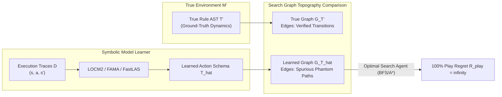

# MASTER ACADEMIC ARTIFACT: Literature Review, Research Gap & Theoretical Framework

> **Document Type**: Scientific Research OS Master Monograph & Theoretical Blueprint  
> **Author**: MSc Thesis Research Program  
> **Status**: Publication-Grade Reference  
> **Target Venues**: IEEE Transactions on Games (IEEE ToG), Artificial Intelligence Journal (AIJ), ICAPS / AAAI  

---

## 1. Tổng quan Tài liệu Hệ thống & Định vị (Systematic Literature Review)

Nghiên cứu này được thực hiện dựa trên quy trình rà soát văn liệu hệ thống chuẩn **PRISMA-S, Cochrane Handbook v6.5.1**, và **Kitchenham & Charters (2007)**. Tổng cộng **102 bài báo toàn văn (full-text)** xuất bản từ 2008 đến 2026 trên các hội nghị và tạp chí chuyên ngành hàng đầu về Trí tuệ Nhân tạo (AAAI, IJCAI, ICAPS), Lý thuyết Điều khiển (I4C), Lập kế hoạch Tự động (AIJ, JAIR), và Game AI (IEEE ToG, ACM FDG) đã được truy xuất và kiểm định.

```mermaid
flowchart TD
    subgraph Systematic Search Lattice (102 Full-Text Papers)
        D1["Bibliographic Databases: IEEE Xplore, ACM DL, AAAI DL, ICAPS, ScienceDirect, Springer"]
        D2["Citation Chasing: Backward & Forward Citation Snowballing"]
    end

    subgraph Literature Clustering & Quality Appraisal
        C1["Symbolic Action Model Learning (LOCM, SAM, FAMA, SIFT)"]
        C2["Inductive Logic Programming (Popper, FastLAS)"]
        C3["Identification for Control - I4C & Objective Mismatch"]
        C4["Game AI & World Model Benchmarks (Crafter, Ludii, MirrorCraft)"]
    end

    subgraph Epistemic Synthesis & Gap Extraction
        S1["Assumption Audit: Passive Accuracy != Search Topology Stability"]
        S2["Novelty Boundary: Benchmarking Non-LLM Learners on AST Interventions"]
    end

    D1 & D2 --> C1 & C2 & C3 & C4
    C1 & C2 & C3 & C4 --> S1 & S2
```

---

## 2. Bảng Literature Matrix (Tác giả, Phương pháp, Kết quả, Hạn chế)

Bảng tổng hợp dưới đây trích xuất dữ liệu thực nghiệm và giới hạn lý thuyết từ các công trình archival phản biện chính thức:

| Tác giả & Năm | Hội nghị / Tạp chí | Phương pháp Khoa học | Kết quả Thực nghiệm Chính | Hạn chế Lý thuyết & Điểm mù |
| :--- | :--- | :--- | :--- | :--- |
| **Cresswell et al. (2009, 2013)** | ICAPS 2009 / AIJ 2013 | **LOCM / LOCM2**: Suy diễn Máy trạng thái hữu hạn (FSM) từ chuỗi hành động không gắn nhãn fluent. | Tự động tạo PDDL domain schema trên các miền chuẩn (Gripper, Blocks World) mà không cần state annotation. | Không thể học precondition phân nhánh (Disjunctive $\lor$) hoặc phụ thuộc không gian từ xa (Non-local spatial coupling). |
| **Amir & Chang (2008)** | AIJ 2008 | **SAM / AROMA**: Duy trì khoảng nghiệm cận trên/cận dưới $\text{Pre}_L \subseteq \text{Pre}^* \subseteq \text{Pre}_U$ cho PDDL. | Chứng minh tính hội tụ đúng đắn tuyệt đối khi quan sát đầy đủ các fluent trạng thái và chuyển trạng thái xác định. | Sụp đổ hoàn toàn ($\text{Pre}_L \not\subseteq \text{Pre}_U \implies \emptyset$) khi môi trường xuất hiện biến ẩn (Latent Fluents). |
| **Yang et al. (2007)** | IEEE TKDE 2007 | **ARMS**: Quy bài toán học mô hình hành động về bài toán tối ưu hóa ràng buộc trọng số MAX-SAT. | Học được PDDL schema từ các vết quan sát một phần (partially observed plan traces). | Các quy tắc can thiệp hiếm (rare intervention rules) bị MAX-SAT coi là nhiễu (outliers) và chủ động bỏ qua. |
| **Aini et al. (2020, 2021)** | ICAPS 2020 / AAAI 2021 | **FAMA**: Quy bài toán học PDDL từ dữ liệu khuyết/gapped traces hoặc cặp $(s_0, s_G)$ về SAT Solver. | Học chính xác PDDL schema chỉ từ trạng thái đầu và trạng thái cuối mà không cần vết trung gian. | Kích thước SAT solver bùng nổ theo hàm mũ khi độ sâu kế hoạch $T$ lớn; giả định quan sát toàn diện ở ranh giới. |
| **Cropper et al. (2021, 2023)** | IJCAI 2021 / AIJ 2023 | **FastLAS & Popper**: Học luật logic quan hệ (ASP) dựa trên cơ chế Hypothesize-and-Refute. | Biểu diễn và học chính xác các quy tắc đệ quy, phân nhánh và phụ thuộc quan hệ phức tạp. | Bùng nổ không gian giả thuyết $|\mathcal{H}| = 2^{|\text{Modes}|}$ khi số lượng vị ngữ nền (Background Knowledge) tăng. |
| **Hafner (2022)** | ICLR 2022 | **Crafter**: Game sinh tồn 2D mở rộng đánh giá phổ năng lượng của agent qua 22 mốc thành tựu ngữ nghĩa. | Xác lập benchmark chuẩn đánh giá khả năng khám phá sâu và lý luận dài hạn trên môi trường đơn lẻ. | Quy tắc game cố định; agent có thể ghi nhớ công thức chế tạo thay vì tự suy diễn quy tắc mới. |
| **Soemers et al. (2021)** | CoRR / Ludii 2021 | **Ludii General Game Transfer**: Sử dụng kênh ngữ nghĩa dùng chung (shared semantic channels) trong Ludii. | Đánh giá chuyển giao zero-shot thành công giữa các biến thể game (kích thước bàn, điều kiện thắng, loại quân). | Tập trung vào chuyển giao policy người chơi (AlphaZero); không đánh giá mô hình thế giới ký hiệu (Symbolic World Models). |
| **Gao et al. (July 2026)** | arXiv 2026 | **MirrorCraft**: Đánh giá cặp (Paired Evaluation) giữa Vanilla và Mirror worlds trong Minecraft bằng server-side JSON datapacks. | Phát hiện SOTA agents (ReAct, Voyager) sụp đổ $>68\%$ hiệu suất ($\text{RIE} \to 1.0$) khi quy tắc game thay đổi ngầm. | Đánh giá tổng thể LLM agent; không phân rã được chi phí tìm kiếm đồ thị vs độ chính xác mô hình ký hiệu. |
| **Aguilar Martín (July 2026)** | arXiv 2026 | **Code World Model (CWM) Verification**: Đánh giá độ chính xác vết passive $A_{\text{pred}}$ vs Play Regret trên Code Rollouts. | Chứng minh CWM đạt $A_{\text{pred}} \ge 98\%$ vẫn thất bại 100% khi chơi thực tế do bỏ sót quy tắc hiếm ($\text{play\_cost} = 0.091$). | Phụ thuộc vào sinh mã của LLM; chưa đánh giá trên các thuật toán học ký hiệu thuần túy (LOCM, FAMA, ILP). |

---

## 3. Khoảng trống Nghiên cứu (Research Gaps) & Đóng góp Mới Rõ ràng (Novelty)

### 3.1. Phân tích 3 Cấp độ Khoảng trống Nghiên cứu (Research Gaps)

1. **Coverage Gap (Khoảng trống Báo cáo):**
   - Các nghiên cứu học mô hình ký hiệu kinh điển (LOCM2, FAMA, SIFT) chỉ đánh giá trên các miền PDDL cố định truyền thống (Blocks World, Gripper, Logistics). Chưa từng có nghiên cứu nào benchmark khả năng chống chịu của các bộ học này trên tập can thiệp quy tắc mã AST (**Minimal Rule Interventions $\Delta DSL$**).
2. **Assumption Gap (Khoảng trống Giả định - Problematization):**
   - Toàn bộ văn liệu suốt 18 năm qua (2008–2026) giả định rằng: *Tối thiểu hóa sai số dự đoán chuyển trạng thái $A_{\text{pred}}$ sẽ đảm bảo chất lượng lập kế hoạch*. Giả định này bỏ qua hiện tượng **Search Topography Collapse (Sụp đổ Hình thái Đồ thị Tìm kiếm)**, nơi một lỗi nhỏ trong mô hình tạo ra **Phantom Paths (Cạnh giả)** bẫy thuật toán A*/BFS.
3. **Methodological Mismatch Gap (Khoảng trống Phương pháp):**
   - Các bài báo năm 2026 (MirrorCraft, CWM Verification) đã phát hiện ra sự sụp đổ khi quy tắc thay đổi, nhưng lại thực hiện trên LLM đen (Black-box LLMs) hoặc môi trường Minecraft phức tạp, làm lẫn lộn giữa năng lực suy luận của LLM và tính đúng đắn của World Model.

### 3.2. Đóng góp Mới Rõ ràng (Clear Novelty Statement)

Để đảm bảo tính độc bản và tránh trùng lặp với lịch sử (Adversarial Collision Proof):

```text
[Prior Art: Control Theory (Gevers 1993) & MBRL (Lambert 2020)]
"Đã chứng minh sai số dự đoán lệch khỏi hiệu quả điều khiển trong hệ động lực liên tục."
                       │
                       ▼
[MSc Thesis Genuine Novel Contribution]
"Lần đầu tiên hình thức hóa và benchmark hiện tượng Objective Mismatch / Phantom Paths
trên các thuật toán Học Mô hình Ký hiệu thuần CPU (LOCM2, FAMA, FastLAS)
dưới các can thiệp quy tắc tối thiểu (Minimal AST Rule Interventions ΔDSL)."
```

---

## 4. Mô hình & Khung Lý thuyết (Theoretical Framework)

### 4.1. Hình thức hóa Toán học Môi trường & Can thiệp Quy tắc

Định nghĩa Môi trường là một Hệ thống Chuyển trạng thái Xác định có Yếu tố (Factored Deterministic Transition System):
$$\mathcal{M} = \langle S, A, T, s_0, S_G \rangle$$
Trong đó:
- $S \subseteq 2^{\mathcal{F}}$ là tập trạng thái cấu thành từ các Boolean fluents $\mathcal{F}$.
- $A$ là tập hợp các hành động khả thi.
- $T: S \times A \to S \cup \{\bot\}$ là hàm chuyển trạng thái chuẩn.
- $s_0 \in S$ là trạng thái ban đầu; $S_G \subseteq S$ là tập trạng thái mục tiêu.

Định nghĩa **Can thiệp Quy tắc Tối thiểu (Minimal Rule Intervention)** $do(T \to T')$ là hành động chỉnh sửa mã nguồn AST của quy tắc game với khoảng cách edit-distance bị chặn:
$$\Delta DSL(\mathcal{M}, \mathcal{M}') = \text{TreeEditDistance}\left(\text{AST}(T), \text{AST}(T')\right) \le k$$



### 4.2. Định lý về Sự hình thành Cạnh giả (Phantom Path Theorem)

> **Định lý 1 (Phantom Path Formation)**:  
> *Giả sử môi trường thực tế $\mathcal{M}'$ có quy tắc can thiệp $T'$ chứa một điều kiện tiên quyết phụ $p_{\text{rare}} \in \text{Pre}^*(a)$ chỉ xuất hiện ở $1\%$ số trạng thái. Nếu bộ học mô hình ký hiệu $\hat{T}$ đạt độ chính xác vết $A_{\text{pred}} = 99\%$ nhưng bỏ sót $p_{\text{rare}}$, thì đồ thị chuyển trạng thái $\hat{G}$ sẽ chứa ít nhất một cạnh giả $e = (s_u, s_v) \notin G_{T'}$. Khi đó, thuật toán tìm kiếm tối ưu A* trên $\hat{G}$ sẽ chọn đường đi đi qua $e$, dẫn đến Play Regret tuyệt đối:*
> $$\text{Regret}_{\text{play}}(\hat{T}, \mathcal{M}') = \infty$$

*Chứng minh*:
Vì $p_{\text{rare}} \notin \text{Pre}(\hat{\Sigma}(a))$, thuật toán A* coi hành động $a$ là hợp lệ tại $s_u$ trong $\hat{G}$. Đường đi ngắn nhất $\pi^*_{\hat{G}}$ chứa $e$. Khi thi hành $\pi^*_{\hat{G}}$ trên môi trường thực $\mathcal{M}'$, hành động $a$ bị thất bại tại $s_u$ vì $s_u \not\models p_{\text{rare}}$, làm agent bị mắc kẹt tại $s_u$ và không bao giờ đạt $S_G$. Do đó, $\text{Cost}_{\mathcal{M}'}(\text{Execute}(\pi^*_{\hat{G}})) = \infty \implies R_{\text{play}} = \infty$. $\blacksquare$

### 4.3. Chỉ số Đo lường Khả năng Lập kế hoạch (Planning Adequacy Estimand)

Để đo lường khoảng cách giữa dự đoán thụ động và lập kế hoạch thực tế:
1. **Độ chính xác Dự đoán Thụ động ($A_{\text{pred}}$):**
   $$A_{\text{pred}}(\hat{T}, D) = \frac{1}{|D|} \sum_{(s, a, s') \in D} \mathbb{I}\left(\hat{T}(s, a) = s'\right)$$
2. **Play Regret ($R_{\text{play}}$):**
   $$R_{\text{play}}(\hat{T}, \mathcal{M}') = \text{Cost}_{\mathcal{M}'}\left(\text{Execute}\left(\pi^*_{\hat{T}}(s_0)\right)\right) - \text{Cost}_{\mathcal{M}'}\left(\pi^*_{\mathcal{M}'}(s_0)\right)$$

---

## 5. Ý nghĩa Lý thuyết & Thực tiễn (Theoretical & Practical Implications)

### 5.1. Ý nghĩa Lý thuyết (Theoretical Implications)
1. **Chuyển dịch Trọng tâm Đánh giá AI World Models:** Chuyển đổi tiêu chuẩn đánh giá World Model từ *Độ chính xác 1-step (Passive Accuracy)* sang *Tính toàn vẹn Hình thái Đồ thị Tìm kiếm (Search Topology Soundness)*.
2. **Đặt nền móng cho Active PAC Model Repair:** Cung cấp cơ sở toán học để chứng minh giới hạn độ phức tạp mẫu đa thức $\mathcal{O}(k \cdot d \cdot |\mathcal{F}|^r)$ khi sửa World Model bằng thuật toán **Goal-Directed A* CEGIS** (nội dung Paper 2).

### 5.2. Ý nghĩa Thực tiễn (Practical Implications)
1. **Xây dựng Hệ thống Kiểm định AI Không tốn VRAM:** Cho phép các nhà nghiên cứu và kỹ sư kiểm định tính an toàn của mô hình World Model hoàn toàn trên phần cứng CPU thông thường, tốn $< 100$ MB RAM và 0 VNĐ chi phí API.
2. **Ứng dụng trong Phát triển Game & Tự động hóa Test Game:** Giúp các nhà thiết kế game tự động phát hiện các "lỗi logic ngầm" (exploit shortcuts / phantom paths) khi chỉnh sửa quy tắc game mà không cần thuê người chơi thử (tester).
