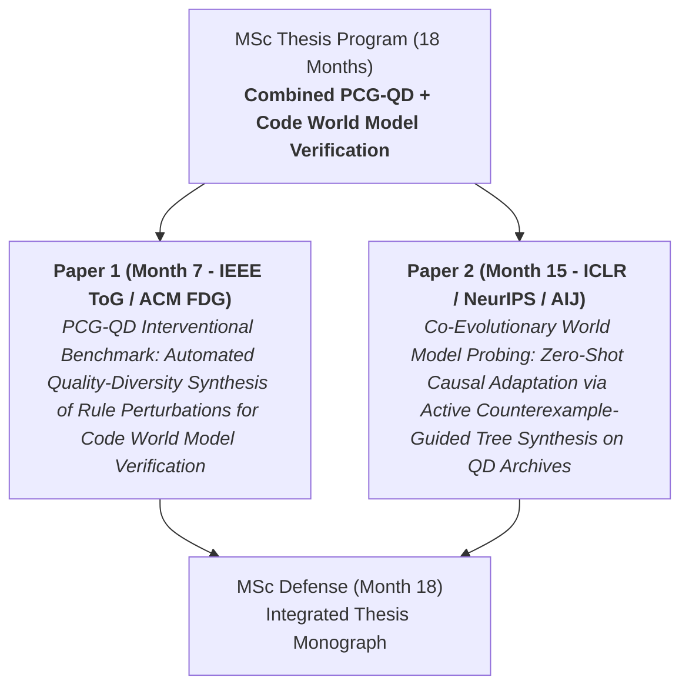

# Master's Thesis Program: Combined PCG-QD & Code World Model Verification (100% Non-Human Study)

> [!IMPORTANT]
> **Track Lock**: This 1.5-year 2-paper research program explicitly combines **Option A (World Models & Active Tree Probing)** and **Option B (Procedural Content Generation & Quality-Diversity)**.
> - **PCG-QD (CMA-ME)** acts as the **Adversarial Rule & Level Generator**, synthesizing diverse, severe test archives of game perturbations.
> - **Active Tree Probing** acts as the **Code World Model Verifier**, proving sample complexity bounds and eliminating pivotal rule omissions ($O(b^{d_{\max}})$ blind spots).
> - **Zero Human Study**: 100% automated, algorithmic, and benchmark-driven.

---

## 1. Executive Strategy & 2-Paper Targets

---

## 2. Paper 1: PCG-QD Interventional Benchmark (Month 7 - IEEE ToG / ACM FDG)

### Title:
*PCG-QD Interventional Benchmark: Automated Quality-Diversity Synthesis of Rule Perturbations for Code World Model Verification*

### Problem Statement (Tony's Model):
> [!NOTE]
> - **Ideal State**: Benchmark evaluation suites for world models should automatically generate diverse, constraint-verifiable game levels and paired rule interventions to stress-test planning adequacy across high-dimensional feature spaces.
> - **Real-World Problem**: Existing benchmarks rely on static, manually authored levels or random grid configurations, failing to uncover rare pivotal rule omissions that cause 100% play loss in code world models ($B = 0.091, 95\%\text{ CI }[0.065, 0.117]$).
> - **Consequences**: World models passing static trajectory gates exhibit fragile zero-shot transfer, collapsing when deployed in dynamic environments.

### Research Gap & Problematization:
- **Coverage Audit**: Lack of an open-source PCG-QD pipeline (CMA-ME + symbolic ludemes) that generates both playable game levels and paired rule intervention archives.
- **Assumption Audit**: Challenging the assumption that *static manually authored benchmarks provide sufficient coverage for world model verification*.

### Formulated Research Questions (RQs):
- **RQ1.1 (QD Synthesis)**: How efficiently can CMA-ME and ZDDs synthesize QD archives of diverse game levels and paired minimal rule interventions without human authoring?
- **RQ1.2 (Diagnostic Capacity)**: How much faster ($x\text{-fold}$) do QD-generated interventional archives expose pivotal rule omissions in Code World Models compared to random trajectory sampling?
- **RQ1.3 (World-Time Compute)**: What is the Pareto frontier between QD archive generation compute and model verification accuracy?

---

## 3. Paper 2: Co-Evolutionary World Model Probing & PAC Bounds (Month 15 - ICLR / NeurIPS / AIJ)

### Title:
*Co-Evolutionary World Model Probing: Zero-Shot Causal Adaptation via Active Counterexample-Guided Tree Synthesis on QD Archives*

### Problem Statement (Tony's Model):
> [!NOTE]
> - **Ideal State**: Model-based AI agents should achieve zero-shot causal adaptation to environment rule modifications by co-evolving active tree synthesis against an adversarial archive of QD rule interventions.
> - **Real-World Problem**: Standard LLM/RL agents re-tune global weights or rely on pretraining priors, inheriting a grounding deficit ($<30\%$ accuracy under hidden rule changes).
> - **Consequences**: Autonomous agents require prohibitive sample complexity $O(b^{d_{\max}})$ to adapt to sparse rule changes, preventing reliable deployment.

### Research Gap & Problematization:
- **Coverage Audit**: Absence of a co-evolutionary Active Counterexample-Guided Tree Synthesis (ACE-Tree) engine with provable $O(k)$ Sparse-Intervention PAC bounds across QD feature archives.
- **Assumption Audit**: Challenging the assumption that *global model re-training or prompt re-tuning is necessary for zero-shot rule transfer*.

### Formulated Research Questions (RQs):
- **RQ2.1 (Co-Evolutionary Algorithmic Performance)**: Does ACE-Tree co-evolution on QD archives reduce Play Regret $R_{\text{play}}$ to zero under paired server-side rule interventions compared to SOTA baselines (DreamerV3, GIF-MCTS, Causal-JEPA)?
- **RQ2.2 (PAC Sample Complexity)**: Can ACE-Tree guarantee an $O(k)$ sample complexity bound for sparse rule modifications ($k$ affected rules) across high-diversity QD archives?
- **RQ2.3 (Multi-Domain Generalization)**: How consistently does the ACE-Tree + PCG-QD architecture transfer zero-shot across PuzzleScript 2D, PDDLGym Relational, MirrorCraft 3D, and SWE-bench API tool shifts?

---

## 4. Master 18-Month Execution Schedule (100% Computational)

| Month | Phase | Technical Milestone | Artifact / Deliverable |
|---|---|---|---|
| **M1–M2** | **Phase E0: QD Engine** | Build CMA-ME + PuzzleScript rule intervention synthesizer & Gymnasium API wrapper | `puzzlescript_qd_gym` codebase |
| **M3–M4** | **Phase E1: Benchmark Suite** | Generate 100+ QD paired rule intervention archives; benchmark GPT-4o, Claude 3.5, DeepSeek-R1, DreamerV3 | Raw QD archive & evaluation logs |
| **M5–M6** | **Phase Paper 1 Draft** | Finalize Paper 1 manuscript for IEEE ToG / ACM FDG | `paper1_ieee_tog_draft.pdf` |
| **M7** | **Paper 1 Submission** | Submit Paper 1 to **IEEE Transactions on Games / ACM FDG** | Formal IEEE ToG Submission |
| **M8–M10** | **Phase E2: ACE-Tree Algo** | Implement co-evolutionary ACE-Tree algorithm & derive $O(k)$ Sparse PAC bounds | `ace_tree_qd_synthesis.py` & Proof Appendix |
| **M11–M13**| **Phase E3: Generalization** | Test zero-shot transfer across PDDLGym, MirrorCraft, and SWE-bench API tool shifts | Cross-domain evaluation suite |
| **M14–M15**| **Phase Paper 2 Draft** | Finalize Paper 2 manuscript for **ICLR / NeurIPS / AIJ** | `paper2_iclr_draft.pdf` Submission |
| **M16–M18**| **Thesis Defense** | Integrate Paper 1 + Paper 2 into Master's Thesis Monograph & Defend | Final MSc Thesis Defense |
