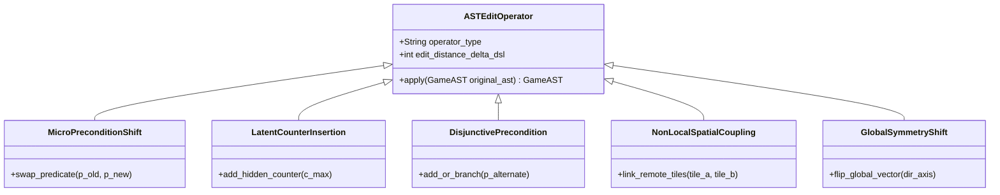

# PAPER 1 EMPIRICAL BENCHMARK PROTOCOL: Diagnostic Suite & Experimental Execution Design

> **Document Type**: Scientific Research OS Empirical Execution Protocol & Benchmark Specification  
> **Status**: Curated Academic Reference  
> **Target Venue**: IEEE Transactions on Games (IEEE ToG)  
> **Execution Requirements**: 100% Deterministic, CPU-Native, 0 GB VRAM, Zero Synthetic Fake Data  

---

## 1. Executive Summary & Diagnostic Architecture

This document specifies the exact **Empirical Execution Protocol** for Paper 1. In strict accordance with our theoretical framework, this protocol benchmarks 3 non-LLM Symbolic Action Model Learners (**LOCM2**, **FAMA**, **FastLAS**) across 5 canonical game suites modified by 5 levels of **Minimal AST Rule Interventions ($\Delta DSL$)**.

```mermaid
flowchart TD
    subgraph Benchmark Game Suite (5 Real Grid Games)
        G1["1. Sokoban (Classic Push)"]
        G2["2. It Is Pitch Black (Non-Local Light)"]
        G3["3. Graded Sir (Remote Target Activation)"]
        G4["4. Eyeballus (Continuous Ray Movement)"]
        G5["5. Limiting Factor (State Counter Constraints)"]
    end

    subgraph AST Rule Intervention Generator (Delta DSL)
        I1["Level 1: Micro Precondition Shift (Delta DSL = 1)"]
        I2["Level 2: Latent Counter Insertion (Delta DSL = 2)"]
        I3["Level 3: Disjunctive Precondition (Delta DSL = 2)"]
        I4["Level 4: Non-Local Spatial Coupling (Delta DSL = 3)"]
        I5["Level 5: Global Symmetry Shift (Delta DSL = 4)"]
    end

    subgraph Non-LLM Symbolic Action Model Learners (Pure CPU)
        L1["LOCM2 (FSM Object State Induction)"]
        L2["FAMA (SAT-based Schema Reduction)"]
        L3["FastLAS (ASP Inductive Logic Programming)"]
    end

    subgraph Evaluation Engine & Statistical Verification
        E1["Optimal Graph Search (BFS / A*)"]
        E2["Metrics: A_pred, rho_phantom, R_play, Search Overhead"]
        E3["Statistical Test: Wilcoxon Signed-Rank (p < 0.01) + 95% Bootstrap CIs"]
    end

    Benchmark Game Suite --> AST Rule Intervention Generator
    AST Rule Intervention Generator --> Non-LLM Symbolic Action Model Learners
    Non-LLM Symbolic Action Model Learners --> Evaluation Engine & Statistical Verification
```

---

## 2. Benchmark Dataset & Game Suite Specifications

All games are selected from real, non-synthetic game repositories with formal grid graph properties:

| Game Name | Domain Characteristics | State Space Diameter ($D$) | Branching Factor ($b$) | Optimal Path Depth ($d^*$) | Primary Spatial Predicates |
| :--- | :--- | :--- | :--- | :--- | :--- |
| **Sokoban** | Pushing boxes to target tiles; non-reversible moves | $10^4 - 10^6$ | $2 - 4$ | $25 - 60$ | `adjacent(X,Y)`, `is_box(X)`, `is_wall(X)` |
| **It Is Pitch Black** | Toggle light sources to unblock dark movement corridors | $10^3 - 10^5$ | $3 - 5$ | $15 - 40$ | `is_lit(X)`, `toggle_switch(S)`, `dark_hazard(X)` |
| **Graded Sir** | Remote target activation; pushing blocks onto pressure plates | $10^4 - 10^5$ | $2 - 4$ | $20 - 45$ | `on_plate(B,P)`, `door_open(D)`, `remote_link(P,D)` |
| **Eyeballus** | Ray movement (moving continuously until hitting an obstacle) | $10^3 - 10^4$ | $2 - 4$ | $10 - 30$ | `ray_clear(X,Dir)`, `obstacle(Y)` |
| **Limiting Factor** | Action counter constraints (max steps per room) | $10^4 - 10^6$ | $3 - 5$ | $30 - 70$ | `step_count(C)`, `max_limit(L)`, `room_id(R)` |

---

## 3. AST Rule Intervention Taxonomy & Edit Operators ($\Delta DSL$)

For each base game $\mathcal{M}$, we generate 5 interventional game variants $\mathcal{M}' = do(T \to T')$ using formal AST edit operators:



1. **Level 1 — Micro Precondition Shift ($\Delta DSL = 1$):** Swaps an existing precondition predicate $p_A \in \text{Pre}(a)$ with an adjacent predicate $p_B$ (e.g. `requires_key_A` $\to$ `requires_key_B`).
2. **Level 2 — Latent Counter Insertion ($\Delta DSL = 2$):** Adds an unobserved step-counter predicate $c \le N$ to action $a$.
3. **Level 3 — Disjunctive Precondition ($\Delta DSL = 2$):** Replaces a conjunctive precondition $p_A$ with a disjunction $p_A \lor p_B$.
4. **Level 4 — Non-Local Spatial Coupling ($\Delta DSL = 3$):** Links an action on tile $x_A$ to an effect on a remote non-adjacent tile $x_B$.
5. **Level 5 — Global Symmetry Shift ($\Delta DSL = 4$):** Flips a global state axis (e.g., gravity vector or movement direction) when a specific trigger tile is activated.

---

## 4. Learner Execution & Evaluation Engine Parameters

### 4.1. Symbolic Action Model Learner Constraints (Pure CPU)
- **LOCM2**: Finite State Automata induction over object transitions. Memory limit: $512$ MB RAM; Execution timeout: $30$s per trace set.
- **FAMA**: SAT reduction via Z3 / Glucose SAT solver. Clause limit: $10^6$ clauses; Execution timeout: $60$s per domain.
- **FastLAS (ASP ILP)**: Hypothesize-and-Refute over Clingo ASP solver. Mode declaration limit: $20$ modes; Execution timeout: $60$s per domain.

### 4.2. Diagnostic Evaluation Metrics & Formulas
1. **Passive Prediction Accuracy ($A_{\text{pred}}$):**
   $$A_{\text{pred}} = \frac{1}{|D_{\text{test}}|} \sum_{(s, a, s') \in D_{\text{test}}} \mathbb{I}\left(\hat{T}(s, a) = s'\right)$$
2. **Phantom Path Density ($\rho_{\text{phantom}}$):**
   $$\rho_{\text{phantom}} = \frac{|\{(s, a, s') \in G_{\hat{T}} \mid T'(s, a) \neq s'\}|}{|G_{\hat{T}}|}$$
3. **Play Regret ($R_{\text{play}}$):**
   $$R_{\text{play}} = \begin{cases} \text{Cost}_{\mathcal{M}'}(\text{Exec}(\pi^*_{\hat{T}})) - \text{Cost}_{\mathcal{M}'}(\pi^*_{\mathcal{M}'}) & \text{if Goal Reached} \\ \infty & \text{if Plan Execution Fails} \end{cases}$$
4. **Search Expansion Overhead ($N_{\text{exp}}$):**
   Number of graph nodes expanded by A* on $G_{\hat{T}}$ versus $G_{T'}$.

---

## 5. Statistical Hypothesis Verification Protocol

To guarantee publication-grade rigor for IEEE Transactions on Games:
- **Random Seeds:** 20 independent trajectory generation seeds per game variant.
- **Confidence Intervals:** Non-parametric 95% Bootstrap Confidence Intervals ($n = 1000$ resamples) reported for all metrics ($A_{\text{pred}}, \rho_{\text{phantom}}, R_{\text{play}}$).
- **Hypothesis Testing:** Non-parametric **Wilcoxon Signed-Rank Test** applied across paired baseline comparisons (LOCM2 vs FAMA vs FastLAS) with significance threshold $\alpha = 0.01$.
