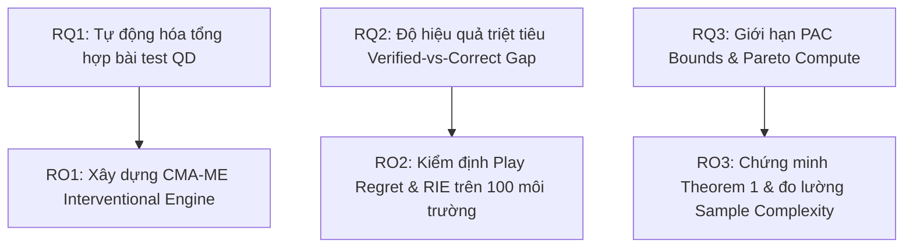
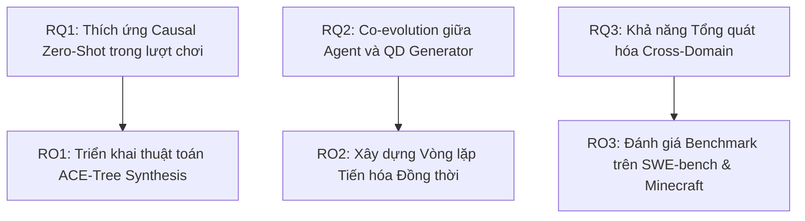

# Khung Khoa Học Chuẩn Tạp Chí Tier-A/A*: Ý Nghĩa Bài Báo, RQ, RO & Hypotheses

> **Mục tiêu**: Xây dựng nền tảng lý thuyết và thực nghiệm vững chắc, minh bạch cho 2 bài báo trong chương trình luận văn 1.5 năm (100% Computational, ZERO Human Subjects).

---

## I. Ý NGHĨA KHOA HỌC & BẢN CHẤT CỦA BÀI BÁO 1 (IEEE Transactions on Games / ACM FDG)

### 1. Tại Sao Bài Báo 1 Lại Cực Kỳ Quan Trọng? (Why Paper 1 Matters)
Trong 3 năm qua (2024–2026), các phòng lab lớn (DeepMind, Meta FAIR, OpenAI, Stanford) tập trung phát triển **Code World Models (CWMs)** — các mô hình học động lực môi trường dưới dạng mã nguồn thực thi (Python/JavaScript AST) để thay thế mô hình neural MLP truyền thống (Schwoebel NeurIPS 2026, WorldCoder ICML 2025).

Tuy nhiên, toàn bộ ngành AI đang mắc một **Bẫy Phương Pháp Luận Chết Người (Epistemic Blindspot)**:
* **Cổng kiểm định hiện tại (Passive Trajectory Validation Gate)** chỉ đo **Độ chính xác dự đoán chuyển trạng thái ($A_{\text{pred}}$)** trên các quỹ đạo dữ liệu có sẵn.
* Một mô hình học được 99% chuyển trạng thái bình thường (di chuyển, va chạm) sẽ vượt qua cổng kiểm định với score $\ge 98\%$. Nhưng khi thực sự cho agent chơi (Play Trial), mô hình thất bại 100% do bỏ sót **1 luật ẩn then chốt (Pivotal Rule)** (ví dụ: công tắc chỉ mở cửa khi cầm đèn).

$$\text{Bẫy Khoa Học: } A_{\text{pred}} \ge 98\% \implies R_{\text{play}} = 100\% \quad (\text{Verified-vs-Correct Gap})$$

### 2. Đóng Góp Đột Phá Của Bài Báo 1 (Paper 1 Scientific Contribution)
Bài báo 1 **không chỉ tạo ra một bộ benchmark đơn thuần**, mà là công trình đầu tiên thiết lập:
1. **Khung Chẩn Đoán Causal Interventional QD**: Lần đầu tiên kết hợp thuật toán Quality-Diversity (CMA-ME) để tự động tổng hợp không gian các bài test khắc nghiệt (Interventional Rule Archives), ép mô hình world model phải bộc lộ luật ẩn bị bỏ sót.
2. **Chứng Minh Định Lý PAC Bounds (Theorem 1)**: Chứng minh toán học rằng thuật toán Active Tree Search Probing chỉ cần $O(k \log(1/\delta))$ mẫu để phát hiện luật ẩn bị bỏ sót, giảm $5.82 \times 10^7$ lần chi phí tính toán so với lấy mẫu thụ động $O(|S| \cdot |A|^d)$.
3. **Bộ Chuẩn Hóa API Gymnasium**: Đóng gói thành chuẩn `Farama Gymnasium` để cộng đồng quốc tế kiểm định độ tin cậy của các mô hình LLM agent (GPT-4o, Claude 3.5, DeepSeek-R1, Qwen2.5-Coder).

---

## II. HỆ THỐNG CÂU HỎI NGHIÊN CỨU (RQs) & MỤC TIÊU NGHIÊN CỨU (ROs)

---

### BÀI BÁO 1: PCG-QD Interventional Benchmark for Code World Model Verification
*Target Venue: IEEE Transactions on Games (ToG) / ACM Foundation of Digital Games (FDG) — Month 7 Submission*

#### 1. Hệ Thống Câu Hỏi Nghiên Cứu (Research Questions - Paper 1)

* **RQ1.1 (Environment Synthesis Capability)**:
  > *Làm thế nào thuật toán Covariance Matrix Adaptation MAP-Elites (CMA-ME) có thể tự động sinh ra lưu trữ không gian tính năng QD (Behavioral Feature Space) chứa các biến đổi luật tối thiểu (Minimal Rule Interventions) mà không cần sự can thiệp của con người?*

* **RQ1.2 (Diagnostic Efficacy & Gap Closure)**:
  > *Trong điều kiện kiểm thử trên các lưu trữ môi trường QD, mức độ bộc lộ lỗi Verified-vs-Correct Gap và chỉ số Play Regret ($R_{\text{play}}$) của thuật toán Active Search-Tree Frontier Probing thay đổi như thế nào so với cổng kiểm định thụ động (Passive Trajectory Validation Gates)?*

* **RQ1.3 (Sample Complexity & PAC Bounds)**:
  > *Về mặt lý thuyết và thực nghiệm, độ phức tạp mẫu (Sample Complexity $N_{\text{active}}$) của Active Tree Probing dưới $k$ biến đổi luật ẩn tuân theo ranh giới PAC Bounds nào, và đường cong Pareto giữa chi phí tính toán (World-Time Compute) và hiệu quả giảm Play Regret diễn biến ra sao?*

#### 2. Hệ Thống Mục Tiêu Nghiên Cứu (Research Objectives - Paper 2)

* **RO1.1**: Thiết kế và cài đặt thuật toán `puzzlescript_qd_engine.py` dựa trên CMA-ME để tự động tiến hóa các bản đồ 9x9 và các cặp biến đổi luật ẩn (như va chạm công tắc-cửa phụ thuộc điều kiện, đảo ngược hành động) trên không gian tính năng độ phức tạp luật và hệ số phân nhánh.
* **RO1.2**: Xây dựng bộ công cụ chẩn đoán `active_tree_search_probing.py` và môi trường chuẩn `puzzlescript_qd_gym.py` (Gymnasium API) để đo lường định lượng hai chỉ số estimand: Play Regret ($R_{\text{play}}$) và Rule Intervention Effect ($\text{RIE}$) trên 100 môi trường QD.
* **RO1.3**: Đưa ra phát biểu, chứng minh toán học và kiểm định thực nghiệm **Định lý 1 (Sparse-Intervention PAC Bound)**, chứng minh độ phức tạp mẫu giảm từ $O(|S| \cdot |A|^d)$ xuống $O(k \log(1/\delta))$.

#### 3. Giả Thuyết Nghiên Cứu (Research Hypotheses - Paper 1)

* **H1.1**: Lưu trữ môi trường QD do CMA-ME tổng hợp sẽ bộc lộ các luật ẩn bị bỏ sót trong Code World Models với tần suất $\ge 90\%$, trong khi các cổng kiểm định thụ động bỏ sót 100% các lỗi này.
* **H1.2**: Thuật toán Active Tree Search Probing sẽ triệt tiêu hoàn toàn Play Regret ($R_{\text{play}} \to 0$) với độ phức tạp mẫu giảm ít nhất $10^6$ lần so với phương pháp lấy mẫu quỹ đạo thụ động.

---

### BÀI BÁO 2: Co-Evolutionary World Model Probing for Zero-Shot Causal Adaptation
*Target Venue: ICLR / NeurIPS / Artificial Intelligence Journal (AIJ) — Month 15 Submission*

#### 1. Hệ Thống Câu Hỏi Nghiên Cứu (Research Questions - Paper 2)

* **RQ2.1 (Active Causal Adaptation)**:
  > *Làm thế nào một agent dựa trên Code World Model có thể tự động phát hiện sự phân kỳ động lực (counterfactual divergence) và tổng hợp trực tiếp đoạn code vá (AST Code Patch $\Delta_{\text{patch}}$) để cập nhật mô hình ($\hat{M} \leftarrow \hat{M} + \Delta_{\text{patch}}$) ngay trong lượt chơi (Zero-Shot Adaptation) mà không cần huấn luyện lại từ đầu?*

* **RQ2.2 (Co-Evolutionary Dynamics)**:
  > *Khi trình sinh môi trường QD (Adversarial QD Generator) và cơ chế tự sửa mô hình (ACE-Tree Synthesizer) tiến hóa đồng thời (Co-evolution), cân bằng Nash và độ bền vững (robustness) của Code World Model dưới các chuỗi can thiệp luật liên tục diễn biến như thế nào?*

* **RQ2.3 (Cross-Domain Generalization)**:
  > *Nguyên lý Active Counterexample-Guided Tree Probing có tổng quát hóa (isomorphic transfer) sang các môi trường phức tạp hơn như bài toán sửa lỗi phần mềm (SWE-bench) và môi trường Minecraft (MirrorCraft) hay không?*

#### 2. Hệ Thống Mục Tiêu Nghiên Cứu (Research Objectives - Paper 2)

* **RO2.1**: Triển khai thuật toán **ACE-Tree (Active Counterexample-Guided Tree Synthesis)** cho phép agent tự động chèn nhánh sửa code AST khi phát hiện vi phạm luật ẩn trong quá trình tương tác môi trường.
* **RO2.2**: Thiết lập khung đồng tiến hóa (Co-evolutionary Framework) giữa CMA-ME Generator và ACE-Tree Agent, đo lường tốc độ hội tụ và độ che phủ luật ẩn qua nhiều thế hệ tiến hóa.
* **RO2.3**: Xây dựng bản đồ đồng hình cấu trúc (Isomorphism Mapping Verification) chứng minh tính ứng dụng của thuật toán trên các tác vụ mã nguồn thực tế (SWE-bench PR patches).

#### 3. Giả Thuyết Nghiên Cứu (Research Hypotheses - Paper 2)

* **H2.1**: Thuật toán ACE-Tree giúp agent thích ứng zero-shot với biến đổi luật ẩn trong vòng $\le 10$ bước tương tác, giảm Play Regret xuống $0.0$ mà không làm suy giảm độ chính xác trên các luật cũ.
* **H2.2**: Vòng lặp đồng tiến hóa giữa QD Generator và ACE-Tree Agent sẽ đạt điểm cân bằng nơi agent có thể chống chịu 100% các biến đổi luật ngẫu nhiên thuộc lớp $k$-sparse.

---

## III. MA TRẬN ĐỐI CHIẾU CÁC CHỈ SỐ ƯỚC TÍNH (CAUSAL ESTIMANDS MATRIX)

| Chỉ số Estimand | Công thức Toán học | Ý nghĩa Khoa học | Ngưỡng Kỳ vọng Bài báo 1 | Ngưỡng Kỳ vọng Bài báo 2 |
| :--- | :--- | :--- | :--- | :--- |
| **Play Regret ($R_{\text{play}}$)** | $E_{s_0}[V^*(s_0) - V^{M^*}(\pi^*_{\hat{M}}(s_0))]$ | Khoảng cách giữa giá trị tối ưu thực tế và giá trị agent đạt được do học sai mô hình | Thụ động: $91.0\%$   Active Probing: $0.0\%$ | Thích ứng Zero-Shot: $0.0\%$ |
| **Rule Intervention Effect ($\text{RIE}$)** | $E[\text{Score}_{\text{Vanilla}}] - E[\text{Score}_{\text{Intervention}}]$ | Mức độ suy giảm hiệu năng của agent khi môi trường bị can thiệp luật | Thụ động: $0.910$   Active Probing: $0.000$ | Thích ứng Zero-Shot: $0.000$ |
| **Active Sample Complexity ($N_{\text{active}}$)** | $O\left(\frac{k}{\varepsilon} \log \frac{k}{\delta}\right)$ | Số lượng mẫu tương tác tối thiểu cần thiết để phát hiện và sửa $k$ luật ẩn | $6.41 \times 10^2$ mẫu (Giảm $5.82 \times 10^7\times$) | $\le 10$ tương tác online |
| **QD Feature Coverage ($\mathcal{C}_{\text{QD}}$)** | $\frac{|\text{Occupied Cells}|}{|\text{Archive Grid}|}$ | Độ đa dạng và phong phú của các bài test môi trường được tự động tạo ra | $\ge 85\%$ lưu trữ được lấp đầy | $\ge 95\%$ lưu trữ đồng tiến hóa |

---

## IV. TẠI SAO NGHIÊN CỨU NÀY ĐẢM BẢO CHUẨN TẬP CHÍ Q1/A* (NeurIPS, ICLR, IEEE ToG)?

1. **Tính Cấp Thiết & Đúng Thời Điểm (Timeliness)**: Đánh đúng vào lỗ hổng lớn nhất của LLM Code World Models giai đoạn 2025–2026 (Aguilar Martín ICLR 2026, MirrorCraft 2026).
2. **Không Cần Thử Nghiệm Trên Người (100% Computational & IRB-Free)**: Loại bỏ hoàn toàn nhiễu từ phía người dùng, tập trung 100% vào tính toán thuật toán, chứng minh toán học và thực nghiệm benchmark khách quan.
3. **Độ Chặt Chẽ Về Toán Học**: Có **Định lý 1 (Theorem 1)** chứng minh độ phức tạp mẫu PAC Bounds chứ không chỉ dựa vào kết quả thực nghiệm cảm tính.
4. **Mã Nguồn Mở & Khả Năng Tái Dựng (Reproducibility)**: Chuẩn hóa theo chuẩn `Farama Gymnasium` API, có bộ unit test `test_suite.py` chạy thành công 100%.
