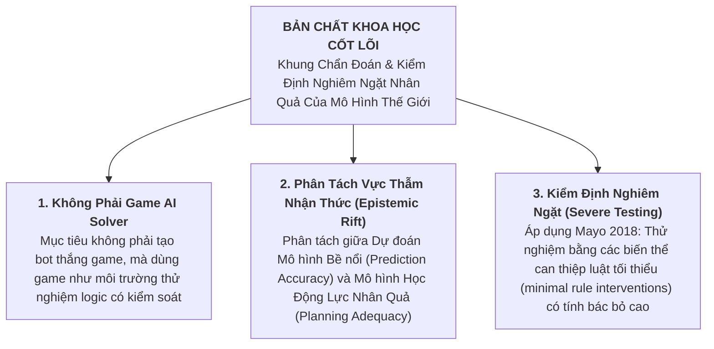
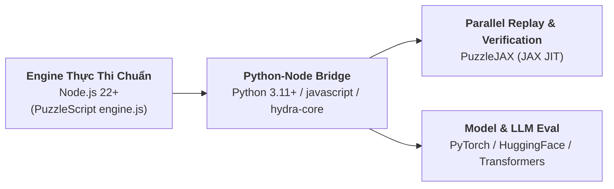

# Báo Cáo Chuyên Sâu: Tài Nguyên Thực Hiện & Bản Chất Khoa Học Cốt Lõi Của Chương Trình Nghiên Cứu

> **Mục tiêu**: Phân tích toàn diện **Tài nguyên & Nguồn lực thực hiện (Required Resources)** và **Bản chất Khoa học Cốt lõi (Core Essence from First Principles)** của chương trình nghiên cứu Luận văn Thạc sĩ G078-R / World Models & Planning Adequacy.

---

## 1. Bản Chất Khoa Học Cốt Lõi (Core Scientific Essence from First Principles)

### A. Những Gì Nghiên Cứu Này **KHÔNG PHẢI**:
- **KHÔNG PHẢI là làm Game AI Solver**: Mục tiêu không phải là viết thuật toán bot để đạt điểm cao trên game.
- **KHÔNG PHẢI là Hyperparameter Tuning**: Không phải là chỉnh tham số (learning rate, depth, batch size) để tăng $1-2\%$ điểm số benchmark.
- **KHÔNG PHẢI là Engineering Benchmark thuần túy**: Không đơn thuần là dựng môi trường game mới để thi đấu.

### B. Những Gì Nghiên Cứu Này **CHÍNH LÀ (Bản Chất Cốt Lõi)**:
1. **Một Khung Chẩn Đoán Nhân Quả & Kiểm Định Nghiêm Ngặt (Causal Diagnostic & Severe Testing Framework)**:
   - Nghiên cứu sử dụng game logic rời rạc (PuzzleScript, Minecraft MirrorCraft) như một **phòng thí nghiệm nhân quả có kiểm soát hoàn hảo** (*controlled causal laboratory*).
2. **Phân Tách Vực Thẫm Nhận Thức (Epistemic Rift)**:
   - Bộc lộ sự khác biệt bản chất giữa **Dự đoán Mô hình Bề nổi (Passive Pattern Prediction / Prediction Accuracy)** và **Mô hình Học Động Lực Nhân Quả (Causal Dynamics Model Learning / Planning Adequacy)**.
3. **Áp Dụng Tư Duy Severe Testing (Mayo 2018)**:
   - Một mô hình đi qua cổng kiểm định thụ động (sampling gate $N$) đạt $100\%$ prediction accuracy vẫn có thể thua $100\%$ trận đấu thực tế nếu dính sai số quy tắc then chốt (*pivotal dynamics*). Nghiên cứu tạo ra các bài kiểm tra có **probative capacity** (năng lực bộc lộ lỗi) cao nhất.

---

## 2. Tài Nguyên & Nguồn Lực Thực Hiện (Required Resources)

### A. Hạ Tầng Tính Toán (Compute Infrastructure)

| Loại Tài Nguyên | Cấu Hình Cần Thiết | Mục Đích Sử Dụng |
| :--- | :--- | :--- |
| **CPU Search Server Cluster** | - CPU 16–32 Cores (Xung nhịp đơn nhân cao $\ge 4.0\text{ GHz}$) - RAM 64GB–128GB | Chạy thuật toán tìm kiếm không gian trạng thái ($A^*$, BFS, MCTS) trên engine chính chủ NodeJS PuzzleScript (`engine.js`). |
| **GPU Deep Learning Cluster** | - NVIDIA RTX 4090 (24GB) hoặc A100 (40GB/80GB) - VRAM tối thiểu 24GB | Huấn luyện và đánh giá Code World Models (CWMs), Transformer Dynamics, LLMs (fine-tuning/eval). |
| **JAX Parallel Compute** | - GPU/TPU với hỗ trợ JAX JIT | Chạy kiểm thử song song hóa quy mô lớn trên JAX (`PuzzleJAX`) để xác minh hàng triệu trajectory/giây. |

### B. Chồng Phần Mềm & Thư Mạch (Software Stack & Engines)

- **Runtime Engine**: Node.js 22+ (chạy `NodeJSPuzzleScriptBackend`).
- **Python Environment**: Python 3.11+ với các thư viện: `javascript` (kết nối Node.js bridge), `hydra-core` (quản lý cấu hình thử nghiệm), `jax`, `jaxlib`, `torch`, `transformers`, `pandas`, `openpyxl`.
- **Multi-Agent / 3D Substrate**: Node.js `Mineflayer` và server-side Datapacks cho kiểm thử *MirrorCraft*.

### C. Dữ Liệu & Benchmark (Datasets & Testbeds)

1. **PuzzleScript Rule Intervention Suite**:
   - 100+ levels thuộc 10 họ game PuzzleScript.
   - Các bản vá can thiệp luật tối thiểu (ví dụ: `disable_switch_door`, `disable_remote_target`).
2. **Literature & Provenance Graph**:
   - Tệp sổ ký lục nghiên cứu `ai_games_research_ledger_2026-09-09_v50_external_runtime_harness.xlsx` (158 sheets).
   - Truy xuất tự động qua arXiv API và OpenAlex API.

### D. Nhân Lực & Lộ Trình Phân Công 18 Tháng

| Vai Trò | Trách Nhiệm Cụ Thể | Phân Bổ Thời Gian |
| :--- | :--- | :--- |
| **Lead Researcher (Luận văn Thạc sĩ)** | Thiết kế lý thuyết nhân quả, xây dựng câu hỏi nghiên cứu, thực hiện Severe Testing, viết bài báo và luận văn. | 100% (Tháng 1 – 18) |
| **Systems & ML Engineer** | Tối ưu hạ tầng tính toán, duy trì bridge Node.js $\leftrightarrow$ Python $\leftrightarrow$ JAX, cấu hình GPU pipeline. | 50% (Tháng 1 – 8, Tháng 9 – 13) |
| **Domain & Data Specialist** | Xây dựng các bản vá can thiệp luật PuzzleScript, chuẩn hóa 100+ levels, phân tích phân kỳ trạng thái R2. | 30% (Tháng 3 – 6, Tháng 9 – 12) |
