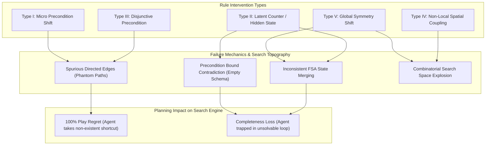

# Taxonomy Matrix: Symbolic Action Model Learners vs. Rule Intervention Types (2008–2026)

> **Document Type**: Scientific Research OS Theoretical Taxonomy & Comparative Failure Mode Analysis  
> **Status**: Curated Academic Reference  
> **Domain**: Symbolic Game AI, PDDL Synthesis, Action Model Learning, Inductive Logic Programming  
> **Target Venues**: IEEE Transactions on Games (IEEE ToG), Artificial Intelligence Journal (AIJ)  

---

## 1. Executive Summary

This document establishes a rigorous theoretical taxonomy comparing the 5 foundational non-LLM Symbolic Action Model Learning paradigms (**LOCM/LOCM2**, **SAM/AROMA**, **ARMS**, **ILP/FastLAS**, and **AST Cellular Automata Induction**) against 5 canonical types of **Minimal Rule Interventions ($\Delta DSL$)**.

For each learner-intervention pair, we analyze:
1. **Mathematical Expressivity Limit**: Can the underlying hypothesis space represent the interventional rule?
2. **Sample Complexity & Degradation Mode**: How does the learner fail when exposed to interventional traces?
3. **Planning Impact (Search Tree Topography)**: Does the failure produce *phantom paths* (spurious edges $\to$ 100% Play Regret) or *blocked paths* (over-restricted schema $\to$ completeness loss)?

---

## 2. Comparative Taxonomy Matrix

| Rule Intervention Type ($\Delta DSL$) | LOCM / LOCM2 (Cresswell 2009/2013) | SAM / AROMA (Amir & Chang 2008) | ARMS (Yang et al. 2007) | ILP / FastLAS (Cropper 2021/2023) | AST Grid Rewriter (Stephens 2016) |
| :--- | :--- | :--- | :--- | :--- | :--- |
| **Type I: Micro Precondition Shift** (e.g. Door requires Key B instead of Key A) | 🟡 **Partial Fit** (Learns new FSM state if key transitions observed) | 🟢 **Exact Fit** (Updates $\text{Pre}_L / \text{Pre}_U$ bounds monotonically) | 🟢 **Exact Fit** (MAX-SAT finds new ground predicate) | 🟢 **Exact Fit** (Hypothesize-and-Refute updates clause) | 🟢 **Exact Fit** (Local AST rewrite updated) |
| **Type II: Latent Counter / Hidden State** (e.g. Bridge collapses after $N=3$ steps) | 🔴 **TOTAL COLLAPSE** (Inconsistent FSA; merges distinct step states) | 🔴 **CONTRADICTION** ($\text{Pre}_L \not\subseteq \text{Pre}_U \implies \emptyset$ collapse) | 🔴 **OUTLIER PENALTY** (MAX-SAT ignores step count as noise) | 🟡 **HIGH COST** (Requires explicit integer fluents in Background Knowledge) | 🔴 **TOTAL COLLAPSE** (Grid state diff contains zero spatial hint) |
| **Type III: Disjunctive Precondition** (e.g. Door opens if Key A OR Switch B) | 🔴 **EXPRESSIVITY LIMIT** (FSA framework cannot model disjunctive transitions) | 🔴 **EXPRESSIVITY LIMIT** (Classical PDDL SAM assumes conjunctive $\bigwedge$) | 🟡 **PARTIAL OVERFIT** (Splits into multiple weak schemas) | 🟢 **EXPRESSIVITY FIT** (Learns disjunctive ASP clauses $A \lor B$) | 🟡 **DUPLICATE AST** (Learns 2 separate local rules) |
| **Type IV: Non-Local Spatial Coupling** (e.g. Step on Tile A teleports Box at Tile B) | 🔴 **OBJECT ISOLATION FAIL** (Assumes independent object state transitions) | 🟡 **COMBINATORIAL EXPLOSION** (Pairs all grid objects into fluents) | 🟡 **SEARCH TIMEOUT** (SAT solver exceeds clause limit) | 🟡 **SEARCH EXPLOSION** (Background predicate pairs $|O|^2$) | 🔴 **NEIGHBORHOOD LIMIT** (Local $3\times 3$ window misses remote tile) |
| **Type V: Global Symmetry / Phase Shift** (e.g. Gravity flips direction on button press) | 🔴 **TOTAL COLLAPSE** (Destroys all learned object movement FSAs) | 🔴 **CONTRADICTION** (Massive fluent inversion across all actions) | 🔴 **MAX-SAT FAIL** (Fails to find satisfiable assignment) | 🔴 **HYPOTHESIS SPACE EXP** (Requires global state predicate in all clauses) | 🔴 **LOCAL PATTERN FAIL** (Local rules invalid globally) |

---

## 3. Deep Dive into Learner Failure Mechanisms

### 3.1. LOCM / LOCM2 Failure Mechanics (Cresswell et al. 2009, 2013)
* **Mathematical Root**: LOCM induces Finite State Automata $M_i = \langle Q_i, \Sigma, \delta_i, q_0 \rangle$ for each object type $i$. It assumes that an object's state transition is uniquely determined by the sequence of actions parameterized by that object.
* **Intervention Vulnerability**: When Type II (Latent Counter) or Type IV (Non-Local Spatial Coupling) is introduced, Object $i$'s transition depends on Object $j$'s hidden state. LOCM merges non-equivalent states $q_a, q_b \in Q_i$, creating **nondeterministic FSA loops**.
* **Search Graph Impact**: Produces *phantom transitions* where the planner assumes an object can change state without the required remote coupling.

### 3.2. SAM / AROMA Failure Mechanics (Amir & Chang 2008)
* **Mathematical Root**: SAM maintains interval bounds $\text{Pre}_L(a) \subseteq \text{Pre}^*(a) \subseteq \text{Pre}_U(a)$. For every valid transition $(s, a, s')$, it updates:
  $$\text{Pre}_L(a) \leftarrow \text{Pre}_L(a) \cup \{f \in \mathcal{F} \mid s \models f\}$$
  $$\text{Pre}_U(a) \leftarrow \text{Pre}_U(a) \cap \{f \in \mathcal{F} \mid s \models f\}$$
* **Intervention Vulnerability**: If a Type II (Latent Counter) intervention occurs where action $a$ is valid in state $s_1$ (counter=1) and state $s_2$ (counter=2), but fluent $f_{\text{hidden}}$ is unobserved, SAM accumulates mutually exclusive fluents into $\text{Pre}_L(a)$, causing $\text{Pre}_L(a) \not\subseteq \text{Pre}_U(a)$.
* **Search Graph Impact**: The precondition set collapses to an impossible constraint ($\text{Pre}(a) = \text{False}$), causing **Completeness Loss** (the planner believes no actions are possible).

### 3.3. ILP / FastLAS Failure Mechanics (Cropper & Dumančić 2021, 2023)
* **Mathematical Root**: FastLAS solves Learning from Answer Sets by finding a hypothesis $H \subseteq \mathcal{H}$ such that $\forall e^+ \in E^+, B \cup H \models e^+$ and $\forall e^- \in E^-, B \cup H \not\models e^-$.
* **Intervention Vulnerability**: While ILP is the *only* paradigm capable of expressing Type III (Disjunctive) and Type IV (Non-Local) rules, its search space $|\mathcal{H}| = 2^{|\text{Mode Declarations}|}$ grows exponentially with grid size $|O|$.
* **Search Graph Impact**: Without active counterexample guidance, ILP overfits to positive traces and omits unobserved negative constraints, generating overly permissive schemas ($\implies$ Phantom Paths).

---

## 4. Key Takeaways for Paper 1 Methodology

1. **No Single Learner Covers All Interventions**: Existing symbolic learners exhibit distinct structural failure modes under different intervention types.
2. **The Ideal Diagnostic Benchmark**: Paper 1 must evaluate symbolic learners across all 5 intervention types ($\Delta DSL$) to map the exact epistemic boundary where passive transition accuracy diverges from active play success.
