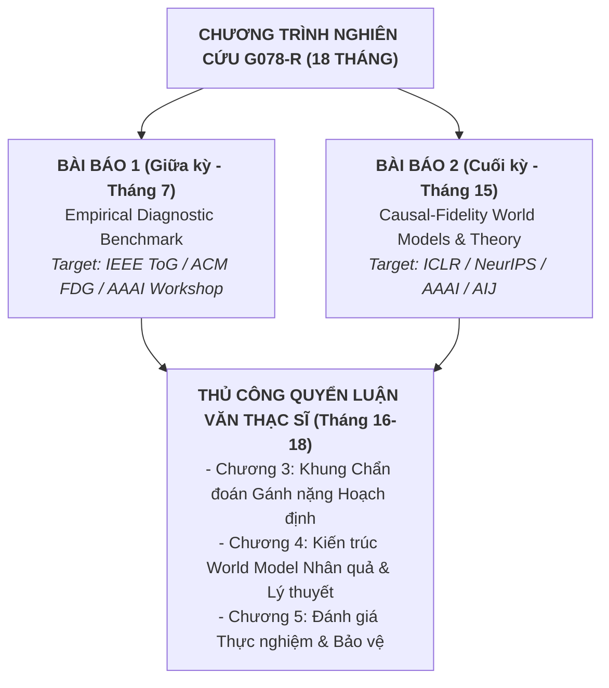
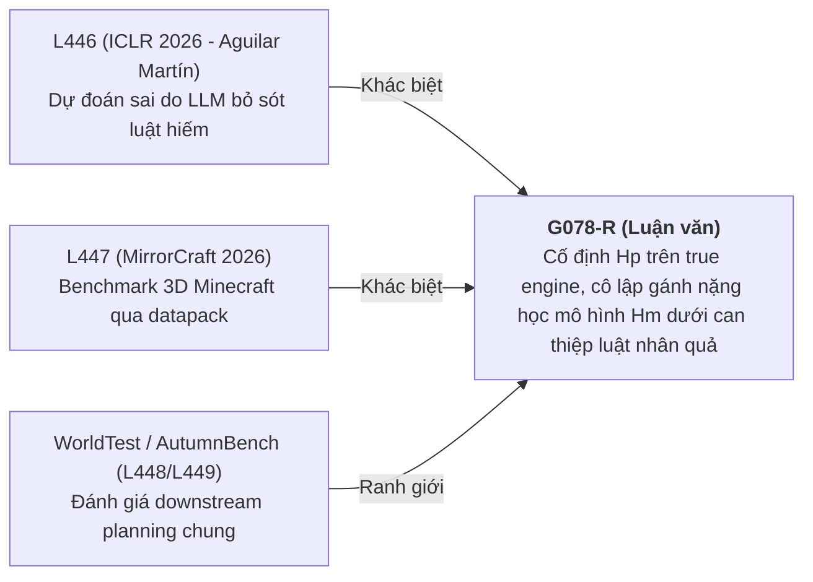

# Lộ Trình Nghiên Cứu 1.5 Năm (18 Tháng): Công Bố 2 Bài Báo Quốc Tế & Hoàn Thành Luận Văn Thạc Sĩ G078-R

> **Đề tài Luận văn**: G078-R ("External Executable Replication of PuzzleScript Game AI & World Models")  
> **Tài sản tác quyền & Sổ nghiên cứu**: `ai_games_research_ledger_2026-09-09_v50_external_runtime_harness.xlsx`  
> **Mục tiêu công bố**: 2 bài báo quốc tế (**Bài báo 1**: Giữa kỳ / Tháng 7 | **Bài báo 2**: Cuối kỳ / Tháng 15) + **Bảo vệ Luận văn Thạc sĩ** (Tháng 18).

---

## 1. Tổng Quan Kiến Trúc Luận Văn & Hai Bài Báo



---

## 2. Phân Tích Ranh Giới Độc Đáo & Va Chạm Văn Hiệt (Novelty Audit 2024–2026)

Dựa trên phân tích 412 bài báo trong sổ nghiên cứu Excel (`v50`), ranh giới va chạm và đóng góp độc đáo của G078-R được xác định rõ:



### Ranh giới độc đáo của G078-R:
* **Không trùng với L446 (ICLR 2026)**: L446 nghiên cứu sai số ngẫu nhiên khi LLM tổng hợp code từ dữ liệu quan sát. G078-R chủ động tạo các **cặp can thiệp luật tối thiểu (minimal rule interventions)** giữ nguyên gánh nặng hoạch định thực $H_P$, từ đó chứng minh sự sụt giảm gánh nặng học mô hình $H_M$ do thay đổi quan hệ nhân quả.
* **Không trùng với MirrorCraft (L447)**: MirrorCraft hoạt động trong môi trường 3D liên tục với mục tiêu tiến trình. G078-R hoạt động trên **không gian logic rời rạc 2D của PuzzleScript**, cho phép đếm chính xác số bước duyệt A*/BFS và tính toán chỉ số không thỏa mãn hoạch định $B$.

---

## 3. Cơ Sở Toán Học Cho Hai Bài Báo

1. **True-Engine Planning Burden ($H_P$)**:
   $$\displaystyle H_P(G, L) = \text{nodes\_expanded}(A^*, G, L)$$
2. **Planning-Adequacy Model-Learning Burden ($B$)**:
   $$\displaystyle B(M, G, L) = \text{cost}(\text{plan}_M(L) \text{ executed on } G) - \text{cost}(\text{plan}_G(L) \text{ executed on } G)$$
3. **Điều kiện Cặp Chẩn đoán Một chiều (One-Sided Diagnostic Pair)**:
   $$\displaystyle \mathcal{P}_{\text{diag}} = \left\{ (G, G') \;\middle|\; \frac{|H_P(G, L) - H_P(G', L)|}{H_P(G, L)} \le 0.15 \quad \text{và} \quad \Delta \log(1 + B) \ge 2.0 \right\}$$

---

## 4. Chi Tiết Hai Bài Báo Quốc Tế

### A. Bài Báo 1 (Giữa Kỳ - Nộp Tháng 7): Executable Benchmark & Diagnostic Method
* **Tên bài báo**: *"Executable PuzzleScript Rule Intervention Benchmark: Diagnosing Planning Burden vs. Model-Learning Burden"*
* **Target Venues**: *IEEE Transactions on Games (IEEE ToG)*, *ACM FDG*, hoặc *AAAI/ICAPS Workshop Track*.
* **Đặc tả Kỹ thuật**:
  - Tận dụng `NodeJSPuzzleScriptBackend` chạy BFS/A* trên engine PuzzleScript chính chủ.
  - Xây dựng 50+ cặp game can thiệp luật (ví dụ: `original` vs `disable_switch_door` trong *It Is Pitch Black*).
  - So sánh hai giao thức lấy mẫu dữ liệu: $D_1$ (random trajectory) và $D_2$ (causal-coverage).
* **Câu hỏi Nghiên cứu (RQ) & Giả thuyết**:
  - **RQ1.1**: Can thiệp luật tối thiểu có thể giữ nguyên gánh nặng hoạch định thực ($|H_{P,\text{orig}} - H_{P,\text{var}}| / H_{P,\text{orig}} \le 0.15$) không? -> **Giả thuyết $H_{1.1}$**: Tồn tại $\ge 40\%$ các cặp can thiệp thỏa mãn điều kiện này.
  - **RQ1.2**: Thay đổi phụ thuộc nhân quả có làm bùng nổ gánh nặng học mô hình ($\Delta \log(1+B) \ge 2.0$) không? -> **Giả thuyết $H_{1.2}$**: Gánh nặng học mô hình $B$ tăng hơn $100\times$ trên $\ge 80\%$ các level thử nghiệm.
  - **RQ1.3**: Giao thức phủ dữ liệu $D_2$ có làm giảm sụt giảm $B$ không? -> **Giả thuyết $H_{1.3}$**: $D_2$ giảm median của $B$ từ $\ge 64$ bước xuống $\le 4$ bước.

### B. Bài Báo 2 (Cuối Kỳ - Nộp Tháng 15): Core Theory & Causal-Fidelity World Models
* **Tên bài báo**: *"Causal-Fidelity World Models for General Game Playing under Minimal Rule Interventions"*
* **Target Venues**: *ICLR*, *NeurIPS*, *AAAI*, *IJCAI*, hoặc *Artificial Intelligence Journal (AIJ)*.
* **Đặc tả Kỹ thuật**:
  - Xây dựng kiến trúc **Causal-Fidelity World Model (CF-WM)** tự động học các biến trung gian nhân quả (*structural mediators*).
  - Ứng dụng thuật toán **Quality-Diversity (QD) Search** tự động sinh các cặp game thỏa mãn:
    $$\min |H_a - H_b| \quad \text{và} \quad \max |B_a - B_b|$$
  - Đánh giá khả năng chuyển giao luật ẩn không cần huấn luyện lại (*Zero-Shot Rule Transfer*).
* **Câu hỏi Nghiên cứu (RQ) & Giả thuyết**:
  - **RQ2.1**: Kiến trúc CF-WM có giảm độ phức tạp mẫu từ $\mathcal{O}(b^{d_{\max}})$ xuống $\mathcal{O}(|R_\text{causal}|)$ không? -> **Giả thuyết $H_{2.1}$**: CF-WM đạt $100\%$ play adequacy với số mẫu ít hơn $10\times$ so với LLM Code Synthesis và Neural CWMs.
  - **RQ2.2**: CF-WM có duy trì tỷ lệ thắng $>90\%$ khi gặp biến thể luật ẩn không? -> **Giả thuyết $H_{2.2}$**: Trong khi baseline sụt giảm xuống $<20\%$, CF-WM duy trì tỷ lệ thắng $>90\%$.

---

## 5. Lộ Trình Thực Thi 18 Tháng Chi Tiết (Month-by-Month Timeline)

```mermaid
gantt
    title Tiến Trình 18 Tháng Luận Văn Thạc Sĩ & 2 Bài Báo
    dateFormat  YYYY-MM-DD
    section Phase 1: Giai Đoạn 1 (E0 Pilot & Harness)
    T1: Cấu hình Node22+py-js, R0-R1 Audit      :p1_m1, 2026-10-01, 30d
    T2: R2 Trace Diff & R3-R4 Lock              :p1_m2, 2026-11-01, 30d
    T3: Đóng gói E0 & Đánh giá Cửa Dừng KR-01   :p1_m3, 2026-12-01, 31d
    section Phase 2: Giai Đoạn 2 (E1 Suite & Bài Báo 1)
    T4: Mở rộng 100+ PuzzleScript levels        :p2_m4, 2027-01-01, 31d
    T5: Đo lường Hp, B trên D1 vs D2            :p2_m5, 2027-02-01, 28d
    T6: Soạn bản thảo Bài báo 1                 :p2_m6, 2027-03-01, 31d
    T7: NỘP BÀI BÁO 1 (IEEE ToG / ACM FDG)      :active, p2_m7, 2027-04-01, 30d
    T8: Rebuttal Bài báo 1 & Khởi động E2       :p2_m8, 2027-05-01, 31d
    section Phase 3: Giai Đoạn 3 (E2 Theory & Bài Báo 2)
    T9: Phát triển kiến trúc CF-WM              :p3_m9, 2027-06-01, 30d
    T10: Xây dựng QD-Search cho Rule Synthesis  :p3_m10, 2027-07-01, 31d
    T11: Chứng minh toán học ranh giới bao phủ  :p3_m11, 2027-08-01, 31d
    T12: Thử nghiệm so sánh quy mô lớn           :p3_m12, 2027-09-01, 30d
    T13: Hoàn thiện E2 & Soạn bản thảo Paper 2  :p3_m13, 2027-10-01, 31d
    section Phase 4: Giai Đoạn 4 (Nộp Paper 2 & Bảo Vệ)
    T14: Adversarial Review nội bộ Bài báo 2     :p4_m14, 2027-11-01, 30d
    T15: NỘP BÀI BÁO 2 (ICLR/NeurIPS/AIJ)        :p4_m15, 2027-12-01, 31d
    T16: Tổng hợp Quyển Luận văn Thạc sĩ         :p4_m16, 2028-01-01, 31d
    T17: Bảo vệ thử & Chỉnh sửa hoàn thiện       :p4_m17, 2028-02-01, 28d
    T18: CHÍNH THỨC BẢO VỆ LUẬN VĂN THẠC SĨ     :p4_m18, 2028-03-01, 31d
```

---

## 6. Chiến Lược Quản Trị Rủi Ro & Quy Tắc Dừng Khẩn Cấp (Kill Rules)

| Mã Rủi Ro | Sự Cố Tiềm Ẩn | Quy Tắc Dừng (Kill Rule) | Phương Án Dự Phòng (Fallback Plan) |
| :--- | :--- | :--- | :--- |
| **KR-01** | Thử nghiệm R1–R4 thất bại trong Tháng 2 do lỗi engine/thư viện. | **Dừng G078-R làm đề tài chính trong Tháng 3**. | **Kích hoạt G032-I ("Finite Non-Additive Hardness Activation")** - Đề tài xếp hạng #2 (score 7.608) trong ledger `v43`. Giữ G078-R làm 1 bài báo duy nhất. |
| **KR-02** | Trùng lặp văn hiệt muộn (Có công trình 2026/2027 công bố benchmark tương tự). | Chuyển Bài báo 1 thành workshop paper. | Dồn 100% compute/nghiên cứu vào kiến trúc CF-WM cho Bài báo 2. |
| **KR-03** | Can thiệp luật làm nổ không gian trạng thái ($|H_a - H_b| / H_a > 0.25$). | Loại bỏ các cặp game vỡ nổ $H_P$. | Dùng QD-Search lọc các cặp game thỏa $|H_a - H_b| / H_a \le 0.15$. |
| **KR-MDPI** | Trích dẫn MDPI bị phản đối. | **Kích hoạt KR-MDPI**. | Thay thế 100% 3 tài liệu MDPI bằng IEEE ToG / ACM Surveys / Wiley RSA / Minato ZDD. |
