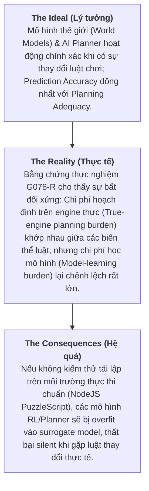
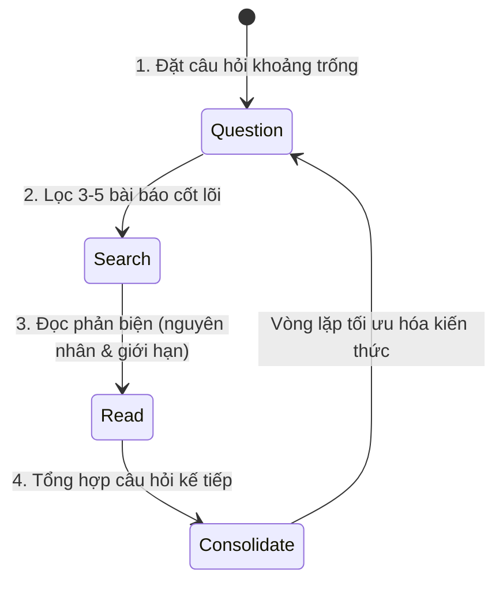

# Bộ Khung Phương Pháp Luận Thạc Sĩ: Ứng Dụng Cho Đề Tài G078-R (PuzzleScript & World Models)

Báo cáo này tổng hợp và ứng dụng trực tiếp **Bộ 3 Phương Pháp Luận Cốt Lõi** (Tony's Model, Dr. Jeff Tao's 4-Step Cycle, và Framing Research Limitations) vào đề tài Luận văn Thạc sĩ **G078-R: Kiểm thử Tái lập Thực thi Ngoại vi trên PuzzleScript Engine**.

---

## 1. Phát Biểu Vấn Đề Chuẩn Xác (Tony's Model)

### Chi Tiết Cấu Trúc:
* **The Ideal (Mục tiêu lý tưởng)**: Các thuật toán học mô hình thế giới (World Model Learning / Action Model Learning) và hoạch định tự động (Automated Planning) phải có khả năng suy luận chính xác và thích ứng với các can thiệp luật chơi tối thiểu (minimal rule interventions). Đánh giá mô hình phải phản ánh đúng năng lực hoạch định thực sự (*planning adequacy*), không chỉ dừng lại ở độ chính xác dự đoán bề mặt (*prediction accuracy*).
* **The Reality (Thực trạng thực nghiệm)**: Kết quả phân tích sơ bộ trên G078-R chỉ ra một hiện tượng một chiều: gánh nặng hoạch định trên engine thực (*true-engine planning burden*) giữa luật gốc và luật can thiệp có thể tương đương, nhưng gánh nặng học mô hình (*planning-adequacy model-learning burden*) lại khác biệt nghiêm trọng khi can thiệp vào mối quan hệ nguyên nhân-kết quả (ví dụ: tắt quy tắc công tắc-mở cửa trong *It Is Pitch Black* hoặc mục tiêu xa trong *Graded Sir*).
* **The Consequences (Hệ quả nếu không giải quyết)**: Các mô hình AI hiện tại có nguy cơ đạt điểm số ảo trên các benchmark học đóng (surrogate environments), nhưng hoàn toàn thất bại khi triển khai vào môi trường thực thi thực tế. Điều này dẫn đến sự sai lệch trong đánh giá năng lực suy luận của AI trong Game AI và Automated Planning.

---

## 2. Xác Định Khoảng Trống Nghiên Cứu (Dr. Jeff Tao's 4-Step Cycle)

Quy trình 4 bước được áp dụng trực tiếp vào quá trình tổng quan văn hiệt cho G078-R:

### Chi Tiết Vòng Lặp 4 Bước Trên G078-R:
1. **Step 1 - Question (Đặt câu hỏi)**:  
   *"Tại sao các mô hình World Model (LLM-synthesized code / Neural World Models) đạt độ chính xác dự đoán cao nhưng vẫn thất bại khi hoạch định trên các bài toán game có cấu trúc luật thay đổi?"*
2. **Step 2 - Search (Tìm kiếm mục tiêu)**:  
   Lọc 3–5 bài báo cốt lõi giải quyết đúng câu hỏi này:
   - *Grimm et al., NeurIPS 2020*: The Value Equivalence Principle for Model-Based RL (L437).
   - *ICLR 2026*: When a Verified World Model Still Loses: Play-Adequacy vs Prediction-Accuracy (L446).
   - *IJCAI 2017 / ICAPS 2024*: Efficient, Safe, and PAC Learning of Action Models (L440, L441).
   - *Viglietta 2014*: Gaming Is a Hard Job (Cơ sở ngữ nghĩa NP/PSPACE-complete của PuzzleScript).
3. **Step 3 - Read (Đọc phân tích)**:  
   - Đánh giá cách các tác giả tiền nhiệm đo lường sai số dự đoán (prediction loss) thay vì đo lường trực tiếp khả năng giải game trên engine thực.
   - Nhận diện giới hạn của các công trình trước: chỉ thử nghiệm trên PDDLGym hoặc synthetic gridworlds giản đơn, chưa kiểm thử trên ngôn ngữ game thực thi tự động có độ phức tạp cao như PuzzleScript.
4. **Step 4 - Consolidate (Tổng hợp & Xác định G078-R Gap)**:  
   Khoảng trống nghiên cứu được xác định: **Thiếu một bộ kiểm thử tái lập thực thi ngoại vi (external executable replication harness) trên engine PuzzleScript chuẩn để tách biệt rõ ràng giữa True-Engine Planning Burden và Model-Learning Burden.**

---

## 3. Thiết Lập Giới Hạn Nghiên Cứu Chuẩn Xác (Framing Limitations)

Khung giới hạn cho Luận văn G078-R được thiết lập dựa trên tính hợp lệ của kết luận, không phải là lời bào chữa cho sai sót:

| Nguyên tắc | Thiết lập cụ thể cho Luận văn G078-R |
| :--- | :--- |
| **"So What?" Test (Tác động giải thích)** | Việc một biến thể can thiệp (ví dụ: `disable_switch_door`) trở nên không giải được (**unsolvable**) không phải là lỗi thuật toán hay bộ dữ liệu, mà là bằng chứng kiểm chứng (negative control) chứng minh quy tắc đó mang tính nhân quả quyết định đến khả năng hoàn thành game. |
| **Generalizability over Flaws (Phạm vi tổng quát)** | Nghiên cứu giới hạn trong không gian game PuzzleScript 2D trên lưới (grid-based, deterministic, discrete-action). Kết luận mang tính tổng quát cho nhóm bài toán **hoạch định rời rạc theo luật xác định**, không đại diện cho các hệ thống điều khiển vật lý liên tục (continuous control robotics). |
| **Data Context (Bối cảnh dữ liệu)** | Dữ liệu kiểm thử sử dụng số bước duyệt thuật toán (BFS/A* search step counts), trạng thái ô lưới (multihot level state hashes) và thời gian thực thi trực tiếp từ **NodeJS PuzzleScript Engine chính chủ**, loại bỏ hoàn toàn nhiễu do tâm lý hoặc hành vi của con người (human play-log bias). |

---

## 4. Bảng Đối Chiếu Quy Trình Kiểm Thử Đề Tài G078-R

| Hạng mục phương pháp | Thành phần trong mã nguồn `f:\Thesis` | Vai trò trong Luận văn |
| :--- | :--- | :--- |
| **Tạo biến thể can thiệp** | `prepare_external_games.py` | Thiết lập các mẫu thử nguyên nhân-kết quả (original, negative control, semantic probe). |
| **Đo lường độ giải được (R1 Gate)** | `run_r1_nodejs_search.py` | Chạy BFS/A* trên NodeJS PuzzleScript backend để thu thập chỉ số khách quan. |
| **Phân tích phân kỳ hành vi (R2 Gate)** | `audit_r2_trace_diff.py` | Kiểm định bước phân kỳ đầu tiên giữa luật gốc và luật can thiệp. |
| **Kiểm tra văn hiệt** | `extracted_papers.json` & `literature_audit_report.md` | Đảm bảo 100% tài liệu tham khảo cốt lõi thuộc hội nghị Tier-A/A*, loại bỏ MDPI/predatory. |
