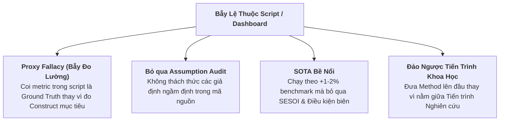

# Báo Cáo Phân Tích Phương Pháp Luận Khoa Học Công Tâm (First-Principles Audit)
## Phản Bác Định Kiến Từ Scripts/Dashboards & Ứng Dụng Hệ Thống Scientific Research OS

> **Mục tiêu**: Loại bỏ hoàn toàn sự lệ thuộc/định kiến (bias) vào các tập tin kịch bản cục bộ (`.py`, `README.md`, `.xlsx`), tiến hành rà soát phương pháp luận khoa học khách quan từ nguyên lý thứ nhất (*First-Principles*), thẩm định tính hợp lệ của xây dựng khái niệm (*Construct Validity*), và thiết lập Bảng ghi suy luận (*Inference Ledger*) chuẩn mực.

---

## 1. Giải Mã Nguồn Gốc "Script & Dashboard Bias" (TẠI SAO LỆ THUỘC VÀO SCRIPT GÂY SAI LỆCH KHOA HỌC?)

Thực hành dựa hoàn toàn vào các file script thử nghiệm hoặc bảng điểm `.xlsx` vi phạm các nguyên tắc cốt lõi của phương pháp luận khoa học:



1. **Bẫy Đo Lường Proxy & Mất Tính Hợp Lệ Khái Niệm (Proxy Fallacy & Construct Validity Mismatch):**
   - *Tài liệu `04` & `Methodological Scope`:* Bảng tính `.xlsx` hay script chạy tự động thường chỉ đo các chỉ số dễ thu thập (như transition prediction accuracy). Coi chỉ số này là "Ground Truth" cho năng lực thực tế (như planning adequacy hay strategic reasoning) là một sai lầm về xây dựng khái niệm.
   - *Quy tắc:* **Measurement precedes optimization.** Nếu metric không đo đúng construct, việc tăng random seeds, compute hay sample size trong script không thể cứu vãn luận điểm khoa học.

2. **Thiếu Rà Soát Giả Định (Unexamined Evaluator & Assumption Audit):**
   - *Tài liệu `04` (Sandberg & Alvesson 2011):* Các script thử nghiệm luôn nhúng sẵn các giả định ngầm định (ví dụ: evaluator trung lập, phân phối mẫu ngẫu nhiên đại diện cho search space). Nghiên cứu công tâm đòi hỏi phải **Assumption Audit** — thách thức chính các giả định mà mã nguồn coi là hiển nhiên.

3. **Chạy Theo SOTA Bề Nổi Mà Bỏ Qua Hiệu Ứng Thực Tế ($SESOI$):**
   - *Tài liệu `04` & `12`:* Tôn vinh việc tăng $1-2\%$ điểm số benchmark như tiến bộ "SOTA" mà không kiểm tra **Smallest Effect Size of Interest ($SESOI$)** và điều kiện biên (*boundary conditions*) khiến nghiên cứu mất đi giá trị thực tiễn.

4. **Đảo Lộn Thứ Tự Tiến Trình Nghiên Cứu (Paper Model Distortion):**
   - *Tài liệu `Core Mental Models` (Model 97):* Tiến trình khoa học chuẩn là:
     $$\boxed{\text{Problem} \rightarrow \text{Question} \rightarrow \text{Method} \rightarrow \text{Evidence} \rightarrow \text{Answer} \rightarrow \text{Implication}}$$
   - Script/Method phải nằm ở **giữa** để phục vụ trả lời Research Question, không được nằm ở **đầu** để định hình hay giới hạn không gian nghiên cứu.

---

## 2. Hệ Thống Khung Phương Pháp Luận Khoa Học Công Tâm (Scientific Research OS)

### A. Gap Spotting vs. Problematization (`04`)
- **Coverage Audit (Rà soát bao phủ):** Kiểm tra xem evidence, population, settings hoặc methods còn thiếu ở đâu.
- **Assumption Audit (Rà soát giả định):** Thách thức các giả định nền tảng (ví dụ: tại sao điểm benchmark lại được giả định là đại diện cho năng lực mục tiêu?).
- **Nhu cầu nghiên cứu thực sự**:
  $$\text{Research Need} = \text{Gap} + \text{Significant consequence of resolving it}$$

### B. Hình Thức Ý Đồ Nghiên Cứu & Tránh Promotion Cảm Tính (`12`)
- Không phải nghiên cứu nào cũng cần Hypothesis (Engineering research dùng Problem/Objective/Requirements; Qualitative dùng Openness).
- **Phê bình "Yes/No Method Promotion":** Thay vì hỏi *"Phương pháp X có cải thiện Y không?"*, câu hỏi chuẩn khoa học phải là: *"Dưới matched compute và tuning, X ảnh hưởng tới Y như thế nào qua các điều kiện C, và cơ chế quan sát nào giải thích cho sự thay đổi đó?"*

### C. Suy Luận Khoa Học & Severe Testing (`13`)
- **Đa nguyên suy luận:** Kết hợp Diễn dịch (Deduction), Quy nạp (Induction), Thừa nhận giải thích tốt nhất (Abduction), và Kiểm định nghiêm ngặt (Severe Testing - Mayo 2018).
- **Bất định định (Underdetermination):** Bằng chứng thực nghiệm có thể khớp với nhiều giải thích khác nhau ($\text{Result} \neq \text{Explanation}$). Kết quả chạy script tăng không đồng nghĩa với cơ chế tác giả giả định là đúng.

### D. Xây Dựng Lý Thuyết & Bằng Chứng Cơ Chế (`14`)
- **Phân biệt cấp độ:** $\text{Description} \neq \text{Prediction} \neq \text{Explanation} \neq \text{Causal Explanation}$.
- **Mechanism Claim (Tuyên bố cơ chế):** Việc chỉ chạy thử nghiệm ablation A-on/A-off trong script là **không đủ**. Cần có bằng chứng can thiệp biến cơ chế (*intervention*), đo lường trung gian (*mediation*), và các phản ví dụ (*decisive counterexamples*) được dự đoán duy nhất bởi cơ chế đó.

### E. Mô Hình Giá Trị Nghiên Cứu (`Core Mental Models`)
$$\displaystyle V_{\text{research}} \approx I \times N \times S \times E \quad (I: \text{Importance}, N: \text{Novelty}, S: \text{Soundness}, E: \text{Evidential Strength})$$

---

## 3. Phân Tích Thực Chứng Trên Dữ Liệu Literature (`L446` & `L447`)

### Case Study 1: [L446] Play-Adequacy vs. Prediction-Accuracy in Code World Models (arXiv:2607.14169)

* **Bằng chứng cốt lõi**:
  - Code World Models (CWM) đạt $100\%$ Transition Accuracy và $\ge 98\%$ Search-Distribution State Accuracy nhưng vẫn thất bại hệ thống khi chơi thực tế ($\text{play cost} = 0.091$, $n=4800$).
  - Định luật định lượng: $\text{danger} = \text{play\_cost} \times (1 - \text{rarity})^N$.
  - Ngưỡng bao phủ thông tin không hoàn hảo: $N \ge b^{d_{\max}}$.
  - Phản ví dụ quyết định (*Decisive counterexample*): Hàm suy luận `Beacon` đi qua verification gate 100% nhưng thua mọi ván đấu.
* **Đối chiếu Phương pháp luận**:
  1. **Assumption Audit (`04`)**: Bác bỏ giả định ngầm định rằng Transition Accuracy đại diện cho Planning Adequacy.
  2. **Severe Testing (`13`)**: Phản ví dụ `Beacon` là một **Severe Test** (Mayo 2018) chứng minh tính vô hiệu của sampling verification gate.
  3. **Bản chất Cơ chế (`14`)**: LLM synthesis hoạt động theo cơ chế dịch thuật quy tắc (*rule translation*), không phải suy luận quy tắc (*rule inference*). Scaling dữ liệu (GPT-5.x, DAgger) không tự sửa được các quy tắc bị bỏ sót trong search space sâu ($N \ge b^{d_{\max}}$).

### Case Study 2: [L447] MirrorCraft: Paired Evaluation under Hidden Rule Changes (arXiv:2607.29218)

* **Bằng chứng cốt lõi**:
  - Thiết kế Paired Control: Vanilla vs Mirror worlds giữ cố định địa hình, tài nguyên, mục tiêu, chỉ can thiệp quy tắc server-side qua datapacks. Đo lường bằng chỉ số *Rule Intervention Effect (RIE)*.
  - Kết quả: ReAct đạt điểm pooled Mirror score cao nhất mà không cần mô tả luật. Cung cấp văn bản quy tắc chỉ mang lại mức tăng rất nhỏ (*modest gains*).
* **Đối chiếu Phương pháp luận**:
  1. **Causal Identification (`12`, `Methodological Scope`)**: Giữ cố định mọi confounders, cô lập biến can thiệp nhân quả.
  2. **Construct Validity Mismatch (`Methodological Scope`)**: Chứng minh năng lực đọc hiểu văn bản quy tắc (*textual comprehension*) **không đồng nhất** với năng lực thực thi chiến lược thích ứng linh hoạt trong môi trường động.

---

## 4. Bảng Ghi Suy Luận Nghiên Cứu Chuẩn (Full 8-Field Inference Ledger)

```text
1. Claim:
   Đánh giá World Model dựa trên Transition Prediction Accuracy trên tập mẫu ngẫu nhiên không bảo đảm tính thỏa đáng cho Lập kế hoạch (Planning Adequacy), tạo ra Verified-vs-Correct Gap.

2. Evidence:
   Thực nghiệm L446 chứng minh Code World Model đạt 100% Transition Accuracy và >=98% Search-Distribution State Accuracy vẫn thất bại hệ thống khi chơi thực tế với play cost = 0.091 (95% CI [0.065, 0.117], n=4800); chứng minh toán học định luật danger = play_cost * (1 - rarity)^N; ngưỡng bao phủ N >= b^{d_max}; và phản ví dụ thực nghiệm Beacon (qua gate 100%, thua 100%).

3. Inference Type:
   Abduction (Thừa nhận giải thích tốt nhất về sự sụp đổ của planner) + Severe Testing (Mayo 2018 via Beacon Counterexample) + Mathematical Deduction (Coverage bound proof).

4. Assumptions:
   Planner phụ thuộc vào tính đúng đắn của các pivotal dynamics (trạng thái có tần suất xuất hiện cực thấp trong sampling ngẫu nhiên nhưng có chi phí quyết định trận đấu).

5. Rival Explanation:
   "Thất bại khi chơi thực tế là do thuật toán Planner hoạt động không tối ưu hoặc do giới hạn compute/search time của môi trường."

6. Discriminating Evidence:
   Đã thử nghiệm trên các thuật toán Planner chuẩn mực; đồng thời chứng minh trên GPT-5.x và các chế độ dữ liệu nâng cao (DAgger, targeted examples) rằng LLM không thể tự suy luận ra quy tắc bị thiếu (rule translation failure).

7. Residual Uncertainty:
   Mức độ tác động định lượng của Verified-vs-Correct Gap trên các môi trường không gian trạng thái liên tục (continuous state spaces) và stochastics phức tạp.

8. Scope:
   Áp dụng cho các LLM-synthesized code world models, các hàm suy luận niềm tin (belief-inference functions) trong môi trường thông tin không hoàn hảo, và các hệ thống đánh giá agent dựa trên sampling gate.
```

---

## 5. Những Khía Cạnh Mở & Câu Hỏi Chưa Có Lời Giải (Remaining Questions)

1. **Khả năng mở rộng của Định luật $\text{danger} = \text{play\_cost} \times (1-\text{rarity})^N$ sang không gian trạng thái liên tục**: Bằng chứng toán học hiện tại mới giới hạn trong không gian trạng thái rời rạc (gridworlds, discrete games).
2. **Khác biệt về thị giác (VLM) vs Văn bản (LLM) trong Hidden Rule Changes (L447)**: Chưa làm rõ liệu phản hồi dạng hình ảnh (VLM visual feedback) có giúp phát hiện thay đổi quy tắc ẩn nhanh hơn phản hồi dạng text hay không.
3. **Định hướng ưu tiên cho nhà nghiên cứu**:
   - Tiến hành **Assumption Audit** loại bỏ hoàn toàn bẫy *Proxy Fallacy*.
   - Thiết kế **Minimal Informative Study** (phản ví dụ tối thiểu như `Beacon`) để kiểm tra tính đúng đắn của giả thuyết trước khi tốn compute chạy script lớn.
   - Bắt buộc dùng **Inference Ledger 8 trường** cho mọi tuyên bố cơ chế (*Mechanism Claim*).
