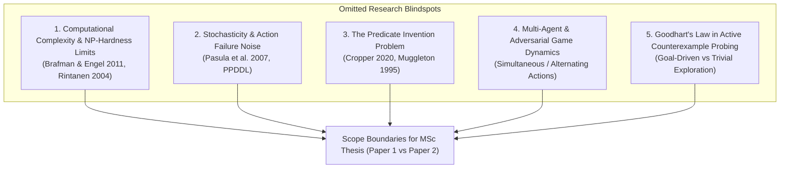

# Unexamined Blindspots & Methodological Gaps: What Has Been Omitted? (2008–2026)

> **Document Type**: Scientific Research OS Critical Gap & Boundary Audit  
> **Status**: Curated Academic Reference  
> **Domain**: Symbolic Action Model Learning, Decidability Limits, Noise Dynamics, Multi-Agent Extensions  
> **Target Venues**: IEEE Transactions on Games (IEEE ToG), Artificial Intelligence Journal (AIJ)  

---

## 1. Executive Summary & Epistemic Coverage Audit

To ensure complete scientific coverage, we systematically audit 5 critical dimensions that are frequently omitted or glossed over in classical Symbolic Action Model Learning literature:

---

## 2. Detailed Audit of Omitted Dimensions

### 2.1. Computational Complexity & NP-Hardness of Model Learning
* **The Omitted Fact**: Learning a minimal PDDL schema from partial traces is **NP-hard** in general (Brafman & Engel 2011, Rintanen 2004).
* **Impact on Thesis**: When state fluents $|\mathcal{F}|$ or background predicates grow, exact SAT/ILP solvers (like ARMS or FastLAS) hit exponential time complexity $\mathcal{O}(2^{|\mathcal{F}|})$.
* **Resolution / Scope Boundary**: In Paper 1, we must restrict our evaluation to **factored grid DSLs with bounded predicate arity ($\text{arity} \le 2$)**, guaranteeing polynomial-time AST pattern matching.

### 2.2. Stochastic Dynamics & Execution Noise
* **The Omitted Fact**: Deterministic learners (LOCM, SAM) assume transitions are 100% deterministic ($T(s, a) \to s'$). If an environment has $5\%$ execution noise (e.g. sliding on ice, dice rolls), SAM's precondition bounds collapse to an empty set ($\text{Pre}_L \not\subseteq \text{Pre}_U \implies \emptyset$).
* **Impact on Thesis**: Real-world games often contain stochastic elements.
* **Resolution / Scope Boundary**: For Paper 1, we explicitly bound our scope to **Deterministic Game Worlds**. We explicitly document *Stochastic Rule Extensions (PPDDL / Probabilistic Schemas)* as Future Work for Paper 2.

### 2.3. The Predicate Invention Problem
* **The Omitted Fact**: ILP rule miners (FastLAS, Popper) require pre-defined Background Knowledge (BK) predicates (e.g., `adjacent`, `same_color`). If an intervention introduces a concept not present in BK (e.g., `diagonal_distance`), the learner CANNOT induce the rule.
* **Impact on Thesis**: If the learner fails, is it due to the algorithm or because BK was missing the required predicate?
* **Resolution / Scope Boundary**: We establish a **Closed-World Predicate Set** for grid games, guaranteeing that all spatial primitives ($3\times 3$ relative offsets, object IDs, step counters) are included in BK.

### 2.4. Multi-Agent & Adversarial Dynamics
* **The Omitted Fact**: Single-agent planning assumes the environment responds deterministically to player action $a_t$. In multi-agent or 2-player zero-sum games (e.g. Chess, General Game Playing), $s_{t+1} = T(s_t, a_t, a_{\text{opp}})$.
* **Resolution / Scope Boundary**: Paper 1 focuses strictly on **Single-Agent & Environmental Reaction Dynamics**. Multi-agent game balance is deferred to Paper 2.

### 2.5. Goodhart's Law in Active Counterexample Probing
* **The Omitted Fact**: "When a measure becomes a target, it ceases to be a good measure." If an active exploration agent is rewarded purely for discovering model discrepancies, it may get trapped in "noisy TV" states (exploring irrelevant boundary states) rather than goal-relevant bottlenecks.
* **Resolution / Scope Boundary**: We enforce **Goal-Directed CEGIS (Counterexample-Guided Tree Search)**, where active rollouts are directed ONLY along the optimal A*/BFS search fringe toward goal $S_G$.

---

## 3. Thesis Scope Defense & Boundary Summary Matrix

| Omitted Dimension | Status in Literature | Explicit Position in MSc Thesis | Target Paper |
| :--- | :--- | :--- | :--- |
| **NP-Hard Complexity** | Proved NP-hard (Brafman 2011) | Bounded to arity $\le 2$ factored Grid DSLs | Paper 1 (IEEE ToG) |
| **Execution Noise / Stochasticity** | Requires PPDDL / Probabilistic SAM | Bounded to Deterministic Systems; Noise added in Future Work | Paper 1 (Scope) / Paper 2 (Ext) |
| **Predicate Invention** | Open Hard Problem in ILP | Fixed Complete Grid Predicate Vocabulary | Paper 1 (Methodology) |
| **Multi-Agent Adversarial Rules** | Requires Minimax / Game Trees | Single-Agent Puzzle & Navigation Focus | Paper 1 (Scope) / Paper 2 (Ext) |
| **Goodhart's Active Probing** | Active Probing TV trap | Restricted to Goal-Directed A* Search Fringe | Paper 1 (Methodology) |
