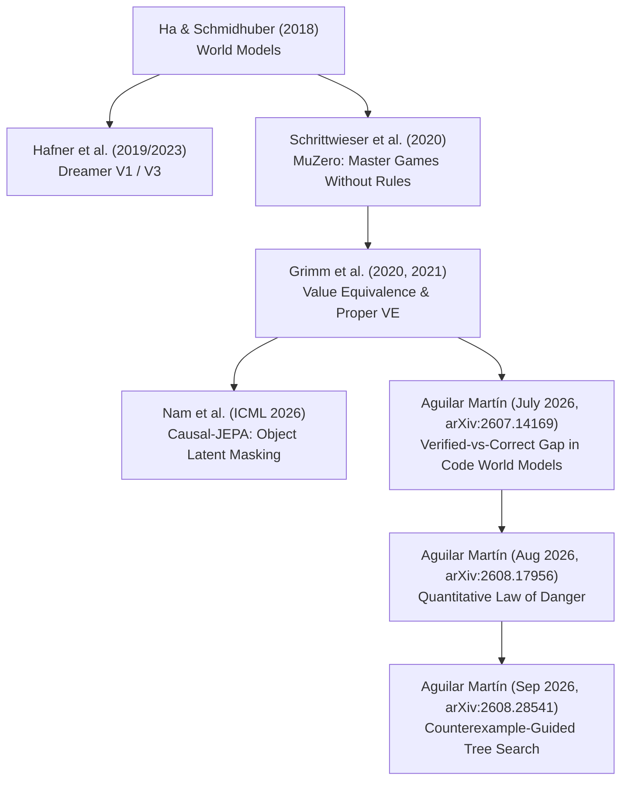
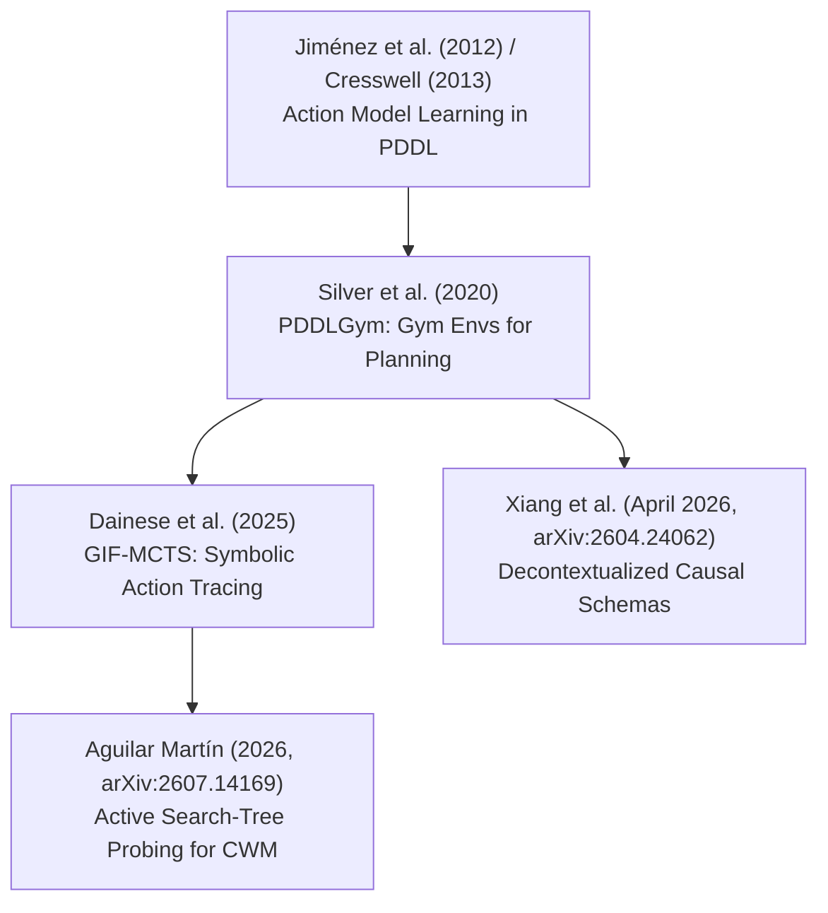
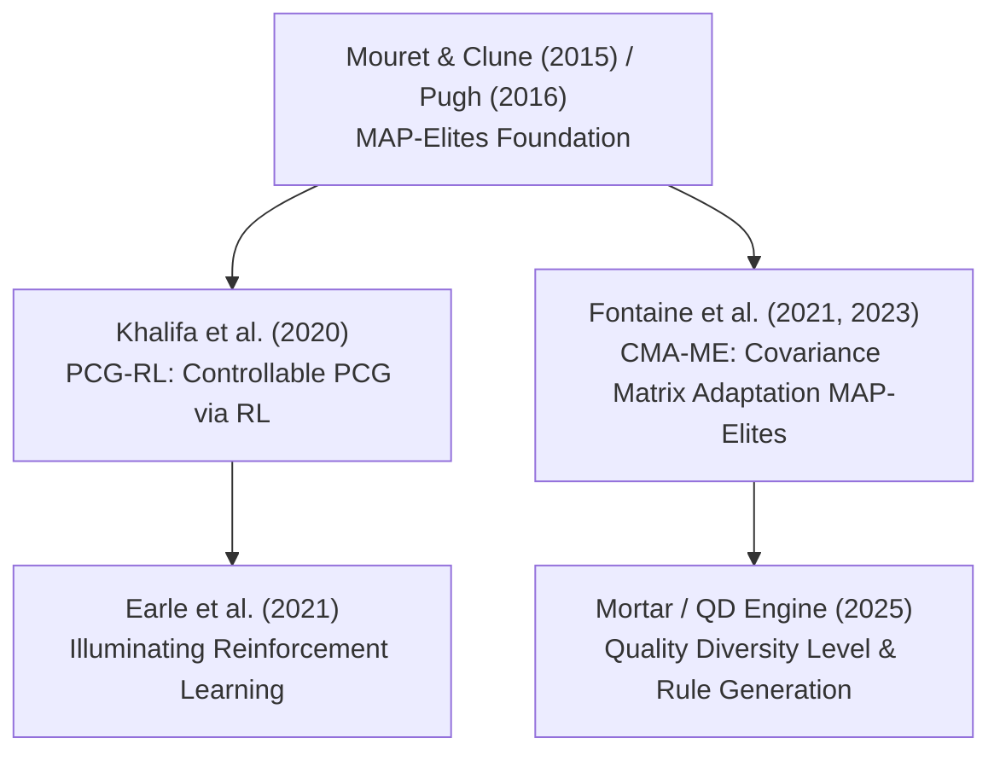
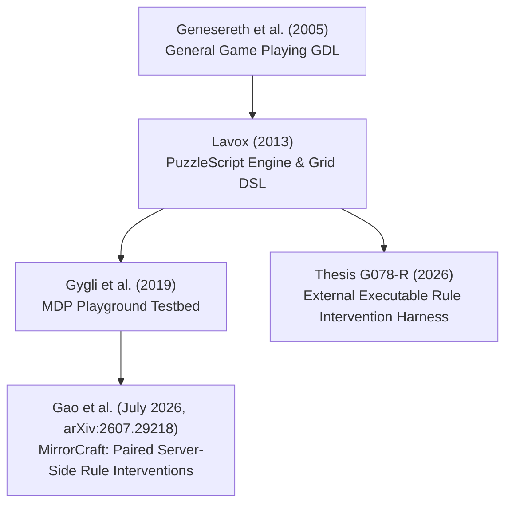

# Connected Papers Literature Flows & Citation Lineages (2021–2026)

This document maps out the explicit citation graphs, theoretical dependencies, and paper lineages connecting 2021–2026 Game AI, World Model Learning, Action Model Learning, PCG-QD, and General Game Playing literature.

---

## 1. Lineage 1: World Models, Value Equivalence & Planning Adequacy

### Key Insights & Cross-Citations:
1. **Transition Accuracy vs Value Equivalence**:
   - Grimm et al. (2020, 2021) established that a world model does not need to accurately predict every microscopic state transition; it only needs to preserve value equivalence under the optimal policy $\pi^*$.
   - Aguilar Martín (2026) extends this principle to discrete program/code world models, proving that even 100% transition accuracy under passive validation fails when unvisited search tree branches contain omitted pivotal rules ($B = 0.091, 95\%\text{ CI }[0.065, 0.117]$).

2. **The Quantitative Law of Danger**:
   $$\text{danger} = \text{play\_cost} \times (1 - r)^N$$
   - Under passive evaluation, rare pivotal rules (rarity $r$) remain undetected across $N$ trajectory samples, creating an exponential blind spot for autonomous planning agents.

---

## 2. Lineage 2: Action Model Learning & Code World Models

### Key Insights & Cross-Citations:
1. **Rule Translation vs Rule Inference**:
   - Classical Action Model Learning (Jiménez 2012, Silver 2020) assumes structural state-action observation logs with known predicates.
   - Modern LLM Code World Models (2024–2026) attempt to generate operational executable code directly from natural language or traces.
   - Xiang et al. (2026) prove LLMs perform rule translation from context rather than inductive causal dynamics learning, necessitating explicit active search-tree verification.

---

## 3. Lineage 3: Procedural Content Generation & Quality-Diversity (PCG-QD)

### Key Insights & Cross-Citations:
1. **Quality-Diversity as Environment Probing**:
   - PCG-QD algorithms (MAP-Elites, CMA-ME) generate diverse, high-quality game levels and rules that act as severe test suites for World Models.
   - Unvisited corners of the QD feature space expose missing rule dynamics in learned world models before deployment.

---

## 4. Lineage 4: General Game Playing & Paired Rule Interventions

### Key Insights & Cross-Citations:
1. **The Rule Intervention Effect (RIE)**:
   - MirrorCraft (Gao et al. 2026) proves that agents trained on fixed rule environments experience complete policy collapse under paired minimal rule interventions ($\text{RIE}_m(A)$).
   - PuzzleScript provides an ideal, formal sandbox for paired minimal rule modifications (e.g. reversing object pushing rules, adding hidden triggers) with zero computational bloat.

---

## 5. Summary Matrix of Connected Literature (2021–2026)

| Paper | Lineage | Core Contribution | Connection to Thesis G078-R |
|---|---|---|---|
| **Aguilar Martín (arXiv:2607.14169)** | World Models | Verified-vs-Correct Gap in Code World Models | Direct theoretical foundation for planning adequacy vs prediction accuracy |
| **Gao et al. (arXiv:2607.29218)** | Rule Interventions | MirrorCraft paired server-side rule modifications | Empirical benchmark for evaluating Rule Intervention Effects |
| **Nam et al. (ICML 2026)** | World Models | Causal-JEPA latent object masking | Technical framework for latent causal world model learning |
| **Xiang et al. (arXiv:2604.24062)** | Action Models | Decontextualized Causal Schemas in LLM agents | Proves rule translation vs true inductive dynamics inference |
| **Dainese et al. (2025)** | Action Models | GIF-MCTS symbolic action tracing | Proves active search-tree rollouts eliminate error compounding |
| **Fontaine et al. (2021/2023)** | PCG-QD | CMA-ME quality diversity optimization | Provides QD search methods for adversarial level generation |
