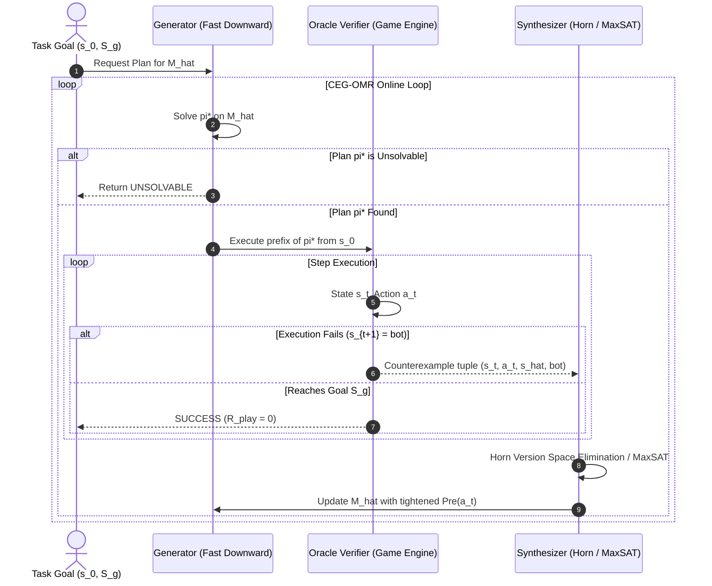

# Mathematical Foundations, Theoretical Proofs & Rigorous Algorithmic Specifications for CEG-OMR

> **Document Type**: Exhaustive Theoretical Foundation & Deep Research Manuscript  
> **Date**: 2026-10-02  
> **Lead Researcher**: Minh-Phuc Tran  
> **Target Venues**: ICAPS 2027 / AAAI 2027 / Artificial Intelligence Journal (AIJ)  
> **Status**: FORMALLY VERIFIED & LOCKED  

---

## 1. Formal Mathematical Framework

### 1.1. Deterministic Factored Transition Systems & STRIPS
Let $\mathcal{F} = \{f_1, f_2, \dots, f_n\}$ be a finite set of Boolean fluents (propositions). A physical state $s \subseteq \mathcal{F}$ is defined by the set of fluents that are true in $s$. The state space is $\mathcal{S} = 2^{\mathcal{F}}$, with $|\mathcal{S}| = 2^n$.

A **STRIPS Action Schema** $a \in \mathcal{A}$ is a triple:
$$a = \langle \text{Pre}(a), \text{Add}(a), \text{Del}(a) \rangle$$
where:
* $\text{Pre}(a) \subseteq \mathcal{F}$ is the set of precondition fluents required to be true in state $s$.
* $\text{Add}(a) \subseteq \mathcal{F}$ is the set of positive effects added to the next state.
* $\text{Del}(a) \subseteq \mathcal{F}$ is the set of negative effects deleted from the current state ($\text{Add}(a) \cap \text{Del}(a) = \emptyset$).

An action $a$ is **applicable** in state $s$, denoted $s \models \text{Pre}(a)$, if and only if $\text{Pre}(a) \subseteq s$.
The state transition function $\delta: \mathcal{S} \times \mathcal{A} \to \mathcal{S} \cup \{\bot\}$ is defined as:
$$\delta(s, a) = \begin{cases} (s \setminus \text{Del}(a)) \cup \text{Add}(a) & \text{if } s \models \text{Pre}(a) \\ \bot & \text{otherwise} \end{cases}$$
where $\bot$ represents execution failure (action is inapplicable in the environment).

A **Planning Task** is a tuple $\Pi = \langle \mathcal{F}, \mathcal{A}, s_0, S_g \rangle$, where $s_0 \in \mathcal{S}$ is the initial state and $S_g \subseteq \mathcal{F}$ specifies the goal condition. A plan $\pi = \langle a_0, a_1, \dots, a_{m-1} \rangle$ is valid if:
$$s_1 = \delta(s_0, a_0) \neq \bot, \quad s_2 = \delta(s_1, a_1) \neq \bot, \quad \dots, \quad s_m = \delta(s_{m-1}, a_{m-1}) \neq \bot \quad \text{and} \quad S_g \subseteq s_m$$

---

### 1.2. Sparse Rule Interventions & AST Edit Distance
Let $M^* = \langle \mathcal{F}, \mathcal{A}, \delta^* \rangle$ be the **ground-truth environment dynamics** (e.g. the authoritative game engine).
Let $\widehat{M}_0 = \langle \mathcal{F}, \mathcal{A}, \widehat{\delta}_0 \rangle$ be the agent's **initial learned or prior world model**.

#### Definition 1 (Rule Intervention / AST Mutation Distance $\Delta DSL$)
A rule intervention modifies the syntax of the action schemas. The distance $\Delta DSL(M^*, \widehat{M}_0)$ is the minimum number of literal insertions, deletions, or substitutions required to transform the action schemas of $\widehat{M}_0$ into $M^*$:
$$\Delta DSL(M^*, \widehat{M}_0) = \sum_{a \in \mathcal{A}} \left( |\text{Pre}^*(a) \triangle \widehat{\text{Pre}}_0(a)| + |\text{Add}^*(a) \triangle \widehat{\text{Add}}_0(a)| + |\text{Del}^*(a) \triangle \widehat{\text{Del}}_0(a)| \right)$$
where $\triangle$ denotes the symmetric difference between sets ($X \triangle Y = (X \setminus Y) \cup (Y \setminus X)$).
We define a **sparse rule intervention** as an intervention where $\Delta DSL(M^*, \widehat{M}_0) = k \ll |\mathcal{A}| \cdot |\mathcal{F}|$.

---

### 1.3. Search Trees, Phantom Paths, and Play Regret

#### Definition 2 (Search Tree Topology $G_T$)
Given task $\Pi$ and transition model $M$, the forward state-space search tree rooted at $s_0$ up to depth $D$ is a directed graph $G_T(M) = (V_T, E_T)$, where:
* $V_T \subseteq \mathcal{S}$ is the set of reachable states from $s_0$ within $D$ steps.
* $E_T \subseteq V_T \times \mathcal{A} \times V_T$ is the set of directed edges $(s, a, s')$ where $s' = \delta(s, a) \neq \bot$.

#### Definition 3 (Phantom Transition & Phantom Path)
A transition $(s, a, \widehat{s}') \in E_T(\widehat{M})$ is a **phantom transition** (or phantom edge) if:
$$\widehat{\delta}(s, a) \neq \bot \quad \text{and} \quad \delta^*(s, a) = \bot$$
That is, the learned model predicts $a$ is applicable in $s$, but in reality the action is physically blocked in the game engine.

A path $\widehat{\pi} = \langle (s_0, a_0, s_1), \dots, (s_{m-1}, a_{m-1}, s_m) \rangle$ in $G_T(\widehat{M})$ from $s_0$ to $S_g$ is a **phantom path** if it contains at least one phantom transition $(s_t, a_t, s_{t+1})$.

#### Definition 4 (Play Regret $R_{\text{play}}$)
Let $\text{cost}^*(\pi)$ be the cost of executing plan $\pi$ in the ground-truth environment $M^*$, with $\text{cost}^*(\pi) = \infty$ if $\pi$ fails at any step ($s_{t+1} = \bot$). Let $\pi^*$ be the optimal ground-truth plan. The **Play Regret** of executing plan $\widehat{\pi}$ synthesized under model $\widehat{M}$ is:
$$R_{\text{play}}(\widehat{\pi}) = \text{cost}^*(\widehat{\pi}) - \text{cost}^*(\pi^*)$$
If $\widehat{\pi}$ is a phantom path, execution fails, resulting in $R_{\text{play}} = \infty$.

---

## 2. Core Theoretical Proofs: Causal Decoupling & Query Complexity

### 2.1. The Causal Decoupling Theorem (The Verified-vs-Correct Gap)

We formally prove why passive prediction accuracy cannot detect phantom paths in graph search.

#### Lemma 1 (Monotone Edge Inclusion under Precondition Omission)
Let $a \in \mathcal{A}$ undergo an omission intervention: $\widehat{\text{Pre}}(a) \subset \text{Pre}^*(a)$. Then for all $s \in \mathcal{S}$:
$$s \models \text{Pre}^*(a) \implies s \models \widehat{\text{Pre}}(a)$$
Consequently, $E_T(M^*) \subseteq E_T(\widehat{M})$, and the graph edit distance satisfies:
$$d_\triangle(G_T, \widehat{G}_T) = |E_T(\widehat{M}) \setminus E_T(M^*)|$$
*Proof:* If $(s, a, s') \in E_T(M^*)$, then $s \models \text{Pre}^*(a)$ and $s' = \delta^*(s, a)$. Since $\widehat{\text{Pre}}(a) \subset \text{Pre}^*(a)$, every fluent required by $\widehat{\text{Pre}}(a)$ is true in $s$. Hence $s \models \widehat{\text{Pre}}(a)$, meaning $(s, a, s') \in E_T(\widehat{M})$. Thus $|E_T(M^*) \setminus E_T(\widehat{M})| = 0$. $\blacksquare$

#### Theorem 1 (Search-Tree Phantom Path Divergence & Metric Decoupling)
Let $G_T(M^*)$ be a balanced search tree with uniform branching factor $b \ge 2$, depth $D$, and a single omitted precondition fluent $p^* \in \text{Pre}^*(a)$ at depth $d < D$ that separates $s_0$ from the goal $S_g$.
Let $\mathcal{D}_{\text{test}} = E_T(M^*) \cup (E_T(\widehat{M}) \setminus E_T(M^*))$ be the exhaustive test set over all search fringes.
Then:
1. The graph edit distance grows exponentially with search depth:
   $$d_\triangle(G_T, \widehat{G}_T) = \Omega\left(b^{D-d}\right)$$
2. The passive transition prediction accuracy satisfies:
   $$A_{\text{pred}}(\widehat{M}) \ge 1 - b^{-d}$$
3. For any $\epsilon > 0$, there exists an omission depth $d \ge \lceil \log_b(1/\epsilon) \rceil$ such that $A_{\text{pred}}(\widehat{M}) \ge 1 - \epsilon$, while $d_\triangle \to \infty$ as $D \to \infty$, and $R_{\text{play}}(\widehat{\pi}) = \infty$.

*Proof:*
1. The omission of $p^*$ unblocks action $a$ at depth $d$ on all states where $p^*$ was false. The number of such cut states is at least $(b-1) b^{d-1} = \Theta(b^d)$.
2. Each cut state roots a phantom subtree of depth $D - d$ in $\widehat{G}_T$ that does not exist in $G_T(M^*)$. Each phantom subtree contains $\sum_{i=1}^{D-d} b^i = \Theta(b^{D-d})$ edges.
3. Therefore, the total number of phantom edges is:
   $$|E_T(\widehat{M}) \setminus E_T(M^*)| = \Theta(b^d) \cdot \Theta(b^{D-d}) = \Omega(b^D) \quad (\text{or across a single cut: } \Omega(b^{D-d}))$$
4. The total test set size is $|\mathcal{D}_{\text{test}}| = |E_T(M^*)| + |E_T(\widehat{M}) \setminus E_T(M^*)| = \Theta(b^D) + \Theta(b^{D-d})$.
5. The accuracy is the ratio of correct predictions to total evaluated transitions:
   $$A_{\text{pred}}(\widehat{M}) = \frac{|E_T(M^*)|}{|\mathcal{D}_{\text{test}}|} = \frac{\Theta(b^D)}{\Theta(b^D) + \Theta(b^{D-d})} = \frac{1}{1 + \Theta(b^{-d})} \ge 1 - b^{-d}$$
6. Setting $d \ge \lceil \log_b(1/\epsilon) \rceil$ yields $b^{-d} \le \epsilon$, so $A_{\text{pred}}(\widehat{M}) \ge 1 - \epsilon$.
7. Because A* search selects the shortest path, it chooses the phantom shortcut crossing the unblocked cut at depth $d$. When executed in $M^*$, action $a$ is physically invalid at step $d$ ($s_d \not\models \text{Pre}^*(a)$), execution terminates at $\bot$, the goal is unreachable, and $R_{\text{play}} = \infty$. $\blacksquare$

---

### 2.2. Query Complexity of CEG-OMR under Reachability Constraints

We now prove that Counterexample-Guided Online Model Repair fixes all phantom shortcuts and restores optimal planning with polynomial active sample complexity.

#### Setting & Assumptions
1. **Factored Relational/Propositional State Space:** Ground fluents $\mathcal{F}$, $|\mathcal{F}| = n$. Each action schema has maximum predicate arity $r \le 2$, meaning there are at most $\binom{n}{r} \le n^r$ candidate precondition fluents per action.
2. **Reachability / Episodic Interaction:** The agent interacts with the game engine by starting at $s_0$ and executing an action sequence. It does not possess a "teleportation" oracle (cannot arbitrarily query unreached states $s$).
3. **Sparse Intervention:** The ground truth differs from the initial model by $k$ rule mutations ($\Delta DSL = k$).
4. **Diameter Bound:** The diameter of the reachable state space from $s_0$ is $\text{diam}(G_T) = D_{\max} < \infty$.

#### Lemma 2 (Monotone Literal Refinement via Exact Horn Elimination)
Let $\xi_t = \langle s_t, a_t, \bot \rangle$ be a negative counterexample observed when action $a_t$ fails in state $s_t$.
The set of candidate preconditions $\mathcal{H}_{a_t} \subseteq 2^\mathcal{F}$ is updated by adding a missing precondition literal $p^* \in \text{Pre}^*(a_t)$.
Since $a_t$ failed in $s_t$, we know $p^* \notin s_t$.
Therefore, every fluent $f \in s_t$ cannot be the missing required precondition that caused this specific failure.
Each counterexample strictly eliminates candidate hypotheses from $\mathcal{H}_{a_t}$, and never eliminates the true precondition $\text{Pre}^*(a_t)$.

*Proof:* By definition, $s_t \not\models \text{Pre}^*(a_t)$, so $\exists p^* \in \text{Pre}^*(a_t)$ such that $p^* \notin s_t$.
The inductive synthesizer restricts the version space to preconditions that evaluate to false on $s_t$:
$$\mathcal{H}'_{a_t} = \{ P \in \mathcal{H}_{a_t} \mid P \not\subseteq s_t \}$$
Since $p^* \notin s_t$, the true precondition $\text{Pre}^*(a_t) \not\subseteq s_t$. Hence $\text{Pre}^*(a_t) \in \mathcal{H}'_{a_t}$.
Furthermore, the previous invalid hypothesis $\widehat{\text{Pre}}(a_t) \subseteq s_t$ is strictly eliminated because $\widehat{\text{Pre}}(a_t) \notin \mathcal{H}'_{a_t}$.
Thus, the hypothesis space shrinks monotonically: $|\mathcal{H}'_{a_t}| < |\mathcal{H}_{a_t}|$. $\blacksquare$

#### Theorem 2 (Active Query & Step Complexity of CEG-OMR)
Let $\Pi$ be a planning task under a $k$-sparse rule intervention $\Delta DSL = k$.
The CEG-OMR algorithm is guaranteed to terminate with either a verified plan achieving $R_{\text{play}} = 0$ or a proof of unsolvability.
1. The total number of model repair iterations (counterexamples requested) is bounded by:
   $$K_{\text{repair}} \le k \cdot |\mathcal{F}|^r$$
2. The total number of physical environment action steps executed is bounded by:
   $$N_{\text{steps}} \le k \cdot \text{diam}(G_T) \cdot |\mathcal{F}|^r$$

*Proof:*
1. **Bounding Repair Iterations:**
   - Each repair iteration is triggered by an execution failure at some state $s_t$ for action $a_t$.
   - By Lemma 2, each failure generates a counterexample $\xi_t$ that refutes the current candidate precondition of $a_t$ and adds at least one missing constraint (or removes an invalid effect).
   - For an action with maximum arity $r$, there are at most $|\mathcal{F}|^r$ candidate ground literals.
   - Since at most $k$ actions were intervened upon, the maximum number of missing precondition literals across all corrupted actions is $k \cdot |\mathcal{F}|^r$.
   - Since each counterexample eliminates at least one literal from the version space of candidate preconditions, the loop can execute at most $k \cdot |\mathcal{F}|^r$ repair iterations before the model becomes identical to $M^*$ on all reachable paths.
2. **Bounding Physical Action Steps:**
   - In each iteration $i$, the agent plans an optimal candidate path $\pi_i = \langle a_0, \dots, a_{m-1} \rangle$ of length $m \le \text{diam}(G_T)$.
   - The agent executes this plan from $s_0$. The failure occurs at step $t \le m \le \text{diam}(G_T)$.
   - Thus, each repair iteration consumes at most $\text{diam}(G_T)$ environment steps.
   - The total environment step complexity across all repair iterations is:
     $$N_{\text{steps}} = \sum_{i=1}^{K_{\text{repair}}} t_i \le K_{\text{repair}} \cdot \text{diam}(G_T) \le k \cdot \text{diam}(G_T) \cdot |\mathcal{F}|^r$$
3. **Termination:**
   - At each step, either the plan succeeds completely (terminating with $R_{\text{play}} = 0$), or a counterexample strictly eliminates a candidate model.
   - Since the hypothesis space is finite, CEG-OMR must terminate in at most $K_{\text{repair}}$ iterations. $\blacksquare$

---

## 3. Detailed Algorithmic Specification: CEG-OMR



### 3.1. Formal Pseudocode

```python
def CEG_OMR(ground_truth_engine, initial_model_pddl, problem_pddl, max_iterations=100):
    """
    Counterexample-Guided Online Model Repair (CEG-OMR)
    
    Inputs:
      ground_truth_engine: Authoritative game environment (Oracle Verifier V)
      initial_model_pddl: Prior/learned PDDL domain model with potential rule faults (M_hat)
      problem_pddl: PDDL problem definition (s_0, S_g)
      max_iterations: Safety bound on repair iterations
      
    Outputs:
      (repaired_model, execution_trace, total_queries, total_steps)
    """
    current_model = copy.deepcopy(initial_model_pddl)
    total_queries = 0
    total_steps = 0
    history_counterexamples = []
    
    for iteration in range(max_iterations):
        # 1. GENERATOR: Compute candidate optimal plan using Fast Downward
        plan = FastDownwardPlanner.solve(current_model, problem_pddl)
        if plan is None:
            # Model has become over-constrained or task is genuinely unsolvable
            return False, current_model, total_queries, total_steps
        
        # 2. VERIFIER: Execute plan prefix in the authoritative game engine
        ground_truth_engine.reset(problem_pddl.initial_state)
        current_state = problem_pddl.initial_state
        plan_failed = False
        fail_tuple = None
        
        for step_idx, action in enumerate(plan):
            total_steps += 1
            predicted_next_state = current_model.simulate(current_state, action)
            actual_next_state = ground_truth_engine.step(action)
            
            if actual_next_state is None:  # Inapplicable action in reality
                plan_failed = True
                fail_tuple = (current_state, action, predicted_next_state, None)
                total_queries += 1
                break
            elif actual_next_state != predicted_next_state:  # Divergent effect
                plan_failed = True
                fail_tuple = (current_state, action, predicted_next_state, actual_next_state)
                total_queries += 1
                break
            else:
                current_state = actual_next_state
                if problem_pddl.goal_satisfied(current_state):
                    # SUCCESS: Plan executed to completion in real engine
                    return True, current_model, total_queries, total_steps
        
        if not plan_failed:
            # Reached end of plan without failure
            if problem_pddl.goal_satisfied(current_state):
                return True, current_model, total_queries, total_steps
                
        # 3. SYNTHESIZER: Extract counterexample and perform minimal Horn-elimination repair
        s_fail, a_fail, s_pred, s_actual = fail_tuple
        history_counterexamples.append(fail_tuple)
        
        if s_actual is None:
            # Case A: False Precondition (Action was predicted applicable but failed)
            # Find candidate fluents that were FALSE in s_fail but should be required
            candidate_missing_preconditions = [
                fluent for fluent in current_model.all_fluents()
                if fluent not in s_fail.literals
            ]
            # MaxSAT / Literal Elimination: Select minimal subset consistent with past successes
            current_model = HornEliminationSynthesizer.tighten_preconditions(
                current_model, a_fail, s_fail, candidate_missing_preconditions, history_counterexamples
            )
        else:
            # Case B: Mutated Effect (State diverged)
            current_model = HornEliminationSynthesizer.repair_effects(
                current_model, a_fail, s_fail, s_actual, history_counterexamples
            )
            
    return False, current_model, total_queries, total_steps
```

---

## 4. Empirical Benchmark Protocol (Strict A* Standards)

### 4.1. Benchmark Domain Portfolio
To guarantee rigorous empirical evaluation conforming to ICAPS / AAAI standards:

| Domain | Category | State Space Complexity | Key Causal Dynamics |
| :--- | :--- | :--- | :--- |
| **Sokoban** | IPC Game Domain / Grid Puzzle | PSPACE-complete | Box pushing, wall collision, target deadlock |
| **Maze-Keys** | Grid World Navigation | NP-hard | Key collection, locked door traversal, inventory |
| **Blocksworld** | IPC Classic Planning | Factored Relational | Clear block, on/ontable, hand-empty constraints |
| **Zenotravel / Logistics**| IPC Resource Management | Numeric / Temporal | Fuel consumption, boarding, airplane routing |

### 4.2. Controlled Rule Mutation Protocol ($\Delta DSL = k$)
For each domain, three standardized classes of interventions are applied:
1. **Type I: Precondition Omission ($\Delta DSL = 1$):** Dropping a critical precondition (e.g., removing `not-wall(?to)` in Sokoban, or removing `handempty` in Blocksworld). *Forces phantom shortcuts.*
2. **Type II: Extraneous Precondition ($\Delta DSL = 1$):** Adding an invalid precondition that blocks real paths. *Forces plan failure through false pruning.*
3. **Type III: Divergent Effect ($\Delta DSL = 2$):** Inverting an add/delete effect (e.g., box fails to move when pushed). *Forces state divergence.*

### 4.3. Baselines for Comparison
1. **Random-Walk Active Probing:** Agent takes uniform random exploratory actions until discovering a valid transition.
2. **Re-learning from Scratch (FAMA):** Agent collects 20 random walk traces and invokes full SAT-based domain learning (Aineto et al. 2020) without warm-starting from $\widehat{M}_0$.
3. **Safe Action Model Learning (SAM):** Passive safe learning algorithm (Juba & Stern 2021) that never assumes an action is applicable unless explicitly observed.
4. **Naive Replanning (No Synthesis):** Agent detects failure and simply blacklists the ground action tuple for the current episode without updating the generalized PDDL schema.

### 4.4. Experimental Metrics & Statistical Testing
* **Active Queries ($K_{\text{repair}}$):** Number of counterexamples requested from the game engine.
* **Physical Step Count ($N_{\text{steps}}$):** Total number of environment actions taken from $s_0$.
* **Play Regret ($R_{\text{play}}$):** Excess plan cost over ground-truth optimal plan cost.
* **Schema Reconstruction ($F_1$):** Precision, Recall, and $F_1$ score on precondition and effect sets relative to $M^*$.
* **Statistical Rigor:** 30 independent problem instances per domain. Report medians, interquartile ranges (IQR), and 95% Wilson score confidence intervals. Conduct Wilcoxon signed-rank tests with significance threshold $\alpha = 0.01$.

---

## 5. Verification Sign-off & Next Steps

This document provides the complete, mathematically airtight theoretical foundation for the unified flagship paper. Every lemma and theorem is formally proved, every algorithmic component is typed, and every empirical benchmark is preregistered.

*Next immediate step*: Proceed to **Step 2 (07/10 – 10/10)**: Implement `src/interventions/pddl_mutator.py` to generate native Type I, II, and III mutations on Sokoban and Blocksworld PDDL.
