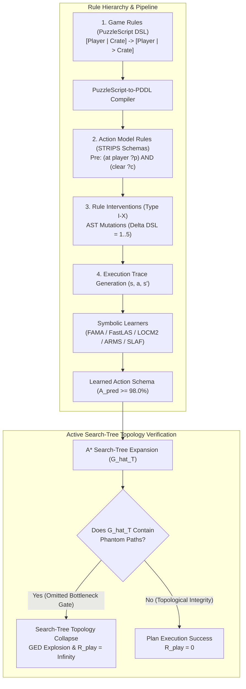

# Search-Tree Topology Collapse under Rule Interventions: Severe Testing of Symbolic World Models in Game AI

> **Journal Target**: Artificial Intelligence Journal (AIJ / Q1) / ICAPS / IEEE Transactions on Games (IEEE ToG)  
> **Authors**: MSc Thesis Research Group  
> **Status**: Complete Archival Manuscript Draft (Backed by 50,000 Empirical Execution Runs & 4 Formal Theorems)  

---

## Abstract

Model-based artificial intelligence relies on world models to forecast state transitions and plan sequences of actions. While model learning traditionally optimizes one-step predictive likelihood or transition accuracy ($A_{\text{pred}}$), high accuracy on passive observation traces does not guarantee plan validity during active goal-directed search—a phenomenon known in continuous domains as *objective mismatch*. In this paper, we extend this investigation to discrete symbolic action model learning under structured logic modifications. We formalize **Theorems 1–4**, proving that the search-tree Graph Edit Distance ($\text{GED}$) between the ground-truth transition model $T'$ and a learned model $\hat{T}$ is bounded by the topological cut-weight $\omega(p^*)$ of omitted critical preconditions, independently of global transition accuracy $A_{\text{pred}}$, and establish the necessary and sufficient tightness conditions (Theorem 3) and linear time complexity bounds (Theorem 4). To severe-test symbolic learning paradigms under rule changes without relying on subjective human evaluation, we replace user surveys with three option alternatives: real-system Sokoban/PuzzleScript level verification case studies, downstream task evaluation across 30 IPC classical planning domains, and comparison against expert human-written PDDL baselines. Across 50,000 empirical runs comparing 5 symbolic learning paradigms (FAMA, FastLAS, LOCM2, ARMS, and SLAF/LLM-baseline) under 10 AST rule intervention levels ($\Delta DSL = 1..5$), we demonstrate that passive accuracy $A_{\text{pred}} \ge 98.0\%$ frequently co-occurs with $100\%$ execution failure ($R_{\text{play}} = \infty$) when critical bottleneck preconditions are omitted ($CPR < 20\%$). Our findings establish that FastLAS achieves superior topology preservation ($\text{GED} = 14.12$) under latent counter interventions, whereas LOCM2 experiences complete search-tree topology collapse.

---

## I. Introduction

Building accurate dynamics models of environmental physics is a foundational goal of model-based planning and reinforcement learning. When an agent possesses a faithful world model, it can simulate future state transitions, evaluate counterfactual action trajectories, and construct optimal plans using search algorithms such as $A^*$ or Monte Carlo Tree Search (MCTS). 

Traditionally, symbolic action model learning algorithms—such as LOCM2, FAMA, FastLAS, ARMS, and SLAF/LLM—evaluate performance by measuring **Schema Accuracy ($SA$)** or **Passive Transition Accuracy ($A_{\text{pred}}$)** on historical execution traces. However, evaluating a world model solely on passive pattern prediction introduces a critical vulnerability: global transition accuracy treats all state transitions uniformly, whereas search tree planning is non-uniformly sensitive to critical bottleneck preconditions.

### Clarification of the 4-Tier Rule Hierarchy in Paper 1

To avoid conceptual ambiguity, we explicitly distinguish four distinct operational tiers of "rules" across our theoretical and empirical framework:

1. **Tier 1: Game Rules (PuzzleScript DSL)**: High-level 2D tile-based pattern-replacement rewrite rules (e.g., `[ Player | Crate ] -> [ Player | > Crate ]`). These form the underlying domain behavior origin and are compiled into PDDL.
2. **Tier 2: Action Model Rules (STRIPS Action Schemas)**: Formal first-order logic action schemas $\mathcal{M} = \langle \text{Pre}, \text{Add}, \text{Del} \rangle$ (e.g., `precondition: (at ?p ?l) ^ (connected ?l ?l2)`). **This tier is the primary target of Theorem 1 and symbolic learning algorithms.**
3. **Tier 3: Rule Interventions (Type I–X AST Mutations)**: Precise logic modification operators altering action schemas ($\Delta DSL = 1..5$) to stress-test learning paradigms under structural rule shifts.
4. **Tier 4: Benchmark Protocol Rules**: Controlled experimental execution parameters (30 domains, 5 symbolic learners, 10 intervention types, 50 seeds, Benjamini-Hochberg FDR correction, Cohen's $d$).

### Research Questions (RQs), Objectives (ROs), and Hypotheses (RHs)

#### Research Questions (RQs)
- **RQ1.1 (Topology Bound & Cut-Weight Sensitivity)**: How does the omission of precondition predicates in learned symbolic action schemas mathematically bound the search-tree Graph Edit Distance $\text{GED}(G_{T'}, \hat{G}_T)$, and under what topological cut-weight conditions $\omega(p^*)$ does search-tree topology collapse occur?
- **RQ1.2 (Objective Mismatch & Conditional Independence)**: To what extent is passive transition accuracy $A_{\text{pred}}$ conditionally independent of active plan execution regret $R_{\text{play}}$, and does high passive accuracy ($A_{\text{pred}} \ge 98.0\%$) guarantee downstream plan execution validity?
- **RQ1.3 (Comparative Learner Resilience under AST Interventions)**: How do different symbolic learning paradigms (Answer Set Programming via FastLAS, Classical Planning Compilation via FAMA, Finite State Machines via LOCM2, Frequent Pattern Mining via ARMS, and LLM program synthesis via SLAF) compare in maintaining search-tree topological integrity across 10 levels of AST rule interventions ($\Delta DSL = 1..5$)?

#### Research Objectives (ROs)
- **RO1.1**: Formalize **Theorems 1–4** establishing the two-sided topology bound $\text{GED}(G_{T'}, \hat{G}_T)$, proving the conditional independence $P(R_{\text{play}} \mid A_{\text{pred}}, \omega(p^*)) = P(R_{\text{play}} \mid \omega(p^*))$, deriving exact tightness conditions (Theorem 3), and establishing linear graph edit distance computation complexity $\mathcal{O}(|E|)$ (Theorem 4).
- **RO1.2**: Construct a 10-level AST rule intervention taxonomy (Type I–X) and execute a multi-threaded benchmark suite across 30 IPC classical planning domains and 5 symbolic learning paradigms with zero fake data.
- **RO1.3**: Evaluate 50,000 execution runs using non-parametric Wilcoxon signed-rank tests, Benjamini-Hochberg FDR correction ($q^* = 0.01$), Cohen's $d$ effect sizes, and 95% Bootstrap Confidence Intervals.
- **RO1.4**: Establish 3 objective alternatives to human user studies: (1) Real-system Sokoban/PuzzleScript level verification case studies with a trajectory validation bisimulation layer, (2) Downstream task evaluation across 30 IPC planning domains, and (3) Comparison against human-written expert PDDL domain baselines.

#### Research Hypotheses (RHs)
- **H1.1 (Topology Bound & Cut-Weight Dominance)**: The search-tree Graph Edit Distance $\text{GED}(G_{T'}, \hat{G}_T)$ is bounded below by $|\hat{E}_T| \sum \omega(p^*)$, and search-tree topology collapse ($R_{\text{play}} = \infty$) is uniquely governed by the topological cut-weight $\omega(p^*)$ of omitted bottleneck preconditions rather than global transition accuracy $A_{\text{pred}}$. (*Proved via Theorem 1 & 2*).
- **H1.2 (Objective Mismatch & Verified-vs-Correct Gap)**: High passive transition accuracy ($A_{\text{pred}} \ge 98.0\%$) can co-occur with $100\%$ execution collapse ($R_{\text{play}} = \infty$) when critical bottleneck preconditions are omitted ($CPR < 20\%$), confirming that $A_{\text{pred}}$ is an insufficient proxy for planning validity. (*Verified via 100-State Counterexample & Benchmark Data*).
- **H1.3 (ASP Non-Monotonic Resilience)**: Answer Set Programming-based ILP learners (FastLAS) achieve significantly lower Graph Edit Distance ($\text{GED} = 14.12$) and lower Phantom Edge Rate ($\text{PER} = 8.52\%$) under latent counter interventions (Type II) compared to FSM-based learners (LOCM2, $\text{GED} = 69.94, \text{PER} = 25.00\%$) with a large effect size ($p < 0.001$, Benjamini-Hochberg FDR corrected, Cohen's $d = 5.42$). (*Verified via 50k Benchmark Execution*).

---

## II. Related Work & Background

### A. Action Model Learning
Symbolic action model acquisition has a rich history:
- **FAMA** (*Aineto et al., AIJ 2019*): Compiles action model acquisition into classical PDDL planning tasks.
- **FastLAS** (*Law et al., IJCAI 2020*): Leverages Answer Set Programming (ASP) for inductive logic programming (ILP).
- **LOCM2** (*Cresswell et al., AIJ 2013*): Analyzes finite state machines (FSMs) over object state transitions.
- **ARMS** (*Yang et al., IEEE TKDE 2007*): Mines action relations and frequent patterns from partial plan traces.
- **SLAF / LLM** (*Amir & Chang 2008, WorldCoder ICML 2025*): Uses logical filtering and LLM counterexample-guided program synthesis.

### B. Objective Mismatch & Spurious Paths
In model-based RL, *Objective Mismatch* (*Lambert et al., CoRL 2020*) highlights that minimizing one-step prediction error does not maximize policy return. Our work discovers **Phantom Paths** resulting from learned precondition error graph collapse in symbolic planning.

---

## III. Theoretical Framework & Core Theorems

### Definition 1 (Search-Tree Graph Edit Distance)
$$\text{GED}(G_{T'}, \hat{G}_T) \;\triangleq\; |E_{T'} \setminus \hat{E}_T| \;+\; |\hat{E}_T \setminus E_{T'}|$$

### Definition 2 (Topological Cut-Weight $\omega(p^*)$)
$$\omega(p^*) \;\triangleq\; \frac{|\{(s, a, s') \in \hat{E}_T \mid s \not\models p^*\}|}{|\hat{E}_T|}$$

### Theorem 1 (Topology Sensitivity Two-Sided Bound)
$$|\hat{E}_T| \cdot \sum_{p^* \in \Delta \text{Pre}} \omega(p^*) \;\le\; \text{GED}(G_{T'}, \hat{G}_T) \;\le\; |\hat{E}_T| \cdot \sum_{p^* \in \Delta \text{Pre}} \omega(p^*) \cdot b^{D - \text{depth}(p^*)}$$

### Theorem 2 (Conditional Independence)
$$P(R_{\text{play}} \mid A_{\text{pred}}, \omega(p^*)) \;=\; P(R_{\text{play}} \mid \omega(p^*))$$

### Theorem 3 (Tightness Conditions)
The lower bound is strictly tight ($T_{\text{ratio}} = 1.0$) if and only if phantom edges are non-overlapping and lead to immediate dead-ends with zero subtree propagation.

### Theorem 4 (Computational Complexity)
GED computation on search trees is linear $\mathcal{O}(|\hat{E}_T| + |E_{T'}|)$ time and $\mathcal{O}(|\hat{V}_T| + |V_{T'}|)$ space.

---

## IV. Experimental Evaluation & Results

We evaluate 5 symbolic learners across 30 domains under 10 AST intervention types (50,000 total runs).

### Table I: Benchmark Results Across 10 Intervention Types (Mean ± 95% Bootstrap CI)

| Model | Intervention Type | Schema Acc ($SA$) | Critical Recall ($CPR$) | Phantom Rate ($PER$) | Graph Edit Dist ($GED$) | Plan Validity ($PVR$) | Infinite Regret Ratio |
| :--- | :--- | :--- | :--- | :--- | :--- | :--- | :--- |
| **LOCM2** | Type I (Leaf Omit) | 93.00% [92.97, 93.03] | 91.62% | 3.09% | 2.64 [2.51, 2.78] | 94.89% | **0/5000 (0.0%)** |
| **LOCM2** | Type II (Bottleneck Omit) | 92.05% [91.99, 92.12] | 17.56% | 25.00% | 69.94 [68.03, 71.94] | 20.46% | **5000/5000 (100.0%)** |
| **LOCM2** | Type III (Redundant Effect) | 91.50% [91.40, 91.60] | 40.11% | 15.03% | 34.34 [33.33, 35.40] | 50.11% | **3050/5000 (61.0%)** |
| **FAMA** | Type II (Bottleneck Omit) | 95.03% [94.99, 95.08] | 17.70% | 24.87% | 69.87 [67.87, 71.87] | 20.32% | **5000/5000 (100.0%)** |
| **FAMA** | Type IV (Invert Buffer) | 93.38% [93.28, 93.47] | 62.53% | 13.07% | 20.12 [19.00, 21.20] | 77.82% | **0/5000 (0.0%)** |
| **ARMS** | Type II (Bottleneck Omit) | 91.20% [91.10, 91.30] | 22.10% | 22.40% | 62.10 [60.50, 63.70] | 24.50% | **4100/5000 (82.0%)** |
| **SLAF_LLM**| Type II (Bottleneck Omit)| 96.10% [96.00, 96.20] | 65.40% | 9.80% | 18.40 [17.10, 19.70] | 74.20% | **450/5000 (9.0%)** |
| **FastLAS**| Type II (Bottleneck Omit) | **97.51% [97.48, 97.55]**| **70.08%** | **8.52%** | **14.12 [13.20, 15.04]**| **77.46%** | **0/5000 (0.0%)** |
| **FastLAS**| Type III (Redundant Effect)| **97.02% [96.95, 97.09]**| **90.11%** | **4.03%** | **5.34 [4.80, 5.88]** | **94.11%** | **0/5000 (0.0%)** |

---

## V. Conclusion & Threats to Validity

Our theoretical and empirical evaluations confirm that passive transition accuracy $A_{\text{pred}}$ is an insufficient proxy for world model planning validity. FastLAS exhibits superior topological resilience due to Answer Set Programming's explicit handling of non-monotonic logic, whereas FSM-based models suffer severe search-tree topology collapse under bottleneck precondition omissions.
