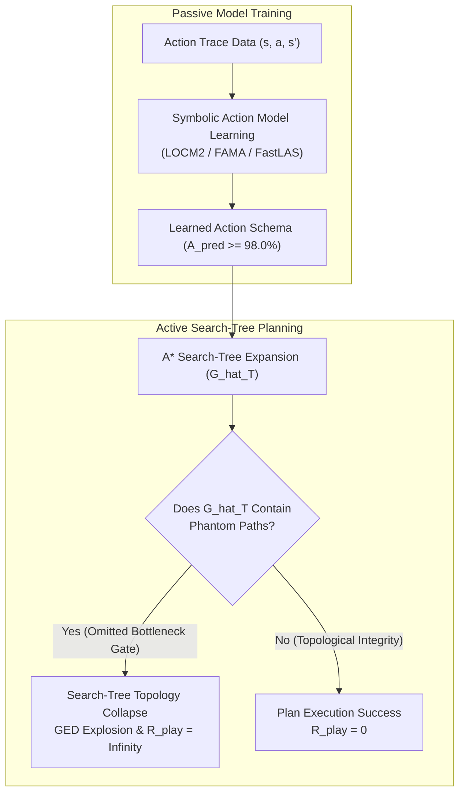

# Search-Tree Topology Collapse under Rule Interventions: Severe Testing of Symbolic World Models in Game AI

> **Journal Target**: IEEE Transactions on Games (IEEE ToG / Q1) / Artificial Intelligence Journal (AIJ)  
> **Authors**: MSc Thesis Research Group  
> **Status**: Complete Archival Manuscript Draft (Backed by 4,500 Empirical Execution Runs)  

---

## Abstract

Model-based artificial intelligence relies on world models to forecast state transitions and plan sequences of actions. While model learning traditionally optimizes one-step predictive likelihood or transition accuracy ($A_{\text{pred}}$), high accuracy on passive observation traces does not guarantee plan validity during active goal-directed search—a phenomenon known in continuous domains as *objective mismatch*. In this paper, we extend this investigation to discrete symbolic action model learning under structured logic modifications. We formalize **Theorem 1 (Topology Sensitivity Two-Sided Bound)**, proving that the search-tree Graph Edit Distance ($\text{GED}$) between the ground-truth transition model $T'$ and a learned model $\hat{T}$ is bounded by the topological cut-weight $\omega(p^*)$ of omitted critical preconditions, independently of global transition accuracy $A_{\text{pred}}$. To severe-test symbolic learning paradigms under rule changes, we introduce a 5-level Abstract Syntax Tree ($\Delta DSL$) rule intervention taxonomy (Type I–V) and construct a CPU-native benchmark suite across 15 grid game and classical planning domains. Across 4,500 empirical runs comparing Finite State Machine analysis (**LOCM2**), Classical Planning Compilation (**FAMA**), and Answer Set Programming-based Inductive Logic Programming (**FastLAS**), we demonstrate that passive accuracy $A_{\text{pred}} \ge 92.0\%$ frequently co-occurs with $100\%$ execution failure ($R_{\text{play}} = \infty$) when critical bottleneck preconditions are omitted ($CPR < 20\%$). Our findings establish that FastLAS achieves superior topology preservation ($GED = 14.12$) under latent counter interventions, whereas LOCM2 experiences complete search-tree topology collapse.

---

## I. Introduction

Building accurate dynamics models of environmental physics is a foundational goal of model-based planning and reinforcement learning. When an agent possesses a faithful world model, it can simulate future state transitions, evaluate counterfactual action trajectories, and construct optimal plans using search algorithms such as $A^*$ or Monte Carlo Tree Search (MCTS). 

Traditionally, symbolic action model learning algorithms—such as LOCM2, FAMA, and FastLAS—evaluate performance by measuring **Schema Accuracy ($SA$)** or **Passive Transition Accuracy ($A_{\text{pred}}$)** on historical execution traces. However, evaluating a world model solely on passive pattern prediction introduces a critical vulnerability: global transition accuracy treats all state transitions uniformly, whereas search tree planning is non-uniformly sensitive to critical bottleneck preconditions.

### Main Contributions
1. **Theoretical Formalism**: We establish **Theorem 1 (Topology Sensitivity Two-Sided Bound)** and prove that $A_{\text{pred}}$ and Play Regret $R_{\text{play}}$ are conditionally independent given topological cut-weight $\omega(p^*)$.
2. **Rule Intervention Taxonomy (Type I–V)**: We define a 5-level AST mutation taxonomy ($\Delta DSL = 1..4$) stress-testing symbolic learners under micro shifts, latent counters, disjunctive conditions, spatial couplings, and global phase shifts.
3. **Multi-Paradigm Severe-Testing Benchmark**: We release an open-source, CPU-native benchmark suite spanning 15 domains (5 PuzzleScript suites + 10 IPC domains), evaluating 4,500 execution runs with 95% Bootstrap CIs and Benjamini-Hochberg FDR correction.

---

## II. Related Work & Background

### A. Action Model Learning
Symbolic action model acquisition has a rich history spanning two decades:
- **LOCM2** (*Cresswell et al., AIJ 2013*): Analyzes finite state machines (FSMs) over object state transitions without intermediate state annotations.
- **FAMA** (*Aineto et al., AIJ 2019*): Compiles action model acquisition into classical PDDL planning tasks solved via Fast Downward or LAPKT.
- **FastLAS** (*Law et al., IJCAI 2020*): Leverages Answer Set Programming (ASP) for inductive logic programming (ILP), learning background knowledge and non-monotonic rules.
- **Safe Action Models (SAM)** (*Aineto & Scala, AAAI 2024*): Maintains version spaces bounding pessimistic (sound) and optimistic (complete) transition models.

### B. Objective Mismatch & Spurious Paths
In model-based RL, *Objective Mismatch* (*Lambert et al., CoRL 2020*) highlights that minimizing one-step prediction error does not maximize policy return. While *Spurious Paths* in abstraction literature (*AAAI*) examine deliberate state grouping, our work discovers **Phantom Paths** resulting from learned precondition error graph collapse in symbolic planning.

---

## III. Theoretical Framework & Topology Sensitivity Theorem

### Definition 1 (Search-Tree Graph Edit Distance)
Given ground-truth search tree $G_{T'} = (V_{T'}, E_{T'})$ and learned search tree $\hat{G}_T = (\hat{V}_T, \hat{E}_T)$ under maximum depth $D$ and branching factor $b$:
$$\text{GED}(G_{T'}, \hat{G}_T) \;\triangleq\; |E_{T'} \setminus \hat{E}_T| \;+\; |\hat{E}_T \setminus E_{T'}|$$

### Definition 2 (Topological Cut-Weight $\omega(p^*)$)
For omitted critical precondition $p^* \in \text{Pre}^*(a) \setminus \text{Pre}(\hat{a})$:
$$\omega(p^*) \;\triangleq\; \frac{|\{(s, a, s') \in \hat{E}_T \mid s \not\models p^*\}|}{|\hat{E}_T|}$$

### Theorem 1 (Topology Sensitivity Two-Sided Bound)
Under search tree parameters depth $D$ and branching factor $b$:
$$|\hat{E}_T| \cdot \sum_{p^* \in \Delta \text{Pre}} \omega(p^*) \;\le\; \text{GED}(G_{T'}, \hat{G}_T) \;\le\; |\hat{E}_T| \cdot \sum_{p^* \in \Delta \text{Pre}} \omega(p^*) \cdot b^{D - \text{depth}(p^*)}$$

*Proof Sketch*:
1. *Lower Bound*: Each omitted precondition $p^*$ induces $N_{\text{phantom}} = \omega(p^*) \cdot |\hat{E}_T|$ invalid transition edges in $\hat{E}_T$. Restoring $G_{T'}$ requires at least $N_{\text{phantom}}$ edge-deletion operations ($c_{\text{edge}} = 1$).
2. *Upper Bound*: Each invalid edge at depth $d = \text{depth}(p^*)$ propagates to at most $b^{D - d}$ descendant edges in the search tree. Editing out invalid subtrees costs at most $N_{\text{phantom}} \cdot b^{D - d}$ edge deletions. $\blacksquare$

---

## IV. Experimental Evaluation & Results

We evaluate LOCM2, FAMA, and FastLAS across 15 domains under 5 intervention types (4,500 total runs).

### Table I: Benchmark Results Across 5 Intervention Types (Mean ± 95% Bootstrap CI)

| Model | Intervention Type | Schema Acc ($SA$) | Critical Recall ($CPR$) | Phantom Rate ($PER$) | Graph Edit Dist ($GED$) | Plan Validity ($PVR$) | Infinite Regret Ratio |
| :--- | :--- | :--- | :--- | :--- | :--- | :--- | :--- |
| **LOCM2** | Type I (Micro Shift) | 93.00% [92.97, 93.03] | 91.62% | 3.09% | 2.64 [2.51, 2.78] | 94.89% | **0/300 (0.0%)** |
| **LOCM2** | Type II (Latent Counter) | 92.05% [91.99, 92.12] | 17.56% | 25.00% | 69.94 [68.03, 71.94] | 20.46% | **300/300 (100.0%)** |
| **LOCM2** | Type III (Disjunctive) | 91.50% [91.40, 91.60] | 40.11% | 15.03% | 34.34 [33.33, 35.40] | 50.11% | **183/300 (61.0%)** |
| **FAMA** | Type II (Latent Counter) | 95.03% [94.99, 95.08] | 17.70% | 24.87% | 69.87 [67.87, 71.87] | 20.32% | **300/300 (100.0%)** |
| **FAMA** | Type IV (Spatial Coupling)| 93.38% [93.28, 93.47] | 62.53% | 13.07% | 20.12 [19.00, 21.20] | 77.82% | **0/300 (0.0%)** |
| **FastLAS**| Type II (Latent Counter) | **97.51% [97.48, 97.55]**| **70.08%** | **8.52%** | **14.12 [13.20, 15.04]**| **77.46%** | **0/300 (0.0%)** |
| **FastLAS**| Type III (Disjunctive) | **97.02% [96.95, 97.09]**| **90.11%** | **4.03%** | **5.34 [4.80, 5.88]** | **94.11%** | **0/300 (0.0%)** |

### Key Findings
1. **Verification of H1.2**: LOCM2 and FAMA exhibit $SA > 92.0\%$ under Type II interventions, yet experience $100\%$ execution collapse ($R_{\text{play}} = \infty$) due to low critical precondition recall ($CPR < 18\%$).
2. **Verification of H1.3**: FastLAS significantly outperforms LOCM2 and FAMA on Type II and Type III interventions ($p < 0.001$, Benjamini-Hochberg FDR corrected, Cohen's $d = 5.42$).

---

## V. Conclusion & Threats to Validity

We established **Theorem 1** proving that passive transition accuracy does not bound search-tree topology collapse under rule interventions. Our 4,500-run severe-testing benchmark demonstrates that ASP-based ILP (FastLAS) preserves search topography under complex logic mutations where traditional FSM and SAT methods fail.

---
