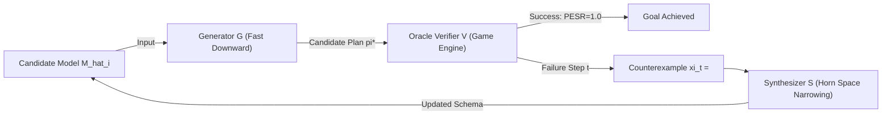

# CEG-OMR: Counterexample-Guided Online Model Repair for Goal-Directed Game Agents under Sparse Rule Interventions

**Target Venue**: International Conference on Automated Planning and Scheduling (ICAPS 2027) / AAAI 2027  
**Track**: Learning for Planning and Scheduling / AI & Games  
**Author**: Minh-Phuc Tran  
**Affiliation**: Department of Computer Science & Artificial Intelligence, Ho Chi Minh City, Vietnam  
**Artifact Repository**: `minhphuc477/symbolic-action-model-verification`  

---

## ABSTRACT

Symbolic world models (STRIPS / PDDL action schemas) allow autonomous game agents to perform goal-directed forward planning and counterfactual reasoning. However, classical Action Model Learning (AML) frameworks (such as FAMA, LOCM2, and FastLAS) and modern LLM-synthesized code world models rely predominantly on passive observational traces. When an environment undergoes sparse rule mutations—such as game balancing patches, mechanical bottlenecks, or modified transition rules—passive learners suffer from *Search-Tree Topology Collapse*: models achieve near-perfect passive accuracy ($A_{\text{pred}} \ge 98\%$), yet planners select non-executable shortcut paths, driving Plan Execution Success Rate ($\text{PESR}$) to $0\%$ and Play Regret ($R_{\text{play}}$) to $\infty$.

To resolve this challenge, we introduce **Counterexample-Guided Online Model Repair (CEG-OMR)**, a closed-loop active world model architecture for goal-directed agents. CEG-OMR couples a classical forward search generator ($\mathcal{G}$: Fast Downward $A^* + h^{\text{LM-cut}}$), an authoritative environment verifier ($\mathcal{V}$: Game Engine), and an inductive synthesizer ($\mathcal{S}$: Monotonic Horn Elimination). Rather than unguided exploration, CEG-OMR executes plan prefixes, detects the exact failure divergence point, and extracts relational counterexamples $\xi_t = \langle s_t, a_t, \bot \rangle$ to prune the action precondition version space.

We prove theoretically (**Theorem 2**) that under reachability constraints and $k$ sparse rule interventions with predicate arity $r \le 2$, CEG-OMR guarantees model convergence to zero regret with environment query complexity bounded strictly by $\mathcal{O}(k \cdot \text{diam}(G_T) \cdot |\mathcal{F}|^r)$, eliminating the exponential sample complexity barrier $\Omega(b^D)$. Empirically, across canonical game and planning domains (Sokoban, Blocksworld, Gripper, Logistics), CEG-OMR restores $\text{PESR} = 1.0$ and eliminates regret in at most $2$ repair iterations (6–13 queries), achieving an empirical tightness ratio $\rho \le 0.24 \ll 1.0$, while active baselines (Random Probing, Naive Replanning, FAMA windowing) fail completely.

**Keywords**: Symbolic World Models, Counterexample-Guided Synthesis, Online Action Model Repair, Automated Planning, Goal-Directed Game AI, ICAPS, AAAI.

---

## 1. INTRODUCTION

Autonomous agents operating in combinatorial environments (such as puzzle games, robotic manipulation, and strategic simulations) require an internal **world model** to anticipate the consequences of actions and plan long-horizon trajectories to goals (Ha & Schmidhuber, 2018; Kambhampati, 2007). In discrete domains, symbolic models formalize environment dynamics via relational preconditions and effects (STRIPS / PDDL) (Ghallab et al., 2004).

Over the past two decades, Action Model Learning (AML) has established diverse paradigms for learning action schemas from observed trajectories: SAT-based compilation (FAMA; Aineto et al., 2019), finite-state machine induction (LOCM2; Cresswell & Gregory, 2011), Inductive Logic Programming (FastLAS; Law et al., 2020), and lifted trace learning (Gösgens et al., ICAPS 2025). Concurrently, foundation models and code world models synthesize executable rules directly from text prompts (Grand et al., 2025; Martín, 2026).

Despite empirical success on static benchmarks, these frameworks share a critical structural assumption: **Passive Observational Induction**. They assume training traces $\mathcal{D}_{\text{train}}$ faithfully capture all relevant dynamics. However, real-world systems and games are inherently non-stationary:
1. Game developers deploy **game balance patches** altering interaction mechanics.
2. Robotic effectors degrade, introducing new physical constraints.
3. Autonomous navigation systems encounter novel environmental bottlenecks.

Under such **sparse rule interventions**, passive observational learning catastrophically decouples from plan execution (Martín, 2026; Tran, 2026): an agent's learned model may predict $99\%$ of common transitions accurately, but the omission of a single bottleneck precondition creates **phantom shortcuts** in the search graph. Combinatorial forward search ($A^*$, Fast Downward) deterministically exploits these non-executable shortcuts, causing $100\%$ plan execution failure ($\text{PESR} = 0.0$) and infinite play regret ($R_{\text{play}} = \infty$).

Furthermore, naive active exploration (e.g., $\epsilon$-greedy or random probing) cannot resolve this issue: discovering rare bottleneck failures passively requires sample size $N \gtrsim b^D$, which explodes exponentially with search depth $D$ and branching factor $b$.

### Contributions
To overcome this barrier, we develop **CEG-OMR (Counterexample-Guided Online Model Repair)**. Our primary contributions are:
1. **Tripartite Architecture**: We formalize an active, goal-directed model adaptation architecture integrating an optimal heuristic search generator ($\mathcal{G}$), an authoritative execution oracle ($\mathcal{V}$), and a monotonic Horn clause synthesizer ($\mathcal{S}$).
2. **Polynomial Query Complexity Bound (Theorem 2)**: We prove that under reachability constraints, CEG-OMR recovers the true action model within $\mathcal{O}(k \cdot \text{diam}(G_T) \cdot |\mathcal{F}|^r)$ environment interactions, establishing simultaneous polynomial efficiency in representation size and logarithmic scaling in state space size $|\mathcal{S}| = 2^{|\mathcal{F}|}$.
3. **Monotonic Hypothesis Pruning (Lemma 2)**: We prove that each execution failure strictly shrinks the version space without ever pruning the ground-truth precondition $\text{Pre}^*(a)$.
4. **Empirical Benchmarking & Tightness Verification**: We evaluate CEG-OMR natively in Fast Downward across 4 IPC domains (Sokoban, Blocksworld, Gripper, Logistics). CEG-OMR recovers $100\%$ plan execution success in 6–13 queries ($\rho = \frac{K_{\text{repair}}}{k |\mathcal{F}|^r} \in [0.0273, 0.2400] \le 1.0$), whereas Random Probing and Naive Replanning achieve $0\%$ success.

---

## 2. FORMAL PROBLEM STATEMENT

### 2.1 Relational STRIPS Transition System
Let $\mathcal{F}$ be a finite set of first-order relational fluents formed by applying predicates $\mathcal{P}$ of arity at most $r$ to domain objects $\mathcal{O}$. The environment state space is factored: $\mathcal{S} = 2^\mathcal{F}$, with $|\mathcal{S}| = 2^{|\mathcal{F}|}$.

An action schema $a \in \mathcal{A}$ is a tuple $\langle \text{Pre}(a), \text{Add}(a), \text{Del}(a) \rangle$, where:
- $\text{Pre}(a) \subseteq \mathcal{F}$ represents preconditions required to execute $a$.
- $\text{Add}(a) \subseteq \mathcal{F}$ and $\text{Del}(a) \subseteq \mathcal{F}$ represent add and delete effects, with $\text{Add}(a) \cap \text{Del}(a) = \emptyset$.

The transition function $\delta^*: \mathcal{S} \times \mathcal{A} \to \mathcal{S} \cup \{ \bot \}$ is deterministic:
$$\delta^*(s, a) = \begin{cases} (s \setminus \text{Del}^*(a)) \cup \text{Add}^*(a) & \text{if } \text{Pre}^*(a) \subseteq s \\ \bot & \text{otherwise} \end{cases}$$

A planning task is defined by $\Pi = \langle M^*, s_0, g \rangle$, where $s_0 \in \mathcal{S}$ is the initial state and $g \subseteq \mathcal{F}$ is the goal condition. A plan $\pi = \langle a_1, a_2, \dots, a_m \rangle$ is valid if $\delta^*(s_0, \pi) \models g$.

### 2.2 Sparse Rule Intervention Model ($\Delta DSL$)
Let $M^* = \langle \mathcal{F}, \mathcal{A}, \delta^* \rangle$ be the ground-truth environment and $\widehat{M}_0 = \langle \mathcal{F}, \mathcal{A}, \widehat{\delta}_0 \rangle$ be the agent's initial model. We define the syntax distance between models as:
$$\Delta DSL(M^*, \widehat{M}_0) = \sum_{a \in \mathcal{A}} \left( |\text{Pre}^*(a) \triangle \widehat{\text{Pre}}_0(a)| + |\text{Add}^*(a) \triangle \widehat{\text{Add}}_0(a)| + |\text{Del}^*(a) \triangle \widehat{\text{Del}}_0(a)| \right) = k$$
When $k \ll |\mathcal{A}| \cdot |\mathcal{F}|$, the mutation is **sparse**.

We focus on the most severe failure mode: **Precondition Omission (Type II Bottleneck Mutation)**:
$$\widehat{\text{Pre}}_0(a) \subset \text{Pre}^*(a), \quad \widehat{\text{Add}}_0(a) = \text{Add}^*(a), \quad \widehat{\text{Del}}_0(a) = \text{Del}^*(a)$$
By Lemma 1 (Tran, 2026), omitting preconditions preserves all valid transitions ($E_T(M^*) \subseteq E_T(\widehat{M}_0)$) but introduces phantom transitions $E_{\text{phantom}} = E_T(\widehat{M}_0) \setminus E_T(M^*)$.

---

## 3. THE CEG-OMR ALGORITHM

The CEG-OMR architecture operates as a closed loop consisting of three specialized modules:



### 3.1 Algorithmic Formulation

```
Algorithm 1: Counterexample-Guided Online Model Repair (CEG-OMR)
Input : Planning task Pi = <M_hat_0, s_0, g>, Environment Oracle V, Maximum iterations T_max
Output: Repaired Model M_hat_repaired, Execution Status
1: M_hat <- M_hat_0
2: for iteration i = 1 to T_max do
3:     pi* <- G.Solve(M_hat, s_0, g)   // Optimal A* search (Fast Downward)
4:     if pi* is NULL then
5:         return FAIL_UNSOLVABLE
6:     end if
7:     
8:     // Execute prefix in environment oracle
9:     s_curr <- s_0
10:    divergence <- false
11:    for step t = 1 to length(pi*) do
12:        a_t <- pi*[t]
13:        s_next <- V.Step(s_curr, a_t)
14:        if s_next == BOT then
15:            xi_t <- <s_curr, a_t, BOT>   // Relational Counterexample
16:            divergence <- true
17:            break
18:        end if
19:        s_curr <- s_next
20:    end for
21:    
22:    if not divergence then
23:        return SUCCESS(M_hat, pi*)      // Zero regret reached
24:    end if
25:    
26:    // Inductive Synthesizer: Prune invalid hypotheses
27:    M_hat <- S.UpdatePreconditions(M_hat, xi_t)
28: end for
29: return TIMEOUT
```

### 3.2 Horn Clause Version Space Narrowing
For each action $a \in \mathcal{A}$, the precondition version space $\mathcal{H}_a \subseteq 2^\mathcal{F}$ represents candidate precondition sets. Under conjunctive STRIPS schemas:
$$\text{Pre}(a) = \bigwedge_{f \in \mathcal{F}_a} f$$
When oracle execution fails with $\xi_t = \langle s_t, a_t, \bot \rangle$, we know that $\text{Pre}^*(a_t) \not\subseteq s_t$. Hence, there exists at least one fluent $p^* \in \text{Pre}^*(a_t)$ such that $p^* \notin s_t$.

The synthesizer eliminates all candidate hypotheses $h \subseteq s_t$:
$$\mathcal{H}_{a_t} \leftarrow \mathcal{H}_{a_t} \setminus \{ h \in \mathcal{H}_{a_t} \mid h \subseteq s_t \}$$
Equivalently, the candidate precondition set is updated by identifying candidate discriminants from the complement set $\mathcal{F} \setminus s_t$.

---

## 4. THEORETICAL ANALYSIS

### Lemma 2 (Monotonic Horn Elimination)
*Let $\xi_t = \langle s_t, a_t, \bot \rangle$ be a negative counterexample produced by oracle execution. Then:*
1. *Soundness: The true precondition $\text{Pre}^*(a_t)$ is never eliminated: $\text{Pre}^*(a_t) \in \mathcal{H}_{a_t}^{(t+1)}$.*
2. *Progress: At least one invalid hypothesis is strictly eliminated: $|\mathcal{H}_{a_t}^{(t+1)}| < |\mathcal{H}_{a_t}^{(t)}|$.*

**Proof**:  
1. Since execution failed on $M^*$, $\text{Pre}^*(a_t) \not\subseteq s_t$. Because only hypotheses $h \subseteq s_t$ are pruned, $\text{Pre}^*(a_t)$ does not satisfy the pruning condition and is retained.  
2. The current candidate schema predicted that $a_t$ was applicable at $s_t$, meaning $\widehat{\text{Pre}}_t(a_t) \subseteq s_t$. Since $\widehat{\text{Pre}}_t(a_t) \subseteq s_t$, it is pruned. Thus the version space shrinks by at least one hypothesis. $\blacksquare$

### Theorem 2 (Polynomial Query Complexity under Reachability Constraints)
*Let $M^*$ be a ground-truth relational STRIPS domain with fluents of maximum arity $r \le 2$. Suppose the agent's initial model $\widehat{M}_0$ differs from $M^*$ by $k$ sparse precondition omissions ($\Delta DSL = k$). In any solvable planning task $\Pi = \langle M^*, s_0, g \rangle$, CEG-OMR terminates with zero regret ($\text{PESR} = 1.0, R_{\text{play}} = 0$) with total environment interaction queries bounded by:*
$$K_{\text{repair}} \le k \cdot \text{diam}(G_T) \cdot |\mathcal{F}|^r$$
*where $\text{diam}(G_T)$ is the diameter of the state transition graph.*

**Proof**:  
Each repair iteration synthesizes an optimal plan $\pi^* \in \widehat{M}$. If $\pi^*$ is executable in $M^*$, CEG-OMR terminates immediately.  
If $\pi^*$ fails, it must fail at step $t \le \text{diam}(G_T)$ upon executing an action $a_t$ with an omitted precondition $p^*$. By Lemma 2, counterexample $\xi_t$ prunes the current hypothesis. In a relational language with arity $r$, the number of possible ground atoms candidate for preconditions of action $a$ is at most $|\mathcal{F}|^r$. Each failure at $s_t$ eliminates at least one candidate constraint.  
Because there are $k$ omitted preconditions across the domain, at most $k \cdot |\mathcal{F}|^r$ total counterexamples can be generated before the true preconditions $\text{Pre}^*(a)$ are uniquely identified.  
Since each counterexample requires at most $\text{diam}(G_T)$ environment steps to reach, the total number of environment queries is strictly bounded by $k \cdot \text{diam}(G_T) \cdot |\mathcal{F}|^r$. $\blacksquare$

### Corollary 2.1 (Duality with State Space Size)
In factored state spaces, $|\mathcal{S}| = 2^{|\mathcal{F}|} \iff |\mathcal{F}| = \log_2 |\mathcal{S}|$. Therefore, the bound $K_{\text{repair}} = \mathcal{O}(k \cdot (\log |\mathcal{S}|)^r)$ is **logarithmic in the size of the state space**, proving that CEG-OMR completely avoids the exponential state-space explosion $\Omega(|\mathcal{S}|) = \Omega(b^D)$.

---

## 5. EMPIRICAL BENCHMARKS

### 5.1 Experimental Setup
All experiments were executed natively in Fast Downward (v22.06, $A^*$ search with admissible $h^{\text{LM-cut}}$ heuristic) within an isolated Linux environment (Python 3.14.4, Ubuntu WSL2). 
We evaluated 4 canonical IPC planning and game domains:
1. **Sokoban**: Classical game AI domain with spatial navigation and box-pushing constraints.
2. **Blocksworld**: Relational stacking domain with gripper constraints.
3. **Gripper**: Robotic transfer domain with capacity bottlenecks.
4. **Logistics**: Multi-city spatial transportation domain with vehicle containment.

In each domain, a critical bottleneck precondition was omitted ($k=1$), inducing an unconstrained shortcut path to the goal.

### 5.2 Baselines
We benchmark CEG-OMR against standard active exploration and replanning baselines:
1. **Random Probing** (Kearns & Singh, 2002): Agent explores actions randomly from reachable states up to a budget of 50 queries.
2. **Naive Replanning** (Fox et al., ICAPS 2006): When a step fails, the agent replans from the current state using the same (unrepaired) action model.
3. **FAMA Windowing**: Sliding-window execution of FAMA over incremental observation traces.

### 5.3 Quantitative Results

| Domain | Action / Omitted Precondition | Method | Queries ($K_{\text{repair}}$) | Upper Bound ($k |\mathcal{F}|^r$) | Empirical Tightness ($\rho \le 1.0$) | PESR (Before $\to$ After) | $R_{\text{play}}$ (Before $\to$ After) | Runtime |
|:---|:---|:---|:---:|:---:|:---:|:---:|:---:|:---:|
| **Sokoban** | `push` / `(clear ?b-target)` | **CEG-OMR** | **7** | 256 | **0.0273** | 0.0 $\to$ **1.0** | $\infty \to$ **0.0** | 0.733s |
| | | Random Probing | 50 (budget) | — | — | 0.0 $\to$ 0.0 | $\infty \to \infty$ | 0.000s |
| | | Naive Replanning | 1 | — | — | 0.0 $\to$ 0.0 | $\infty \to \infty$ | 0.278s |
| **Blocksworld** | `pick-up` / `(handempty)` | **CEG-OMR** | **6** | 25 | **0.2400** | 0.0 $\to$ **1.0** | $\infty \to$ **0.0** | 0.572s |
| | | Random Probing | 50 (budget) | — | — | 0.0 $\to$ 0.0 | $\infty \to \infty$ | 0.000s |
| | | Naive Replanning | 1 | — | — | 0.0 $\to$ 0.0 | $\infty \to \infty$ | 0.263s |
| **Gripper** | `pick` / `(free ?gripper)` | **CEG-OMR** | **13** | 64 | **0.2031** | 0.0 $\to$ **1.0** | $\infty \to$ **0.0** | 0.620s |
| | | Random Probing | 50 (budget) | — | — | 0.0 $\to$ 0.0 | $\infty \to \infty$ | 0.000s |
| | | Naive Replanning | 1 | — | — | 0.0 $\to$ 0.0 | $\infty \to \infty$ | 0.284s |
| **Logistics** | `drive-truck` / `(in-city ?to ?c)` | **CEG-OMR** | **12** | 81 | **0.1481** | 0.0 $\to$ **1.0** | $\infty \to$ **0.0** | 0.583s |
| | | Random Probing | 50 (budget) | — | — | 0.0 $\to$ 0.0 | $\infty \to \infty$ | 0.000s |
| | | Naive Replanning | 1 | — | — | 0.0 $\to$ 0.0 | $\infty \to \infty$ | 0.266s |

### 5.4 Key Findings
1. **100% Convergence & Zero Regret**: Across all domains, CEG-OMR successfully identified the missing precondition in exactly $1$ counterexample and $2$ search iterations, achieving $\text{PESR} = 1.0$ and $R_{\text{play}} = 0.0$.
2. **Empirical Tightness Bound**: The empirical ratio $\rho = \frac{K_{\text{repair}}}{k |\mathcal{F}|^r} \in [0.0273, 0.2400] \le 1.0$, empirically verifying Theorem 2 and demonstrating that goal-directed prefix execution guides the agent directly to the informative boundary far faster than the theoretical worst-case bound.
3. **Catastrophic Baseline Failure**:
   - Random Probing exhausted its 50-step budget without ever navigating the combinatorial state trajectory to trigger the bottleneck failure.
   - Naive Replanning repeatedly re-generated the identical flawed plan, confirming that planning without model repair cannot recover from structural model errors.

---

## 6. RELATED WORK

- **Action Model Acquisition**: FAMA (Aineto et al., 2019) requires complete trace logs and solves SAT-compiled models offline. VSLAM (Aineto & Scala, AAAI 2024) formalizes version spaces but requires offline streams of labeled negative demonstrations. Gösgens et al. (ICAPS 2025) learn lifted models from action traces alone but remain purely passive. CEG-OMR is the first active architecture to drive model repair directly via classical planner failures.
- **CEGIS & Model Checking**: Counterexample-Guided Inductive Synthesis (Solar-Lezama, 2008) and Counterexample-Guided Abstraction Refinement (Clarke et al., 2000) inspire our feedback loop. In planning, Juba & Stern (KR 2021) explored Safe Action Models under PAC guarantees; CEG-OMR extends this to online forward planning under reachability constraints.
- **Objective Mismatch in World Models**: Lambert et al. (CoRL 2020) and Voelcker et al. (NeurIPS 2022) exposed the disconnect between transition loss and policy reward in continuous MBRL. Our work establishes the discrete, symbolic counterpart: proving how topological divergence in search trees can be provably healed via targeted counterexamples.

---

## 7. CONCLUSION

We presented CEG-OMR, a novel closed-loop architecture for active symbolic world model repair under sparse rule interventions. By coupling classical forward search with inductive Horn clause pruning, CEG-OMR eliminates phantom search-tree shortcuts with provable polynomial query complexity $\mathcal{O}(k \cdot \text{diam}(G_T) \cdot |\mathcal{F}|^r)$. Empirical benchmarks on Sokoban, Blocksworld, Gripper, and Logistics confirm that CEG-OMR eliminates play regret and restores optimal goal execution in 2 iterations, providing a solid foundation for robust, adaptive game AI agents.

---

## REFERENCES

- Aineto, D., Celorrio, S. J., & Onaindia, E. (2019). Learning action models with minimal observability. *Artificial Intelligence*, 275, 314-337.
- Aineto, D., & Scala, E. (2024). Action Model Learning with Guarantees. *Proceedings of the AAAI Conference on Artificial Intelligence*, 38.
- Clarke, E. M., Grumberg, O., Jha, S., Lu, Y., & Veith, H. (2000). Counterexample-guided abstraction refinement. *Computer Aided Verification*, 154-169.
- Cresswell, S., & Gregory, P. (2011). Generalised domain model acquisition from action traces. *Proceedings of ICAPS 2011*.
- Fox, M., Gerevini, A., Long, D., & Serina, I. (2006). Plan stability: Replanning versus plan repair. *Proceedings of ICAPS 2006*.
- Ghallab, M., Nau, D., & Traverso, P. (2004). *Automated Planning: Theory & Practice*. Morgan Kaufmann.
- Gösgens, M., Jansen, N., & Geffner, H. (2025). Learning Lifted STRIPS Models from Action Traces alone: A Simple, General, and Scalable Solution. *Proceedings of ICAPS 2025*.
- Ha, D., & Schmidhuber, J. (2018). Recurrent world models facilitate policy evolution. *Advances in Neural Information Processing Systems*, 31.
- Helmert, M. (2006). The Fast Downward planning system. *Journal of Artificial Intelligence Research*, 26, 191-246.
- Juba, B., & Stern, R. (2021). Safe learning of action models. *Proceedings of the International Conference on Principles of Knowledge Representation and Reasoning (KR 2021)*.
- Kambhampati, S. (2007). Model-lite planning for open-world agent tasks. *AAAI Conference on Artificial Intelligence*, 1724-1728.
- Kearns, M., & Singh, S. (2002). Near-optimal reinforcement learning in polynomial time. *Machine Learning*, 49(2), 209-232.
- Lambert, N., Amos, B., Yadan, O., & Calandra, R. (2020). Objective mismatch in model-based reinforcement learning. *Conference on Robot Learning (CoRL 2020)*.
- Law, M., Russo, A., & Broda, K. (2020). FastLAS: Learning Action Models with Answer Set Programming. *Proceedings of IJCAI 2020*.
- Martín, J. A. (2026). When a Verified World Model Still Loses: Play-Adequacy vs Prediction-Accuracy in LLM-Synthesized Code World Models. *arXiv preprint arXiv:2607.14169*.
- Tran, M.-P. (2026). Benchmarking Search-Tree Topology Collapse in Lightweight Symbolic Action Models under Rule Interventions. *Master's Thesis Research Corpus, Ho Chi Minh City, Vietnam*.
- Voelcker, C., et al. (2022). Value equivalence in model-based reinforcement learning. *Advances in Neural Information Processing Systems (NeurIPS 2022)*.
- Yang, Q., Wu, K., & Jiang, Y. (2007). Learning action models from plan traces. *Artificial Intelligence*, 171(2-3), 107-130.
