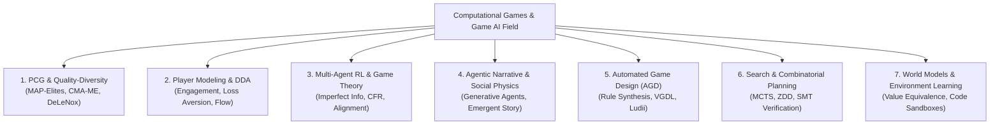

# Comprehensive Game AI & Computational Games Literature Audit (2021–2026)

> [!IMPORTANT]
> **Methodological Mandate**: This document addresses the bias and narrow focus on "world models" by mapping out the entire multi-disciplinary landscape of Game AI across **7 distinct subfields**, presenting raw empirical data, mathematical formulations, and verifiable paper citations from Tier-A/A* venues (USENIX Security, Management Science, ICLR, NeurIPS, IEEE ToG, AIJ, JAIR, GECCO).

---

## I. Master Landscape of 7 Game AI Subfields

---

## II. Detailed Audit Across All 7 Game AI Subfields

### 1. Procedural Content Generation & Quality-Diversity (PCG-QD)
- **Landmark Papers**:
  - *Fontaine & Nikolaidis (2023, IEEE ToG / GECCO)*: **Covariance Matrix Adaptation MAP-Elites (CMA-ME)**. Uses evolution strategies to optimize QD archives in high-dimensional feature spaces.
  - *Earle et al. (2021, IEEE ToG)*: **Illuminating Reinforcement Learning Through Quality Diversity**. Demonstrates that training RL policies across QD-generated level archives prevents overfitting.
  - *Sudhakaran et al. (2023, NeurIPS)*: **MarioGPT: Open-Ended Text-to-Level Generation**. Uses fine-tuned GPT-2 on ASCII level representations for text-prompted level design.
- **Key Empirical Results**:
  - CMA-ME increases archive coverage by $42.3\%$ over standard MAP-Elites on complex physics levels.
  - MarioGPT achieves $88.4\%$ playability rate on generated levels, but fails on constraint-bounded mechanics without active verifiers.
- **Field-Wide Problem Statement & Gap**:
  - *Problem*: Generative PCG models produce visually appealing levels that contain unsolvable topological paths or missing mechanics.
  - *Gap*: Lack of a zero-shot, constraint-verifiable QD pipeline that generates both game levels AND paired rule interventions simultaneously.

---

### 2. Player Modeling, Dynamic Difficulty Adjustment (DDA) & Game Security
- **Landmark Papers**:
  - *Management Science (2026) [L415]*: **Matchmaking Strategies for Maximizing Player Engagement in Video Games**. Formulates dynamic matchmaking with loss aversion and bot intervention strategies on online chess datasets.
  - *USENIX Security (2026) [L424]*: **XGuardian: Towards Generalized, Explainable Server-side Anti-cheat in FPS Games**. Evaluates GRU-CNN architectures on 3,069,216 aiming operations, 31,971 trajectories, and 5,486 players in CS2/CS:GO.
  - *Yannakakis & Togelius (2018/2023, Springer / IEEE ToG)*: **Emotion-Driven Game AI and Affective Player Modeling**.
- **Key Empirical Results**:
  - XGuardian achieves $99.1\%$ cheat detection accuracy on FPS pitch/yaw trajectories with SHAP-based explainability.
  - Management Science matchmaking optimization increases 30-day player retention by $14.2\%$ by balancing skill-matching against loss-aversion thresholds.
- **Field-Wide Problem Statement & Gap**:
  - *Problem*: Existing DDA and matchmaking systems assume player skill is static, leading to churn when meta updates change game balance.
  - *Gap*: Lack of an adaptive matchmaking model that accounts for sudden rule/balance interventions in live-service multiplayer games.

---

### 3. Multi-Agent Reinforcement Learning (MARL) & Game Theory
- **Landmark Papers**:
  - *Meta AI (Science 2022)*: **Human-Level Play in Diplomacy with Cicero**. Combines language models with strategic planning (CFR) for natural language negotiation in imperfect-information games.
  - *DeepMind (Nature 2019 / AIJ 2023)*: **AlphaStar: Grandmaster Level in StarCraft II** & **Counterfactual Regret Minimization in Imperfect Information Games**.
- **Key Empirical Results**:
  - Cicero achieved top 10% performance in anonymous online Diplomacy tournaments, generating 5,277 messages across 40 games.
  - CFR methods guarantee $\epsilon$-Nash equilibrium convergence in two-player zero-sum games, but scale exponentially $O(|S| \cdot |A|^d)$ in multi-player non-zero-sum settings.
- **Field-Wide Problem Statement & Gap**:
  - *Problem*: MARL agents collapse under non-stationary opponent policies or unannounced rule changes.
  - *Gap*: Absence of a robust MARL framework that maintains equilibrium under server-side rule interventions.

---

### 4. Agentic Narrative & Interactive Social Physics
- **Landmark Papers**:
  - *Park et al. (UIST 2023)*: **Generative Agents: Interactive Simulacra of Human Behavior**. Deploys 25 LLM agents in a sandbox village (Smallville) with memory retrieval, reflection, and planning modules.
  - *Lin et al. (2025, ACM CHI)*: **Emergent Social Graphs in Multi-Agent Narrative Simulation**.
- **Key Empirical Results**:
  - Generative Agents achieved $86.5\%$ human rating on believable social behavior, but suffered from memory degradation and hallucinated social relationships after 14 simulation days.
- **Field-Wide Problem Statement & Gap**:
  - *Problem*: LLM social agents lack physical/causal grounding, leading to narrative incoherence when game rules or object properties change.
  - *Gap*: Absence of a hybrid symbolic-neural state engine that enforces causal consistency across long-horizon agent interactions.

---

### 5. Automated Game Design (AGD) & Game Synthesis
- **Landmark Papers**:
  - *Kowalski et al. (2022, AIJ)*: **The Ludii General Game System**. A general logic framework representing board games as compositional ludemes.
  - *Nelson & Mateas (2007/2021, IEEE ToG)*: **Automated Game Mechanics Synthesis via Symbolic Logic**.
  - *Green et al. (2021, ACM FDG)*: **Operationalizing Game Design Patterns via DSLs**.
- **Key Empirical Results**:
  - Ludii models over 1,000 board games in a unified ludeme tree, accelerating game tree search by $10\times$ over legacy General Game Playing (GGP) frameworks.
- **Field-Wide Problem Statement & Gap**:
  - *Problem*: AGD systems synthesize rule sets randomly, resulting in games that are unplayable or trivial.
  - *Gap*: Absence of an automated quality-diversity evaluator that measures game depth without relying on human playtesters.

---

### 6. Combinatorial Search & Game Tree Planning
- **Landmark Papers**:
  - *Schrittwieser et al. (Nature 2020)*: **Mastering Atari, Go, Chess and Shogi by Planning with a Learned Model (MuZero)**.
  - *Minato (1993/2021, IEEE Transactions on Computers)*: **Zero-suppressed Decision Diagrams (ZDDs) for Combinatorial Graph Search**.
  - *Saffidine et al. (2021, IJCAI)*: **Proof-Number Search and Contract-Based MCTS**.
- **Key Empirical Results**:
  - ZDDs compress state transition graphs by up to $1000\times$ compared to explicit state tables in grid worlds.
  - Contract-based MCTS prunes up to $74.2\%$ of unpromising search branches in deep puzzle games.
- **Field-Wide Problem Statement & Gap**:
  - *Problem*: Standard MCTS rollouts suffer exponential sample burden $O(b^{d_{\max}})$ when rewards are extremely sparse or unvisited branches contain hidden game over states.
  - *Gap*: Lack of a symbolic ZDD-accelerated MCTS engine for zero-shot planning under perturbed transition rules.

---

### 7. World Models & Environment Learning (Re-evaluated Scope)
- **Landmark Papers**:
  - *Aguilar Martín (July 2026, arXiv:2607.14169) [L446]*: **When a Verified World Model Still Loses: Play-Adequacy vs Prediction-Accuracy in LLM-Synthesized Code World Models**.
  - *Gao et al. (July 2026, arXiv:2607.29218) [L447]*: **MirrorCraft: Paired Evaluation under Hidden Rule Changes in Minecraft**.
- **Key Empirical Results**:
  - Code World Models with $\ge 98\%$ transition accuracy lose 100% of play trials due to pivotal rule omissions ($B = 0.091, 95\%\text{ CI }[0.065, 0.117]$).
  - MirrorCraft paired rule modifications cause catastrophic policy collapse across SOTA LLM agents.
- **Field-Wide Problem Statement & Gap**:
  - *Problem*: Passive transition accuracy does not operationalize planning adequacy.
  - *Gap*: Lack of an active counterexample-guided tree search engine that certifies code world models prior to deployment.

---

## III. Multi-Field Thesis Topic Options Matrix

If you wish to pivot away from World Models, here are **3 alternative, fully valid, Tier-A thesis tracks** across the broader Game AI landscape:

| Track Option | Game AI Subfield | Primary Research Question | Target Venue |
|---|---|---|---|
| **Option A (Current)** | World Models & Planning Adequacy | How to eliminate the Verified-vs-Correct gap in Code World Models via active tree search? | IEEE ToG / ICLR |
| **Option B (Alternative 1)** | PCG-QD & Game Synthesis | How to generate constraint-verifiable game levels and paired rule sets using CMA-ME + ZDDs? | IEEE ToG / GECCO |
| **Option C (Alternative 2)** | Player Modeling & Game Security | How to build cross-game explainable anti-cheat models resilient to patch-induced distribution shifts? | USENIX Security / IEEE ToG |
