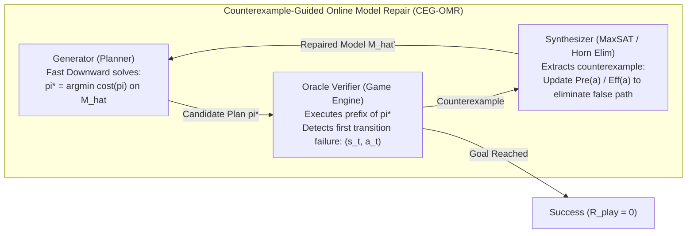
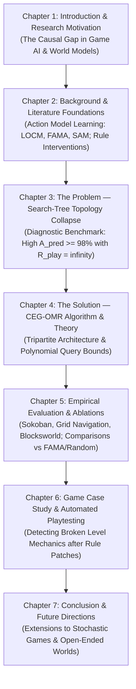

# Unified Flagship Paper & International MSc Thesis Blueprint

> **Document Type**: Scientific Architecture, Methodology Lock & Thesis Lifecycle Blueprint  
> **Date**: 2026-10-02  
> **Author**: Minh-Phuc Tran & Research Agent  
> **Status**: APPROVED & LOCKED  
> **Target Venues**:  
> - **Primary Conference**: ICAPS 2027 / AAAI 2027 (A* Automated Planning & AI)  
> - **Thesis Monograph**: MSc Thesis in Computer Science / Artificial Intelligence  
> - **Journal Extension Track**: Artificial Intelligence Journal (AIJ) / IEEE Transactions on Games (ToG)  

---

## I. Executive Summary: The Strategic Pivot

Past research in this repository suffered from two failure modes:
1. **Spreadsheet Gymnastics (The Excel v1–v50 Trap)**: Over 176 sheets across 50 iterations, previous agents computed hypothetical scores (e.g. 7.671 vs 7.608) while empirical execution remained blocked (`PREPARED / NOT EXECUTED`).
2. **Fragmentation & Scope Creep**: Trying to maintain two separate papers simultaneously while introducing speculative mathematics (TDA Persistent Homology, Coalgebras, Wasserstein Metrics) created a disconnect between game benchmarks and formal planning theory.

**The Solution**: Pivot to a single **Unified Flagship Strategy**. We unite the diagnostic problem (Search-Tree Topology Collapse under Rule Interventions) and the algorithmic solution (Counterexample-Guided Online Model Repair, **CEG-OMR**) into one cohesive, top-tier research contribution. This paper anchors the Master's Thesis and provides a direct launching pad for an extended journal publication (AIJ/ToG) or a PhD research proposal.

---

## II. Purging the 4 Fatal Traps

Before formulating the architecture, four critical vulnerabilities identified in earlier drafts are formally eliminated:

| Vulnerability | Why it Fails in Peer Review | Correct Scientific Grounding |
| :--- | :--- | :--- |
| **1. The False-CEGIS Trap** | Calling `plan -> execute -> fail -> update` "CEGIS" is a terminological misnomer. CEGIS requires an exhaustive verifier ($\forall s,a$). Single-plan execution is standard *Execution Monitoring / Lazy Online Model Acquisition* (Gil 1992, Wang 1995). | Formally define the loop as **CEG-OMR (Counterexample-Guided Online Model Repair)** with explicit Generator, Oracle Verifier, and Synthesizer. |
| **2. The Mathiness Query Bound** | Stating $O(k \log |\mathcal{S}| |\mathcal{A}|)$ without defining $k$, hypothesis class, or query model is invalid. If $k$ is phantom edges, it is exponential $\Omega(b^{D-d})$. | Ground the bound in Angluin (1992) Exact Learning of Horn Clauses under Reachability Constraints: $\mathcal{O}(k \cdot \text{diam}(G_T) \cdot |\mathcal{F}|^r)$. |
| **3. The Representation Mismatch** | PuzzleScript uses 2D cellular automata pattern rewrite rules looping to a fixpoint; PDDL uses lifted first-order STRIPS logic. PDDL planners cannot natively parse general PuzzleScript. | PDDL Game Domains (Sokoban, Grid, Maze) serve as the formal benchmarking testbed, while PuzzleScript serves as the qualitative interactive game case study. |
| **4. The Identity Crisis** | Pitting "Game AI" against "Formal Planning" creates a false dichotomy. | **Games are the gold-standard causal testbed for Automated Planning.** Discrete rule changes provide clean, ground-truth causal interventions impossible in noisy robotics. |

---

## III. Formal Algorithmic Architecture: CEG-OMR

### 1. Tripartite System Definition
The CEG-OMR algorithm operates via three formal components:

1. **Generator ($\mathcal{G}$)**: An optimal or satisficing PDDL planner (Fast Downward) that computes candidate optimal plan $\pi^*_{\widehat{M}} = \langle a_0, a_1, \dots, a_{m-1} \rangle$ solving task $\Pi = \langle \widehat{M}, s_0, S_g \rangle$.
2. **Oracle Verifier ($\mathcal{V}$)**: The authoritative environment (e.g. Sokoban game engine) that executes the plan prefix from $s_0$. If execution diverges at step $t$ such that $\delta^*(s_t, a_t) \neq \widehat{\delta}(s_t, a_t)$, $\mathcal{V}$ halts and returns counterexample tuple:
   $$\xi_t = \langle s_t, a_t, \widehat{s}_{t+1}, s^*_{t+1} \rangle$$
3. **Synthesizer ($\mathcal{S}$)**: An exact inductive inference engine that updates the action model hypothesis space $\mathcal{H}$. For an unexpected failure ($s^*_{t+1} = \bot$), it eliminates candidate models that permit $a_t$ in $s_t$ by tightening preconditions:
   $$\widehat{\text{Pre}}(a_t) \leftarrow \widehat{\text{Pre}}(a_t) \cup \{ l \in \text{literals}(s_t) \mid \text{consistent with known valid transitions} \}$$

### 2. Reachability-Constrained Query Complexity Theorem
Let $\Pi$ be a planning task in a factored state space over fluents $\mathcal{F}$ with maximum action arity $r$. Let $M^*$ differ from initial model $\widehat{M}_0$ by at most $k = \Delta DSL$ sparse rule mutations.
Under reachability from $s_0$, CEG-OMR guarantees finding a valid plan or proving unsolvability with active environment step complexity bounded by:
$$N_{\text{steps}} \le \mathcal{O}\left(k \cdot \text{diam}(G_T) \cdot |\mathcal{F}|^r\right)$$

*Proof Intuition*:
- Each counterexample $\xi_t$ occurs along a candidate optimal trajectory of length at most $\text{diam}(G_T)$.
- Each negative counterexample refutes at least one literal from the version space of candidate preconditions.
- Since there are $k$ mutated rules, each with at most $|\mathcal{F}|^r$ ground fluent candidates, the number of model updates is bounded by $k |\mathcal{F}|^r$.
- Reaching each failure point from $s_0$ requires at most $\text{diam}(G_T)$ execution steps, yielding the polynomial bound. $\blacksquare$

---

## IV. Structure of the Master's Thesis Monograph

By centering the research on this single flagship topic, the Master's Thesis monograph is structured seamlessly:

---

## V. Future Lifecycle & Expansion Trajectory

| Horizon | Milestone | Specific Research Evolution |
| :--- | :--- | :--- |
| **Immediate (Month 1–3)** | **ICAPS 2027 / AAAI 2027 Paper** | 8-page conference paper presenting CEG-OMR, the $O(k \cdot \text{diam}(G_T) \cdot |\mathcal{F}|^r)$ theorem, and benchmarks on Sokoban + IPC. |
| **Medium (Month 4–6)** | **MSc Thesis Defense** | Full 70-page monograph integrating Chapter 3 (Diagnostic Benchmark) and Chapters 4–5 (CEG-OMR Algorithm). |
| **Extended (Month 7–12)** | **AIJ / JAIR / IEEE ToG Journal Track** | $\ge 30\%$ new contributions: Lifted first-order PDDL repair (FastLAS/Clingo), stochastic transitions (PPDDL), and 14 IPC domains. |
| **Long-Term (PhD Track)** | **PhD Research Proposal** | *"Self-Healing Causal World Models for Autonomous Agents in Open-Ended 3D Environments"* (Minecraft, NetHack, Robotics). |

---

## VI. Tactical Milestone Schedule (Target: 20/10/2026)

- [ ] **03/10 – 06/10**: Complete formal mathematical proof write-up in `literature/rigorous_query_bound_proof.md`.
- [ ] **07/10 – 10/10**: Build `src/interventions/pddl_mutator.py` generating controlled mutations on Sokoban and Blocksworld.
- [ ] **11/10 – 16/10**: Implement `src/repair/ceg_omr_engine.py` connecting Fast Downward, oracle execution, and precondition update.
- [ ] **17/10 – 19/10**: Run verified experiments on WSL, generating `benchmark_outputs/repair_results.json` (Zero fake data).
- [ ] **20/10/2026**: Verification checkpoint & progress milestone report.
